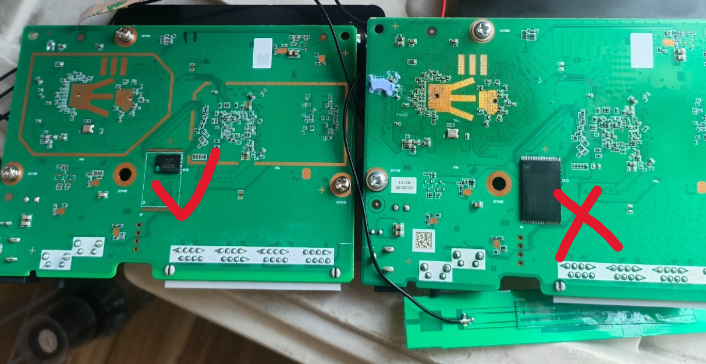
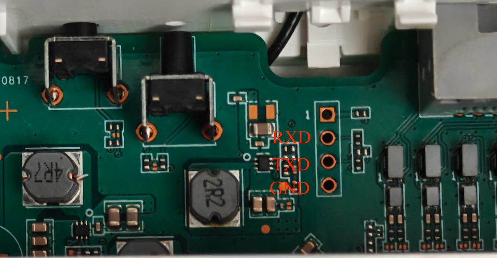
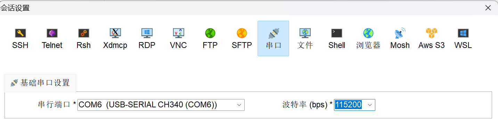
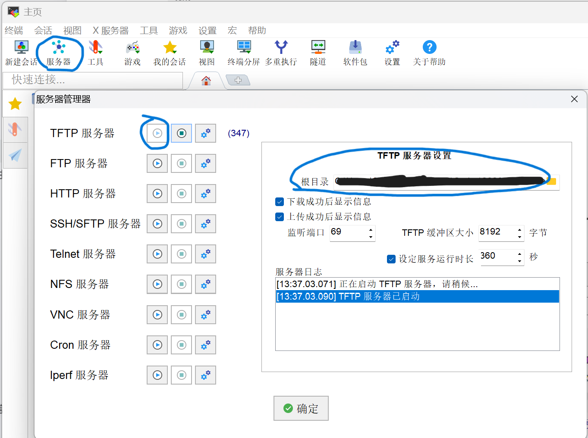

> [!CAUTION] 免责声明与使用约定
> 1. 固件刷写、分区读写、Telnet、TTL、U-Boot 和 MTD 操作均可能造成数据丢失、设备变砖、网络中断、保修失效或其他不可预期后果。**请对自己的设备和全部操作结果负责并自行承担风险。**
> 2. 教程中涉及的固件、商标、产品名称及第三方程序，其权利归各自权利人所有。如本文内容存在侵权、错误引用或其他权益问题，请联系作者核实；确认后将及时删除或修正相关内容。

## 说明

1. 由于是全分区整片写入，刷完后默认 WiFi 名称会变为 `ZTE-Q2QHKu`，密码为 `bhdh3954`。
2. 所有内容仅适用于 256 MB 内存、WSON8 封装版本。
3. 本教程会覆盖你的所有分区，无法找回，**若想保留，请先参考[Telnet篇](https://zlion.top/posts/e2631-research-telnet/#2-%E6%9C%AC%E6%9C%BA%E4%BF%A1%E6%81%AF%E4%BC%98%E5%8C%96)备份两个关键分区：tag、wifi。**
4. 若在TFTP传输中失败，可能是传输速度太慢，超出了MobaXterm未注册版本的开启时长限制，此问题自行解决。

## 准备工作

- 核对路由器版本，见下图：



- USB 转 TTL 模块 CH340G 一个，最好带杜邦线，方便连接。
- 由编程器固件去掉 OOB 、并裁切10MB空间预留给坏块写入跳过的 [118 MB 镜像](https://wwbnc.lanzoub.com/iBlN541u3rxe)。编程器固件来自 [hzw521](https://www.right.com.cn/forum/thread-8472425-1-1.html)。
- MobaXterm 等串口连接工具。
- TFTP 服务工具（MobaXterm自带）。
- 网线一根。

## 操作步骤

### 1. 拆机

### 2. 连接 TTL 和网线

使用网线连接电脑和路由器，参考下图连接 TTL：



### 3. 进入 U-Boot

连接好后，使用 MobaXterm 软件进行串口连接，波特率设置为 `115200`：



路由器上电后马上按 `1` 中断系统启动，输入密码进入 U-Boot（密码来源见[论坛](https://voz.vn/t/unlock-mesh-zte-e1600-2603-2615-thanh-phien-ban-quoc-te.903294/)）：

```text
5cE080@fyBD
```

### 4. 配置电脑网络和 TFTP

关闭防火墙，将电脑 IPv4 改为手动配置：

- IP 地址：`192.168.10.1`
- 子网掩码：`255.255.255.0`

设置固件存放目录。此时先不要开启 TFTP 服务。




### 5. 在串口终端设置 IP

在 u-boot 串口终端中输入：

```shell
setenv ipaddr 192.168.10.2
setenv serverip 192.168.10.1
ping 192.168.10.1
```

看到类似下面的提示即表示通信正常：

```text
host 192.168.10.1 is alive
```

此时再启动前面配置好的 TFTP 服务。

### 6. 通过 TFTP 传输并刷写固件

在串口终端中通过 TFTP 将固件传到 RAM：

```shell
tftp 0x43000000 e2631_no_oob_trim_tail_ff_10MiB.bin
```

传输完成后，确认下载大小必须为：

```text
Bytes transferred = 123731968 (7600000 hex)
```

确认无误后，擦除整片 NAND：

```shell
nand erase 0x0 0x8000000
```

应当看到以下输出

```text
NAND erase: device 0 whole chip
Erasing at 0x7fe0000 -- 100% complete.
OK
```

然后一次性写入：

```shell
nand write 0x43000000 0x0 0x7600000
```

应当看到以下输出

```text
NAND write: device 0 offset 0x0, size 0x7600000
 123731968 bytes written: OK
```

### 7. 重启

刷写完成后执行：

```shell
reset
```

此时还可以在串口终端中看到系统启动的日志：

```text
Boot SPI NAND
start read bootheader
start read secondboot
non secure boot
Jump

enter bootloader...
crpm init enter
crpm init done
ddr init enter, rate is 1333 Mbps
5ddr init done
serial init start
serial init done
SPI NAND
non secure uboot
backup header!!
Jump

.............
```

最后停在`Starting kernel ...`代表系统已经成功启动。
