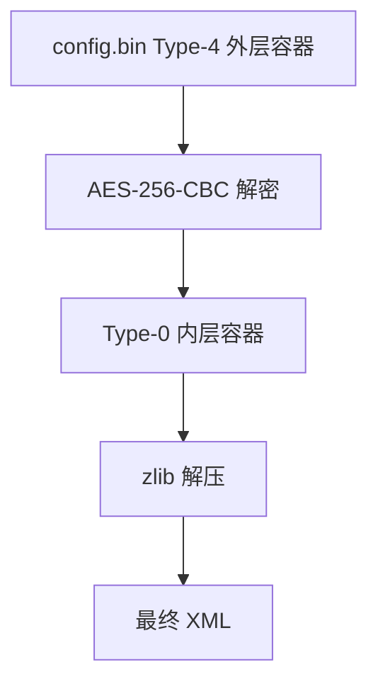
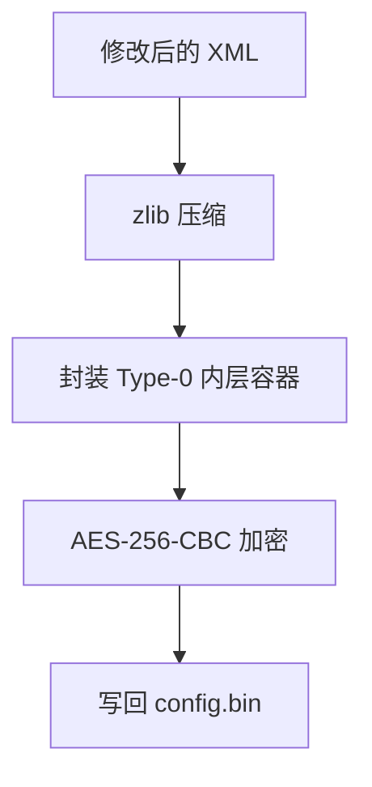
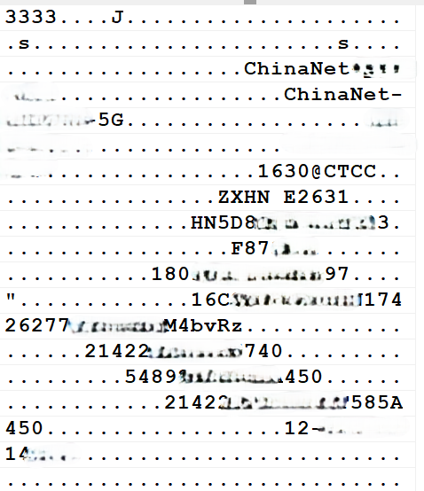

> [!CAUTION] 免责声明与使用约定
> 1. 本教程及随附的全部工具仅供技术研究、学习交流和维护本人拥有或已获明确授权的设备使用，不构成任何形式的商业服务、质量保证或操作承诺。
> 2. **禁止以任何形式出售、打包收费、付费分发、引流获利，或将本教程及随附工具用于其他商业获利行为。**
> 3. 对教程、文档或工具进行二次修改、转载和再分发时，必须保留原作者 `zlion`、原始版权说明及本免责声明，并明确标注原始来源；不得删除署名、冒充原创或以修改版本替代原始来源。
> 4. 固件刷写、分区读写、Telnet和 MTD 操作均可能造成数据丢失、设备变砖、网络中断、保修失效或其他不可预期后果。**操作者应对自己的设备和全部操作结果负责并自行承担风险。**
> 5. 教程作者不保证本文内容和工具适用于所有机型、硬件批次或固件版本。
> 6. 使用者必须遵守所在地适用的法律法规、网络安全规定、电信管理要求、知识产权规则及设备服务协议，不得用于未经授权的访问、破坏、规避安全机制或侵犯第三方权益。
> 7. 教程中涉及的固件、商标、产品名称及第三方程序，其权利归各自权利人所有。如本文内容存在侵权、错误引用或其他权益问题，请联系作者核实；确认后将及时删除或修正相关内容。


---

## 1. Config.bin的加解密与Telnet开启

### 1.1 Config.bin的加解密

`config.bin` 不是明文 XML，而是 ZTE 的 Type-4 外层容器。E2631 中使用的是 AES-256-CBC。

| 参数 | 值 |
|------|------|
| `keySeed` | `E2631Key13515211` |
| `ivSeed` | `E2631Iv13515211` |
| `key` | `SHA256(keySeed)` |
| `iv` | `SHA256(ivSeed)` 取前 16 字节 |
| 填充 | 关闭，尾部补零到 AES 块边界 |

解包流程如下：



回写流程如下：



### 1.2 修改Config.bin开启Telnet

这里提供一个一键开启Telnet脚本[config_telnet_tool.zip](https://wwbnc.lanzoub.com/iQRhI40ks1ze)
其中也包含解、加密脚本，可以自行研究，解包得到可修改的XML文件，在打包回去使用。
`PortControl` 中 TELNET 行：
```xml
<DM name="ServName" val="TELNET"/>
<DM name="PortEnable" val="1"/>
```
`TelnetCfg` 中启用 LAN、关闭 WAN：
```xml
<Tbl name="TelnetCfg" RowCount="1">
  <Row No="0">
    <DM name="TS_Enable" val="1"/>
    <DM name="Wan_Enable" val="0"/>
    <DM name="Lan_Enable" val="1"/>
    <DM name="TS_Port" val="23"/>
    <DM name="TS_UName" val="admin"/>
    <DM name="TS_UPwd" val="admin"/>
  </Row>
</Tbl>
```

> [!CAUTION] 注意
> 本工具由 zlion 原创，首发于 zlion.top
> 禁止二次修改、倒卖、打包收费或用于任何商业盈利行为，转载须保留完整出处及作者署名。

> [!WARNING] 使用说明
> 1. 将 config-telnet-enable.bat、zte_config_telnet_enable.js 和 config.bin 放在同一个目录。
> 2. 双击 config-telnet-enable.bat。
> 3. 成功后，同目录会生成 config-telnet-enable.bin。
> 4. Telnet 端口为 23，账号和密码均为 admin。
> 
> 运行环境：
> 1. 完整工具包已经附带 node.exe，无需安装 Node.js 或 Python。
> 2. 请勿单独移动 BAT；config-telnet-enable.bat、zte_config_telnet_enable.js 和 node.exe 必须放在一起。
> 3. 不支持的配置会显示“config文件暂不适配”，且不会保留输出文件


## 2. 本机信息优化

> [!NOTE] 本节提醒
> 适用于想用U-BOOT刷写全片且保留自身设备信息和无线数据分区
> 适用于刷了三方固件无法绑定APP（未验证APP端是否只检测设备型号，仅猜测）


### 2.1 Tag 、Wifi 分区读取

在路由器 Telnet 终端执行：

```sh
cat /proc/mtd
```
应该可以看到：
```text
mtd2: 00100000 00020000 "tag"
mtd3: 00100000 00020000 "wifi"
```
两者大小均为 `0x100000`，即 `1048576` 字节。

读取 Tag 分区：

```sh
cat /dev/mtd2 > /tmp/tag-backup.bin
```
读取 Wi-Fi 分区：

```sh
cat /dev/mtd3 > /tmp/wifi-backup.bin
```


确认电脑的 TFTP 服务已启动，根目录允许写入。

上传 Tag 备份：

```sh
tftp -p -l /tmp/tag-backup.bin -r tag-backup.bin 192.168.5.7
```

上传 Wi-Fi 备份：

```sh
tftp -p -l /tmp/wifi-backup.bin -r wifi-backup.bin 192.168.5.7
```

 `192.168.5.7`请替换为电脑当前的局域网 IP。

### 2.2 修改Tag分区信息

这里只需要修改型号就可以了，使用脚本[改型号为E2631](https://wwbnc.lanzoub.com/iLgJ840kyibi)
把`tag-backup.bin`重命名为`tag.bin`，跟脚本放在同一级目录下，双击脚本即可。这样其他信息都还是自己贴纸上的
提醒一下tag分区是有校验的，Tag 中同时存在主 MAC、第二 MAC、MAC 前缀、D-SN、S/N、型号和 Wi-Fi 信息。`F87***` 只是 MAC 前三字节，不是完整 MAC；



Tag结构：

```text
0x00  33 33 33 33
0x04  payload size，小端
0x08  CRC32，小端
0x0c  记录区
尾部  ff 填充
```

CRC32 计算范围从 `0x0c` 开始，长度由 payload size 决定。

### 2.3 Tag、Wifi分区写入

先将这两个分区传到路由器里去


#### 2.3.1 方案一：使用cat命令


### 4.3 直接写设备节点失败

```sh
cat /tmp/tag.bin > /dev/mtd2

cat /tmp/tag.bin > /dev/mtdblock2

sync

cat /dev/mtd2 > /tmp/tag_readback.bin

md5sum /tmp/tag.bin /tmp/tag_readback.bin
```

设备返回：

```text
/bin/sh: can't create /dev/mtdblock2: Success
```

且 MD5 不一致。重新 `mknod` 到 `/tmp`、修改节点权限也无效，因为根因不是路径权限，而是 MTD 擦除/写入接口。

### 4.4 编译 ARMv7 MTD 工具

默认 `gcc` 得到 AArch64，目标路由器是 armv7l，不能使用。安装交叉工具链：

```sh
apt update

apt install -y gcc-arm-linux-gnueabi binutils-arm-linux-gnueabi libc6-dev-armel-cross linux-libc-dev-armel-cross
```

清除宿主头文件变量后编译：

```sh
unset CPATH

unset C_INCLUDE_PATH

unset CPLUS_INCLUDE_PATH

unset LIBRARY_PATH

arm-linux-gnueabi-gcc -Os -static -s -o mtd_write_tag_armv7 mtd_write_tag.c

file mtd_write_tag_armv7
```

正确架构：

```text
ELF 32-bit LSB executable, ARM, EABI5, statically linked
```

第一次报 `bits/wordsize.h: No such file or directory`，正是缺少 `libc6-dev-armel-cross`/`linux-libc-dev-armel-cross`。

### 4.5 写入和三重校验

```sh
tftp -g -l /tmp/mtd_write_tag -r mtd_write_tag_armv7 192.168.5.7

tftp -g -l /tmp/tag.bin -r tag.bin 192.168.5.7

chmod +x /tmp/mtd_write_tag

/tmp/mtd_write_tag --yes /dev/mtd2 /tmp/tag.bin

cat /dev/mtd2 > /tmp/tag_readback.bin

md5sum /tmp/tag.bin /tmp/tag_readback.bin

tftp -p -l /tmp/tag_readback.bin -r tag_readback.bin 192.168.5.7
```

成功条件：工具内部逐字节 `OK`、路由器 MD5 一致、电脑端原文件与读回文件 MD5 一致。

`MEMUNLOCK warning: Operation not supported` 可在后续擦除/写入/校验全部成功时视为非致命。`fsync: Invalid argument` 也是驱动不支持同步调用的可能表现，但绝不能跳过读回校验。

---

## 5. 第三部分：Web 上传研究

### 5.1 接口和表单

抓到的 Web 流程：

```text
GET  /?_type=vueData&_tag=vue_nowversion_lua
POST /?_type=vueData&_tag=prepare_firmware_upgrade
POST /?_type=vueData&_tag=do_firmware_upgrade
```

multipart 字段名：

```text
VersionUpload
```

核心表单头：

```text
Content-Type: multipart/form-data; boundary=...
Content-Disposition: form-data; name="VersionUpload"; filename="firmware.bin"
Content-Type: application/octet-stream
```

### 5.2 SessionTimeout 的定位

页面返回过 `logintoken`，响应头也返回过 `X_XSRF_TOKEN`。曾出现：

```text
HTTP 200
IF_ERRORSTR = SessionTimeout
```

以及多种 token 组合均失败：

```text
prepare same token  => SessionTimeout
prepare sessOnly    => SessionTimeout
prepare sessionOnly => SessionTimeout
```

后续在同一登录 Session 内获取页面 token、Cookie 和 XSRF token，并先调用 `vue_loadprevent_data`，曾得到：

```text
prepare same:<page token> => SUCC
```

这只说明准备阶段通过，不说明上传和刷写一定成功。

### 5.3 升级管理器调试

Telnet 下可以打开升级管理器日志并查看状态：

```sh
sendcmd cspd.cspd.upgrade_mgr setDebug 1

sendcmd cspd.cspd.upgrade_mgr show

sendcmd cspd.cspd.upgrade_mgr -p

sendcmd cspd.cspd.upgrade_mgr -l
```

`show` 中的 `State`、`Location`、`TempDirName`、`FlashingPid` 和 `MediaPid` 可帮助判断升级是否真正进入后端。研究中 Web 失败后常见：

```text
State       :0
Location    :
TempDirName :
MediaPid    :
```

同时没有 `/var/tmp/fw.bin`，这更像请求未进入后端刷写，而不是固件已经写入。

### 5.4 请求体上限实验

| 测试文件 | 现象 | 判断 |
|---|---|---|
| 约 300 KiB | 100% 后 HTTP 200，`SessionTimeout` | 能传完整请求，会话仍有问题 |
| 约 320 KiB | 100% 后连接重置 | 接近/超过请求体限制 |
| 约 330 KiB | 约 97% 后重置 | multipart 边界也占空间 |
| 约 512 KiB | 约 62% 后重置 | 设备端提前关闭连接 |
| 22,413,844 bytes 官方包 | 无法稳定上传 | 不适合该页面 |

`/bin/httpd` 中发现：

```text
content length is beyond limit.
Http request body read fail.
Upload file fail for not enough space, g_nContentLength(%d) >= g_nAllowedSpace(%d)
fwrite fail when upload.
VersionUpload
/var/tmp/fw.bin
do_firmware_upgrade
my_upload_file
```

这证明有 body length、临时空间和写文件分支；字符串本身不能证明唯一的上限数值。

### 5.5 `/tmp` 空间与 Web 限制

当时读取到：

```text
/var/tmp 约 40960 KiB，可用约 40736 KiB
/tmp     约 20480 KiB，可用约 19456 KiB
```

官方包约 21.38 MiB，在 `/var/tmp` 理论上放得下，但仍被 HTTP 处理路径重置。磁盘空间够，不等于请求体限制够，也不等于升级进程会接受该文件。

### 5.6 Wireshark 过滤器

只看 HTTP 上传：

```text
ip.addr == 192.168.5.1 && ip.addr == 192.168.5.7 && tcp.port == 80
```

只看电脑到路由器：

```text
ip.src == 192.168.5.7 && ip.dst == 192.168.5.1 && tcp.dstport == 80
```

只看重置/重传：

```text
tcp.flags.reset == 1 || tcp.analysis.retransmission
```

早期过滤 `udp` 只能看到 DNS、多播或调试包，不能证明 HTTP 升级。抓包中由 `192.168.5.1:80` 返回 `RST, ACK`，与设备端连接关闭相符。

### 5.7 Web 结论

- 进度 100% 只表示浏览器发完请求，不表示设备已经校验或写入。
- `SessionTimeout` 和 `ERR_CONNECTION_RESET` 必须分层排查。
- 大于几百 KiB 的正式升级包应走 Telnet + TFTP + 本地 `fw_flashing`，不应继续反复提交 Web 请求。
- 隐藏页面是真实刷写路径，不是安全测试页面。

---

## 6. 第四部分：fw-flashing 与双槽启动

### 6.1 参数和最小失败测试

```sh
/bin/fw_flashing

/bin/fw_flashing -h
```

输出包含：

```text
fw_flashing:no parameter
d:r:p:f:m:v:
```

确认 `-f`：

```sh
echo test > /var/tmp/fw-test.bin

/bin/fw_flashing -f /var/tmp/fw-test.bin

echo $?
```

输出：

```text
fw_flashing name=/var/tmp/fw-test.bin,states.st_size =5
read magic failed!
GetVersionInfo error==========fw_flashing error==========
```

说明 `-f` 确实接受路径，并要求带固件 Magic/版本头。

### 6.2 小升级包和 128 MiB 全片的区别

本次官方升级包：

```text
文件大小     22,413,844 = 0x1560214
文件头       0x214 bytes
实际固件体   0x1560000 bytes
```

全片镜像：

```text
Whole flash  0x08000000
```

| 文件 | 用途 |
|---|---|
| 128 MiB 全片镜像 | 备份、离线分区分析、专用救援流程 |
| 约 22 MiB `fw.bin` | `fw_flashing -f` 带头升级包 |
| 约 25/26 MiB 第三方包 | 仍是带头包，但版本、签名和校验必须单独确认 |

不要把 `e2638_no_oob_full_128MiB.bin` 直接传给 `fw_flashing -f`。

### 6.3 官方包成功刷写

电脑确认：

```bat
dir fw.bin

certutil -hashfile fw.bin MD5
```

路由器获取并校验：

```sh
cd /var/tmp

rm -f /var/tmp/fw.bin

tftp -g -l /var/tmp/fw.bin -r fw.bin 192.168.5.7

ls -l /var/tmp/fw.bin

md5sum /var/tmp/fw.bin
```

本次包 MD5：

```text
de682a3dce2b128cf7edeb8ac5f958a1
```

执行：

```sh
/bin/fw_flashing -f /var/tmp/fw.bin
```

关键输出：

```text
RunningVerStartAddr:700000
RunningHeadHighAddr:2300000
g_ver_towrite=2
g_upgrade_startaddr=0x2300000
g_upgrade_endaddr=0x3f00000
firmware_size=22413312
firmware_offset=0x214
sect_size=0x20000
WriteVersion head success!
==========fw_flashing success==================
```

说明程序选择备用高槽、擦除并写入了包体，同时更新了版本头。

### 6.4 确认当前槽

```sh
cat /proc/cmdline

cat /proc/zte/verinfo/versionstates

cat /proc/zte/verinfo/softVersion

cat /proc/zte/verinfo/othersoftVersion
```

槽位关键字段：

| 字段 | 含义 |
|---|---|
| `currentverphyaddr` | 当前运行物理起始地址 |
| `backverphyaddr` | 备用槽物理起始地址 |
| `curverIsBad` | 当前槽是否标坏 |
| `backverIsBad` | 备用槽是否标坏 |
| `curverSerialNumber` | 当前记录序号 |
| `othersoftVersion` | 备用槽版本记录 |

本次低槽运行时确认：

```text
currentverphyaddr: 0x00700000
backverphyaddr:    0x02300000
```

另一次从高槽启动时，`/proc/cmdline` 尾部出现 `0x2300000`。两者一致时，才是较强的槽位证据；不能只看 `root=/dev/mtdblock8`。

### 6.5 已确认的检查方向

从 `/bin/fw_flashing` 字符串、符号和运行输出来看，存在：

```text
read magic failed!
GetVersionInfo
check_ver_board
invalid vid version!
CheckBootFile
CheckFile
Checkheader
CspUserMtdRead / Write / Erase
flash addr overflow
uImage
CRC
CspSwitchVersion
```

合理的校验链：

1. 文件大小和可读性。
2. Magic、版本和升级头。
3. 板型、VID、版本关系。
4. 长度和目标槽范围。
5. uImage 头部/数据 CRC，具体分支由版本决定。
6. 擦除、写入和写后读回。
7. 写版本头、切换或等待下一次启动选择。

未找到明确 RSA 公钥验证调用。RSA 可能在 `cspd`、Web、BootROM 或其他库中，不能仅凭 `fw_flashing` 字符串判断。

### 6.6 低版本回官方最新包

先采集：

```sh
cat /proc/capability/boardtype

cat /proc/zte/verinfo/softVersion

cat /proc/zte/verinfo/versionstates
```

离线分析：

```bash
node common-tools/zte_firmware_analyzer.js official-fw.bin --signature-offset 0x37fdcc --signature-size 564
```

确认型号、硬件版本、VID、包头格式和槽容量后，仍应保留当前可启动槽、Tag、配置和 Bootloader 备份。`fw_flashing` 没有可靠的只检查不写入模式，正式执行随时可能擦写备用槽。

---

## 7. 第三方固件对比

### 7.1 官方包

```text
大小：22,413,844 bytes
MD5：de682a3dce2b128cf7edeb8ac5f958a1
SHA256：ad05c7afade1bc2e0c900cf05e19a1b05b6df92d8d33bbb598436ab1cba77326
型号：ZXHN E2631 V1.0.0
版本：V1.0.0.7B5.8000
```

### 7.2 `E2633toE3630`/`AX5400Pro` 包

不同文件名的两个包字节完全一致：

```text
大小：25,428,500 bytes
MD5：1f3109ec3e282c93ae6964d88c6f5485
SHA256：d0218b01739fa6fc110735f9020f38f1c0b9d3e1b6d026088568e798f091f7a8
包头型号：ZXHN E2631 V1.0.0
版本：V1.0.0.3B1.8000
日期：20230327020150
```

固定签名区 `0x37fdcc`、长度 564 字节全零。文件名中的 E2633/E3630/AX5400Pro 不能替代包头实际型号。

### 7.3 `V1.0.0.6B3.8000` 包

```text
大小：26,870,292 bytes
MD5：525045e36cc27dd9ef42c21f99e54921
SHA256：0617c17a70972cdc8e9b0c7beffa32e3b8bd86faad5f888d94e0ec62d492ce6c
包头型号：ZXHN E2631 V1.0.0
版本：V1.0.0.6B3.8000
日期：20240611215845
```

该包签名区非全零，且长度仍落在单槽容量内；但从 `7B5` 降到 `6B3` 是降级场景，不能只看型号匹配。

### 7.4 第三方升级程序

| 文件 | 官方 MD5 | 第三方 MD5 | 判断 |
|---|---|---|---|
| `fw_flashing` | `b543771bf99ba80cdd12e1f327563039` | `d3c4d2c36e5b24a5348dee7711b625b2` | 二进制不同 |
| `boot_flashing` | `5b651691df4d333fc94cf07cb8afbe84` | `5152556ea2d0a0b788ebfe3cfdb5bc6d` | 二进制不同 |
| `cspd` | `c9fb945c7789335f2307e876d0e6aa72` | `d1dd580d45819fb92e6978d495112a2f` | 升级策略可能不同 |

第三方 `fw_flashing` 仍保留 Magic、板型、VID、uImage、CRC、范围、写后回读和版本切换相关字符串。因此准确描述是“升级栈被修改，部分策略或签名处理发生变化”，不是“所有校验都被删除”。

---

## 8. 完整试错记录

### 8.1 U-Boot 命令差异

缺失或不可用：

```text
mtdparts
crc32
tftpput
fatwrite
usb
mmc
loadb
loads
```

可用关键命令：

```text
nand read / write / read.raw / erase / bad
tftp
xmodem
mtddebug
cspboot
cspstart
```

标准 U-Boot 教程不能直接套用。

### 8.2 U-Boot 中断问题

从 `/dev/mtd1` 和 `/dev/mtd0` 仍能 grep 到：

```text
bootdelay=3
bootcmd=setenv
BootImageNum=0x00000001
```

但实际启动日志没有稳定倒计时。此前 TTL 曾正常显示倒计时，硬件问题已低优先级排除。前置提示为：

```text
Hit 1 to upgrade software version
Hit any key to stop autoboot: 0
```

更像 `cspboot` 阶段输入窗口极短或串口时机问题，而不是 Linux `bootargs`。继续修改 Linux 参数不能解决尚未启动 Linux 的问题。

### 8.3 Tag 直接写失败

尝试 `cat`、`mknod`、`chmod` 后仍 MD5 不一致。设备没有 `mtd_debug`、`flash_erase`、`nandwrite`，只有 `boot_flashing`、`fw_flashing`、`upgradetest` 等程序；这些程序没有暴露 Tag 写入接口。

最终使用 MTD ioctl 工具成功。

### 8.4 Web 反复失败

```text
升级准备失败：SessionTimeout
上传连接失败
net::ERR_CONNECTION_RESET
```

进度 31%、62%、97%、100% 后都见过失败。用小文件先拆分问题，确认大文件主要被 HTTP 路径限制后，停止继续提交 22 MiB 包，转为本地 `fw_flashing`。

### 8.5 `boot_flashing` 误用风险

```sh
/bin/boot_flashing

/bin/boot_flashing -h
```

它要求特定带头的 Boot 文件，并直接涉及 `/dev/mtd1`。从 `/dev/mtd1` 读出的裸 1 MiB 备份不能直接作为其输入。

### 8.6 未验证自动回退

已确认 `currentverphyaddr`、`backverphyaddr`、两个 `IsBad` 字段，但没有故意刷坏包测试回退。不要为了得到一个“确定答案”而破坏当前可启动槽。

---

## 9. 通用脚本与操作说明

### 9.1 目录

```text
common-tools/
  README.md
  zte_type4_config_tool.js
  enable_telnet_admin.bat
  zte_firmware_analyzer.js
  strip_oob_and_slice.js
  fw_slot_status.sh
```

### 9.2 Type-4 工具

```bash
node common-tools/zte_type4_config_tool.js inspect config.bin

node common-tools/zte_type4_config_tool.js decrypt config.bin config.xml --profile e2631

node common-tools/zte_type4_config_tool.js encrypt config.xml config-new.bin --profile e2631

node common-tools/zte_type4_config_tool.js enable-telnet config.bin config-telnet.bin --profile e2631 --user admin --password admin
```

其他机型必须显式提供已验证种子：

```bash
node common-tools/zte_type4_config_tool.js decrypt config.bin config.xml --key-seed MODELKeyXXXXXXXX --iv-seed MODELIvXXXXXXXX
```

### 9.3 固件分析工具

```bash
node common-tools/zte_firmware_analyzer.js firmware.bin

node common-tools/zte_firmware_analyzer.js firmware.bin --signature-offset 0x37fdcc --signature-size 564
```

输出哈希、可打印头部、型号标记、uImage CRC 和指定签名区零字节数。签名区非零不等于签名有效。

### 9.4 OOB 和切片工具

```bash
node common-tools/strip_oob_and_slice.js raw.bin no-oob.bin --page 2048 --oob 64 --slice tag:0x100000:0x100000:tag.bin

node common-tools/strip_oob_and_slice.js raw.bin no-oob.bin --page 2048 --oob 64 --slice tag:0x100000:0x100000:tag.bin --slice wifi:0x200000:0x100000:wifi.bin
```

offset 是去 OOB 后的逻辑偏移，原始镜像不会被修改。

### 9.5 双槽只读采集

```sh
tftp -g -l /tmp/fw_slot_status.sh -r fw_slot_status.sh 192.168.5.7

/bin/sh /tmp/fw_slot_status.sh > /tmp/fw-slot-status.txt

tftp -p -l /tmp/fw-slot-status.txt -r fw-slot-status.txt 192.168.5.7
```

重点查看 `versionstates` 的当前地址、备用地址和 `IsBad`，不要把 `othersoftVersion` 当作自动回退证明。

### 9.6 写 Tag 最小清单

```sh
cat /sys/class/mtd/mtd2/name 2>/dev/null

cat /sys/class/mtd/mtd2/size 2>/dev/null

tftp -g -l /tmp/mtd_write_tag -r mtd_write_tag_armv7 192.168.5.7

tftp -g -l /tmp/tag.bin -r tag.bin 192.168.5.7

chmod +x /tmp/mtd_write_tag

/tmp/mtd_write_tag --yes /dev/mtd2 /tmp/tag.bin

cat /dev/mtd2 > /tmp/tag_readback.bin

md5sum /tmp/tag.bin /tmp/tag_readback.bin
```

只有工具 `OK` 且输入/读回 MD5 一致才继续。任何不一致都应停止并保存日志，不要马上重启。

---

## 10. 故障排查

### 10.1 TFTP 超时或 `(512)`

```sh
ping -c 3 192.168.5.7

ls -l /tmp/file.bin

tftp -g -l /tmp/file.bin -r file.bin 192.168.5.7
```

电脑侧检查当前 IP、TFTP 根目录、Windows 防火墙、UDP 69/数据端口和服务端覆盖权限。`(512)` 通常是服务端拒绝写入、目录权限或文件策略，不是固件格式错误。

### 10.2 架构错误

```sh
file mtd_write_tag_armv7
```

路由器为 armv7l 时必须是 `ELF 32-bit ARM EABI5`，不能是 AArch64。

### 10.3 config 解密失败

确认原文件来自目标机、前 8 字节 Type-4、种子来自目标机、ASCII 种子经过 SHA256 派生、AES 关闭自动 padding、CRC 和 zlib 均通过。失败后不要继续生成配置。

### 10.4 Web 失败

小文件返回 `SessionTimeout`，先重新登录并使用同一 Session 的 Cookie/XSRF token；小文件成功而大文件 RST，则排查请求体限制。进度 100% 不代表刷写。

### 10.5 RST 与升级状态

```sh
ls -l /var/tmp/fw.bin /tmp/fw.bin 2>/dev/null

sendcmd cspd.cspd.upgrade_mgr show

ps | grep -E "fw_flashing|httpd|cspd"
```

如果没有临时文件、升级状态为 0、由路由器发 RST，优先判定为上传链路/请求体/进程状态，而不是已经开始刷写。

### 10.6 槽位不明确

```sh
cat /proc/cmdline

cat /proc/zte/verinfo/versionstates

cat /proc/zte/verinfo/softVersion

cat /proc/zte/verinfo/othersoftVersion
```

当前地址和命令行中的物理地址一致时，证据最强。两个槽通常共用 Linux 分区编号。

---

## 11. 风险边界与推荐流程

### 11.1 推荐顺序

```text
1. 记录 /proc/mtd、boardtype、cmdline、versionstates。
2. 备份当前 config、Tag、Wi-Fi、Bootloader，并保存哈希。
3. 所有输入先离线分析，失败就停。
4. config 修改后做 XML 回读；Tag 修改后做 CRC 和结构检查。
5. 只有确认架构和分区后才使用 ARMv7 MTD 工具。
6. 固件升级使用带头小包，不把全片镜像当升级包。
7. 写入后采集当前槽、备用槽和版本状态。
8. 不覆盖唯一可启动备份槽，不主动测试坏包回退。
```

### 11.2 禁止直接做

```text
不要把参考机 config、Tag、rootfs 或 bootloader 写到目标机。

不要把 128 MiB 全片 dump 传给 fw_flashing -f。

不要用 cat > /dev/mtd2 的“Success”判断写入成功。

不要把裸 /dev/mtd1 备份直接交给 boot_flashing。

不要在没有救援手段时覆盖当前唯一正常槽。

不要故意写入损坏固件来测试自动回退。
```

### 11.3 仍未确认的事项

- 当前版本完整的 Bootloader 中断窗口和输入时序。
- `versionopenorclose=close` 的全部状态转换。
- 启动失败后的自动回退是否真的启用。
- RSA 签名在具体升级链中的准确调用位置。
- 第三方 `cspd` 修改了哪个完整性分支。
- 不同硬件批次的配置种子是否完全相同。

这些问题应优先通过只读二进制、日志、符号、包头和配置研究，不能用高风险刷写猜测。

---

> **文档版本：** 2026-08-04
> **适用系统：** Windows + Node.js；路由器 BusyBox/Linux 4.1.x；Armbian ARM 交叉编译环境
> **适用平台：** 已确认 ZXHN E1630/E2631 同平台样本；其他机型必须重新验证
