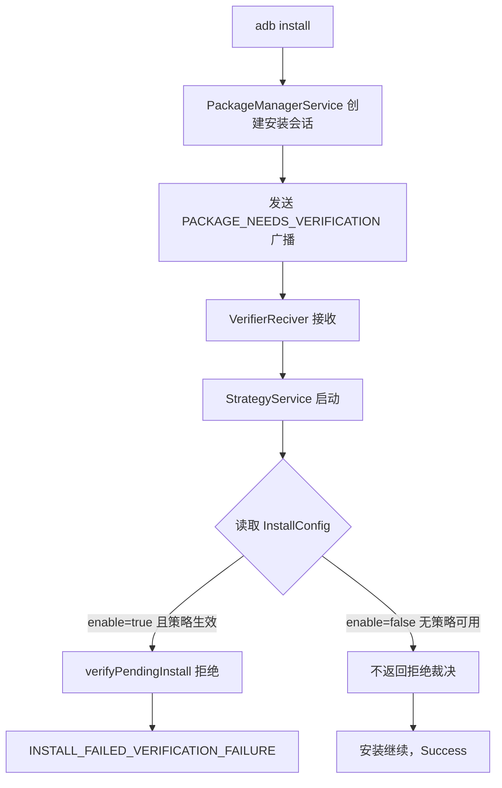

> 本文档记录一次针对 TCL 电视（mt5879 方案，Android 11）「ADB 无法安装应用，必须先禁用安装器」问题的完整排查过程与最终解法。
> **适用设备：** TCL 电视（mt5879_cn 方案，Android 11，其他 TCL/雷鸟机型可参考）
> **适用人群：** 会使用 ADB 的电视用户 / 运维玩家

---

## 1. 问题现象

TCL 电视通过 Wi-Fi ADB 连接后，安装应用直接报错：

```bash
adb connect 192.168.5.6

adb install xxx.apk
```

报错内容：

```text
adb.exe: failed to install xxx.apk: Failure [INSTALL_FAILED_VERIFICATION_FAILURE]
```

只有先禁用系统安装器 `com.android.packageinstaller` 才能安装；但安装完成后**必须重新启用**，否则电视无法开机。整个流程繁琐且有翻车风险。

> [!WARNING] 警告
> `com.android.packageinstaller` 是开机关键组件，任何时候都不要让电视在「安装器被禁用」的状态下重启。

---

## 2. 排查过程

### 2.1 缩小范围：排除 TCL 安全守护

先怀疑的是 TCL 安全守护 `com.tcl.guard`，但实测它的启停与拦截无关；只有禁用 `com.android.packageinstaller` 才能放行安装，说明拦截逻辑在安装器应用自身。

### 2.2 复现拦截并抓取日志

保持安装器启用状态，安装一个真实 APK 并抓取系统日志：

```bash
adb logcat -c

adb install -r xxx.apk

adb logcat -d > block.log
```

日志中出现关键线索：

```text
Start proc com.android.packageinstaller for broadcast
  {com.android.packageinstaller/com.android.packageinstaller.verifier.VerifierReciver}
Foreground service started ...: service com.android.packageinstaller/.verifier.StrategyService
Config:Grabber:InstallConfig: Currrent content from Db is ：[{"enable":"true","strategies":[...]}]
D ConfigProvider: feature:content://com.tcl.providers.config/InstallConfig
```

拦截者浮出水面：**TCL 在系统安装器里内置了一个验证组件**，其策略来自一个内容提供者。

### 2.3 拉取安装器 APK 分析

```bash
adb shell pm path com.android.packageinstaller

MSYS_NO_PATHCONV=1 adb pull /system/priv-app/PackageInstaller/PackageInstaller.apk .

unzip -o -q PackageInstaller.apk -d apk
```

提取 dex 字符串确认：

- `com.android.packageinstaller.verifier.VerifierReciver` 监听 `android.intent.action.PACKAGE_NEEDS_VERIFICATION`，持有 `android.permission.PACKAGE_VERIFICATION_AGENT` 权限（全系统仅它持有）；
- `StrategyService` 每次安装时从 `content://com.tcl.providers.config/InstallConfig` 读取策略 JSON。

查询该配置：

```bash
adb shell content query --uri content://com.tcl.providers.config/InstallConfig
```

```text
Row: 0 project_id=InstallConfig, config_content=[{"enable":"true","strategies":[
  {"name":"safeStrategy","enable":"true","priority":"0"},
  {"name":"blackListStrategy","enable":"true","packages":[],"priority":"1"},
  {"name":"thridStrategy","enable":"false","packages":[...],"priority":"2"},
  {"name":"launcherStrategy","enable":"true","packages":[],"priority":"3"},
  {"name":"overDueStrategy","enable":"true","packages":[],"priority":"4"},
  {"name":"pmStrategy","enable":"true","priority":"5"}]}]
```

> [!IMPORTANT] 重要
> 组件级禁用（`pm disable-user com.android.packageinstaller/.verifier.VerifierReciver`）会被系统拒绝（`Shell cannot change component state`），但 shell 对这个配置提供者**有写权限**——这就是突破口。

---

## 3. 拦截机制原理



要点：

| 组件 | 作用 |
|------|------|
| `com.android.packageinstaller` | TCL 改造的系统安装器，同时是开机关键组件 |
| `.verifier.VerifierReciver` | 接收系统安装验证广播 |
| `.verifier.StrategyService` | 按策略决定放行/拒绝 |
| `com.tcl.providers.config/InstallConfig` | 策略配置存储，shell 可读写 |

---

## 4. 永久放行方案

把 `InstallConfig` 的总开关改写为 `false`，验证器读不到可用策略即放行。**安装器全程保持启用，开机无影响，重启后依然生效。**

Git Bash：

```bash
adb shell "content update --uri content://com.tcl.providers.config/InstallConfig --bind 'config_content:s:{\"enable\"\\:\"false\"}' --where \"project_id='InstallConfig'\""
```

PowerShell：

```powershell
adb shell "content update --uri content://com.tcl.providers.config/InstallConfig --bind 'config_content:s:{`"enable`"\:`"false`"}' --where `"project_id='InstallConfig'`""
```

验证写入结果：

```bash
adb shell content query --uri content://com.tcl.providers.config/InstallConfig --projection config_content
```

输出应为：

```text
Row: 0 config_content={"enable":"false"}
```

> [!TIP] 建议
> 写入后如果电视上正有安装会话在跑，建议执行 `adb shell am force-stop com.android.packageinstaller` 让验证器进程重启、重新读取配置。

之后安装直接：

```bash
adb install xxx.apk
```

> [!NOTE] 提示
> `content` 命令的 `--bind` 参数按冒号分段解析，JSON 内的冒号必须写成 `\:` 转义，这是本方案最隐蔽的坑。

---

## 5. 恢复原始拦截

想恢复 TCL 原始策略时，把总开关改回 `true` 即可：

```bash
adb shell "content update --uri content://com.tcl.providers.config/InstallConfig --bind 'config_content:s:{\"enable\"\\:\"true\"}' --where \"project_id='InstallConfig'\""
```

原始配置全文（备份用）：

```json
[{"enable":"true","strategies":[{"name":"safeStrategy","enable":"true","priority":"0"},{"name":"blackListStrategy","enable":"true","packages":[],"priority":"1"},{"name":"thridStrategy","enable":"false","packages":["com.dangbeimarket","com.shafa.market","com.ant.store.appstore"],"priority":"2"},{"name":"launcherStrategy","enable":"true","packages":[],"priority":"3"},{"name":"overDueStrategy","enable":"true","packages":[],"priority":"4"},{"name":"pmStrategy","enable":"true","priority":"5"}]}]
```

---

## 6. 兜底方案：禁用-安装-恢复

若上述配置方案因固件更新失效，可回退到传统方案：禁用安装器 → 安装 → 恢复。

```bash
adb shell pm disable-user com.android.packageinstaller

adb install -r xxx.apk

adb shell pm enable com.android.packageinstaller
```

> [!CAUTION] 注意
> 禁用后务必确认恢复：`adb shell "dumpsys package com.android.packageinstaller"` 输出 `enabled=1` 才是启用状态（`enabled=3` 为禁用）。电视在安装器禁用状态下重启可能无法开机。

核心兜底逻辑（PowerShell 脚本要点）：

```powershell
try {
    adb shell pm disable-user com.android.packageinstaller
    adb install -r $apk
}
finally {
    adb shell pm enable com.android.packageinstaller
}
```

`try/finally` 保证即使安装失败、甚至 ADB 中途断线，恢复命令也会执行。

---

## 7. 故障排查

**Q：写入命令报 `Binding not well formed`？**

JSON 里的冒号没有转义。每个 `:` 必须写成 `\:`（Git Bash 中写作 `\\:`，PowerShell 中写作 `` \` `` + `:`）。

**Q：写入成功但仍报 `INSTALL_FAILED_VERIFICATION_FAILURE`？**

验证器进程缓存了旧配置，强制重启它：

```bash
adb shell am force-stop com.android.packageinstaller
```

**Q：过了一段时间又被拦截了？**

TCL 云端配置同步可能覆盖了本地配置，重新执行第 4 节的写入命令即可。可先用第 4 节的查询命令确认当前配置内容。

**Q：`adb devices` 显示 `unauthorized`？**

在电视屏幕上找到「允许 USB 调试」弹窗，勾选「一律允许」并确认；若电视无弹窗，重插网络 ADB 连接触发。

---

> **文档版本：** 2026-08-28
> **适用设备：** TCL 电视 mt5879_cn 方案（Android 11），其他 TCL/雷鸟机型可参考
> **适用平台：** Wi-Fi ADB / USB ADB
