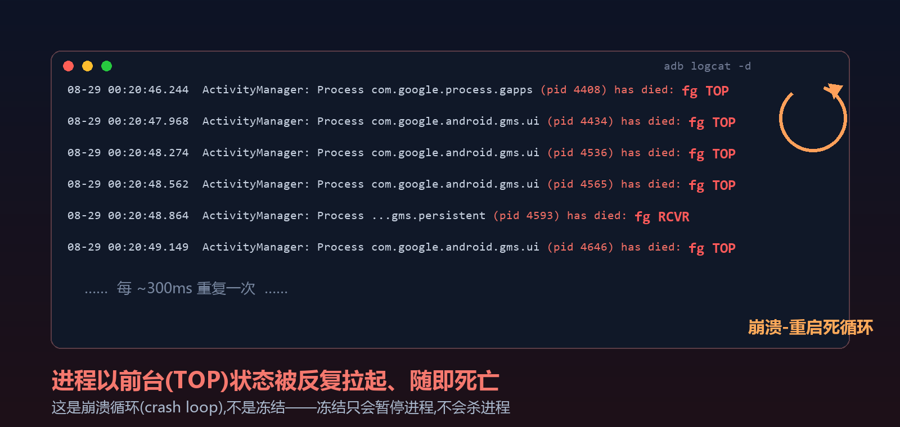
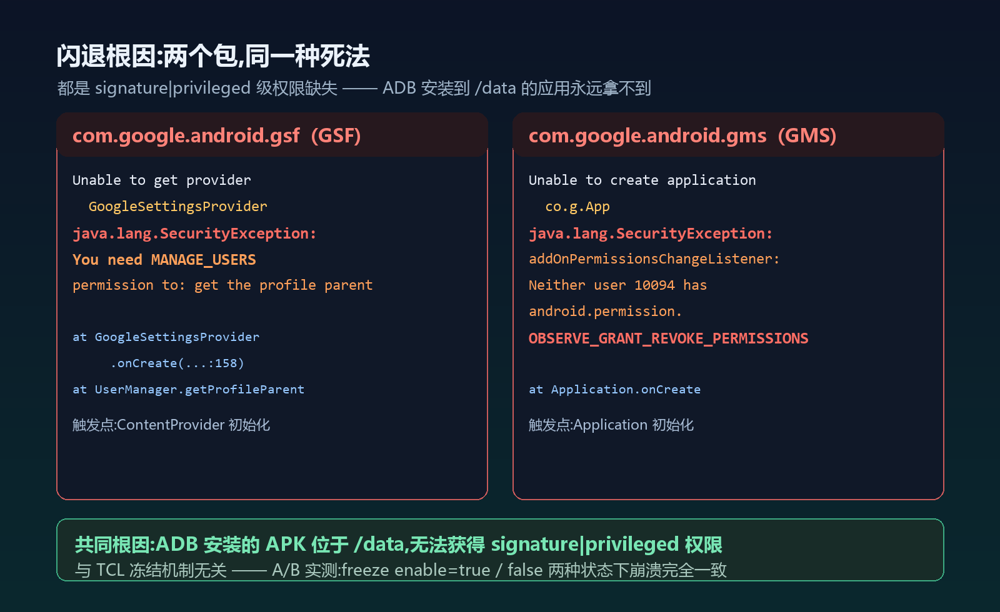
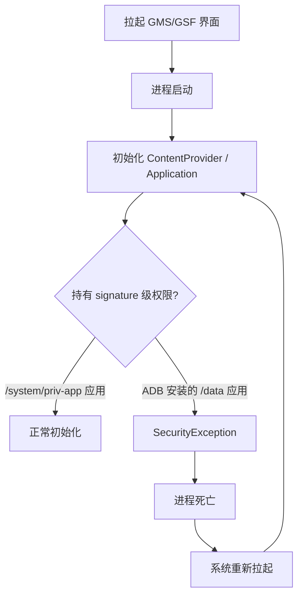

> 本文档记录 TCL 电视冻结 Google 相关进程的发现、确认结果、失败尝试，以及 2026-08-29 的续篇：freeze 配置写入打通与三件套闪退根因定位。  
> **适用设备：** TCL `tcl_mt5879_cn`
> **适用系统：** Android 11 / API 30，固件 V729
> **连接方式：** ADB over Wi-Fi

> [!WARNING] 结论（2026-08-29 更新）
> Google 三件套 APK 可以被系统识别并安装，但无法正常运行。**闪退根因已定位：ADB 安装的 APK 位于 `/data`，拿不到 `signature|privileged` 级权限，进程在初始化阶段必然崩溃，与冻结机制无关**（A/B 实测确认）。此前卡住的 `freeze` 配置写入也已打通，但它解决不了三件套的闪退。

---

## 1. 发现

通过 ADB 检查 TCL 电视运行状态、系统组件和固件内容时，发现 TCL 系统存在针对 Google 进程的冻结逻辑。

相关逻辑位于：

```text
system_ext/apex/com.tcl.tcore.apex
```

其中可以看到 `FreezeManager`、`TGuard`、冻结白名单以及 Google Play 相关字符串。TCL 系统还提供了配置入口：

```text
content://com.tcl.providers.config/freeze
```

---

## 2. 确认结果

`freeze` 配置是一个键值集合，完整结构如下：

```json
[
  {"name": "enable", "value": "true"},
  {"name": "debug", "value": "false"},
  {"name": "tcl_fastHibernate", "value": "true"},
  {"name": "tcl_fastHibernateTimeout", "value": "1500"},
  {"name": "tcl_fastHibernateDebug", "value": "false"},
  {"name": "freezeProcessList", "value": ["..."]},
  {"name": "fastFreezeProcessList", "value": ["..."]}
]
```

`freezeProcessList` 中确认包含以下 Google 相关进程：

```text
com.google.android.gms

com.android.vending:download_service

com.android.vending:instant_app_installer
```

这些进程分别涉及 Google Play services、Play Store 下载服务和即时应用安装服务。

> [!NOTE] 修正（2026-08-29）
> 最初把 `freezeProcessList` 理解为「待冻结名单」。但名单里同时存在 `com.tcl.settings`、`com.android.bluetooth`、`com.google.android.tvlauncher` 等 TCL 自家核心应用——冻结它们电视自己就无法工作。它更可能是**免冻结白名单**，即名单内进程受保护。该语义尚待反编译确认，但对本文结论无影响（见第 4 节，闪退与冻结无关）。

同时确认：

- 冻结实现位于 `tcore` apex 内的 `tcl-service.jar`，核心类为 `com.android.server.am.appfreeze.FreezeManager`、`TclFreezeConfigUpdater`，系统服务名为 `tguard`。
- `com.tcl.guard` 是 TCL 的守护组件，会参与进程管理。
- `com.tcl.providers.config` 是 TCL 配置提供者，不应当作为普通应用随意停用。
- Google 三件套包可以被 `pm path` 识别，说明 APK 安装本身成功。
- 安装成功不代表获得系统签名、特权权限或 Google 认证状态——**这句话正是后来定位到的闪退根因**。

---

## 3. 已进行的尝试

### 3.1 临时停用 `com.tcl.guard`

```bat
adb -s 192.168.5.2:5555 shell pm disable-user --user 0 com.tcl.guard
```

结果：`com.tcl.guard` 可以进入 `disabled-user` 状态，但 Google 三件套仍不能正常运行。之后已恢复：

```bat
adb -s 192.168.5.2:5555 shell pm enable --user 0 com.tcl.guard
```

### 3.2 安装 Google 三件套

针对设备的 Android 11、32 位 `armeabi-v7a` 和 Android TV 环境，尝试安装：

```text
com.google.android.gsf

com.google.android.gms 26.24.34

com.android.vending 52.0.20
```

结果：三个 APK 均可被系统识别，但 Play Store 无法正常进入，Google 相关进程也不能稳定运行。

### 3.3 修改 `freeze` 配置（2026-08-29 已打通）

最初普通 ADB shell 下的 JSON 写入没有成功，原始配置保持不变。

> [!TIP] 突破
> 失败原因是 `content` 命令的 `--bind` 参数**按冒号分段解析**，JSON 里的每个 `:` 都必须转义成 `\:`（Git Bash 中写作 `\\:`）。转义后写入成功：

```bash
J=$(cat /data/local/tmp/freeze.json)

E=$(echo "$J" | sed 's/:/\\\\:/g')

content update --uri content://com.tcl.providers.config/freeze --bind "config_content:s:$E" --where "project_id='freeze'"
```

用同样的方法可以查询和回写配置（原始配置已备份）。同一技巧也解决了另一台 TCL 电视的 ADB 安装拦截问题，见《[TCL/雷鸟电视 ADB 安装拦截排查与永久放行](/posts/tcl-tv-adb-install-unlock/)》。

### 3.4 查询或调用 TCL 特殊接口

尝试使用 `cmd feature` 等接口进一步查询或修改 TCL 配置。

结果：相关功能需要更高权限或 debug 模式，普通 ADB shell 无法完成写入。

### 3.5 修改系统组件或刷写固件

未执行以下高风险操作：

- 修改 `com.tcl.tcore.apex`。
- 修改 `FreezeManager` 或 `freezeProcessList`。
- 修改 `boot`、`system`、`vendor`、`product`、`system_ext` 分区。
- 刷入其他版本 TCL 固件。

原因：这些操作涉及系统签名、分区校验和变砖风险，且没有证据表明仅修改其中一处就能恢复 Google 三件套运行。

---

## 4. 闪退复现与根因定位（2026-08-29 续篇）

### 4.1 实验环境

在另一台同固件的 TCL 电视（`tcl_mt5879_cn`，`192.168.5.6:5555`）上完成：

1. 使用 MindTheGapps `11.0.0-arm-ATV`（匹配 Android 11 + armeabi-v7a + Android TV）。
2. 通过 ADB 安装 `GoogleServicesFramework.apk` 与 `PrebuiltGmsCorePano.apk`（即 `com.google.android.gms`），均安装成功。

### 4.2 触发方式

国内固件**开机后没有任何东西会拉起 GMS**：没有 Play Store 和 setup wizard 作为触发源，且 ADB 安装的包处于 stopped 状态，收不到开机广播。需要主动拉起 GMS 的可用 Activity（如 `com.google.android.gms/.ads.settings.AdsSettingsActivity`）。

### 4.3 现象：崩溃-重启死循环

进程以**前台（TOP）状态**被反复拉起、随即死亡，约 300ms 一次：



注意这不是冻结——冻结只会暂停进程，不会杀进程；这里的进程死因是自身初始化抛异常。

### 4.4 根因：signature|privileged 权限缺失

从 `dumpsys dropbox --print data_app_crash` 拿到完整堆栈，两个包各死于一个系统权限：



GSF 的崩溃堆栈（`GoogleSettingsProvider` 初始化）：

```text
java.lang.RuntimeException: Unable to get provider
    com.google.android.gsf.settings.GoogleSettingsProvider:
    java.lang.SecurityException: You need MANAGE_USERS permission to: get the profile parent
        at com.google.android.gsf.settings.GoogleSettingsProvider.onCreate(GoogleSettingsProvider.java:158)
        at UserManager.getProfileParent(UserManager.java:3564)
```

GMS 的崩溃堆栈（Application 初始化）：

```text
java.lang.RuntimeException: Unable to create application co.g.App:
    java.lang.SecurityException:
    addOnPermissionsChangeListener: Neither user 10094 nor current process
    has android.permission.OBSERVE_GRANT_REVOKE_PERMISSIONS
```

`MANAGE_USERS` 与 `OBSERVE_GRANT_REVOKE_PERMISSIONS` 都是 `signature|privileged` 级权限，只能授予 `/system/priv-app` 内、且在 privileged-permissions 白名单中的应用。ADB 安装的 APK 位于 `/data`，**永远拿不到这两个权限**，于是 provider / Application 初始化必然抛 `SecurityException`，系统反复拉起 → 无限闪退。



### 4.5 A/B 验证：与冻结无关

控制变量实验——同一台电视、同一组 APK、只切换 `freeze` 配置：

| freeze enable | 现象 |
|------|------|
| `true`（原始值） | 拉起即闪退，300ms 崩溃循环 |
| `false`（冻结关闭） | **完全相同的闪退**，堆栈一致 |

结论：三件套的闪退与冻结机制无关，是确定性的权限缺失，ADB 层面无解。

---

## 5. 对冻结机制的再认识

- `freeze` 配置可被 shell 读写（冒号转义突破后），配置修改在重启后依然生效。
- 开机时 `FreezeManager` 确实按配置工作（日志可见 `doUnFreeze`、`FreezeNameList: policy : freezeProcessList ... inSpecifyList : true/false`）。
- 但 `freezeProcessList` 的语义存疑：名单内含大量 TCL 核心应用，更接近免冻结白名单；且三件套的死亡方式（前台状态主动死亡）与冻结（暂停不杀）行为特征不符。
- 国内固件开机后不会自发拉起 GMS，「开机闪退」在这台电视上不会自发发生——只有主动打开依赖 Google 服务的界面才会触发。

---

## 6. 最终结论

1. TCL 固件确实存在进程冻结机制（`FreezeManager` / `tguard`），配置可读写，但其语义更接近白名单，且**与三件套闪退无关**（A/B 实测确认）。
2. 三件套闪退的根因是 `signature|privileged` 级权限缺失（GSF 缺 `MANAGE_USERS`，GMS 缺 `OBSERVE_GRANT_REVOKE_PERMISSIONS`），ADB 安装的 `/data` 应用拿不到这些权限。
3. 在不 root、不修改系统分区的前提下，三件套无法正常工作——修复必须将 GMS/GSF 放入 `/system/priv-app` 并加入特权权限白名单。
4. ADB 能做到的极限：安装成功（需先解除 TCL 的安装拦截，见《[TCL/雷鸟电视 ADB 安装拦截排查与永久放行](/posts/tcl-tv-adb-install-unlock/)》）、配置接口自由读写；无法赋予系统特权。
5. `com.tcl.guard` 只是守护组件之一，停用它不能改变任何结果。

---

> **文档版本：** 2026-08-29
> **记录状态：** freeze 配置写入已打通；闪退根因已定位（权限缺失），ADB 层面无解
