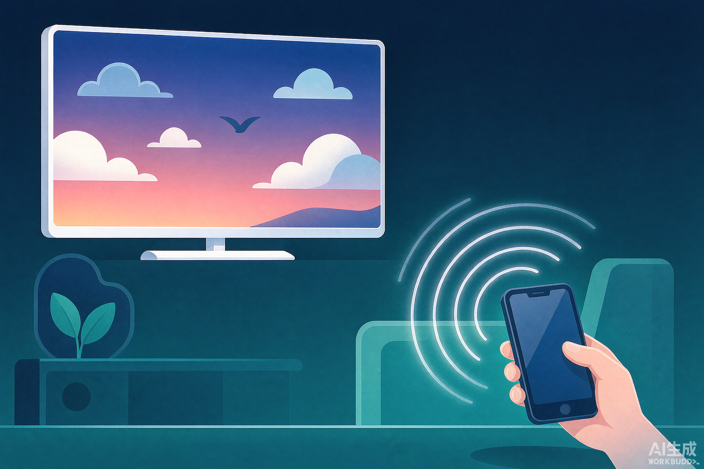
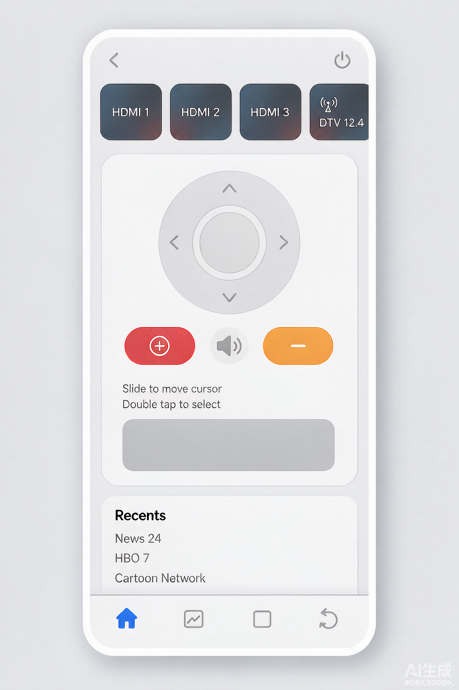
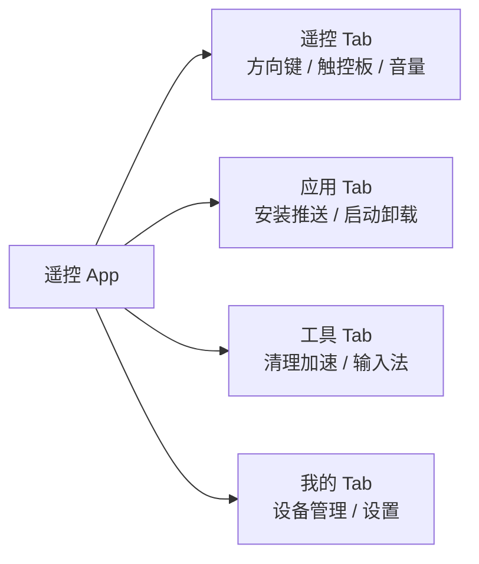
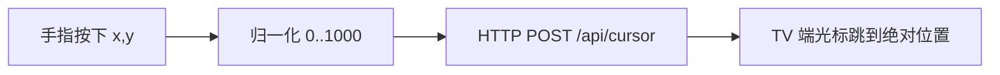
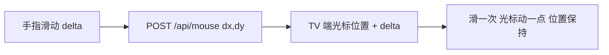
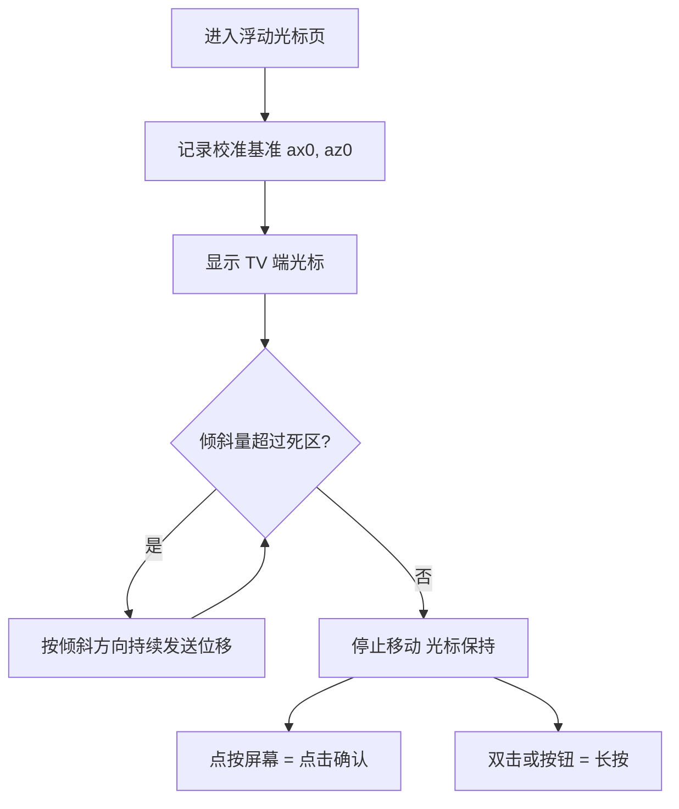

> 本文档面向想要设计「手机遥控电视」类 App 的产品与开发人员，涵盖设计目标、视觉语言、信息架构、核心交互与踩坑经验。
> **适用系统：** Android 8.0+（TV 端）/ Android 8.0+（手机端）
> **适用平台：** 智能电视 / 电视盒子 + 安卓手机



---

## 1. 为什么要重新设计遥控器

智能电视的遥控器越做越短：按键从三十多个砍到十几个，最后只剩一个十字键加几个功能键。但电视上的内容越来越复杂——应用商店、设置菜单、登录页面、验证码输入框，都在逼着用户在「十字键一格一格挪」里浪费时间。

实体遥控器的物理极限暴露无遗：

| 场景 | 实体遥控器 | 手机遥控 |
|------|-----------|---------|
| 搜索片名 | 十字键逐字选择 | 直接打字 |
| 安装应用 | 逐格导航到安装按钮 | 手机上点一下推送 |
| 输入密码 | 虚拟键盘逐字符移动 | 手机键盘直接输入 |
| 精准点击小按钮 | 几乎不可能 | 触控板 + 光标 |

于是我们决定做一款手机遥控 Android TV 的 App，对标市面上的八爪鱼遥控：**TV 端 + 手机端双端架构**，手机负责输入与展示，TV 端负责接收指令并注入系统事件。

---

## 2. 设计目标与约束

设计开始前，先把约束摆清楚。约束不是敌人，它决定了方案的下限。

### 2.1 产品功能范围

六大核心功能一个都不能少：

1. 基础遥控（方向、确认、返回、主页、菜单、音量、电源）
2. App 安装推送
3. 远程输入法（IME）
4. 电视清理 / 加速
5. 远程应用管理（启动 / 卸载）
6. 基于传感器的 TV 端浮动光标

### 2.2 技术约束

> [!IMPORTANT] 重要
> TV 端无法开启 Accessibility 服务（部分厂商环境限制），ADB 路线也被明确排除。输入注入必须依赖 AccessibilityService 或厂商私有插件，这直接决定了浮动光标必须做成「虚拟光标」而非系统鼠标。

- 手机与电视在同一局域网，走 HTTP（TCP）+ UDP 自研协议
- TV 端覆盖层窗口必须由 AccessibilityService 上下文创建
- 传感器数据驱动光标，位移采用 0..1000 归一化坐标，TV 端按分辨率缩放

### 2.3 设计目标

一句话：**让用户拿起手机的三秒内，就能完成一次电视操作。**

---

## 3. 设计语言：为什么选 iOS 16 风格

遥控器 App 是一个「工具」，工具的最高境界是被忽略——用户看的是电视，不是手机。因此视觉上追求极简、安静、零学习成本。

最终确定的设计规范：

| 元素 | 规范 |
|------|------|
| 背景色 | `#F2F2F7`（iOS 分组式灰底） |
| 卡片圆角 | 14dp，白色卡片浮在灰底上 |
| 图标 | 线性图标（stroke 风格），不用填充图标 |
| 导航 | 底部 Tab Bar，四个入口 |
| 特效 | 毛玻璃（半透明 + 模糊），仅用于顶栏与 Tab Bar |
| 阴影 | 无阴影，靠灰底与白卡的对比分层 |

> [!WARNING] 警告
> 明确禁用一切 Material Design 元素：FAB 悬浮按钮、ripple 水波纹、hamburger 抽屉菜单、投影卡片。这些元素一旦混入，整个界面会立刻「变味」，视觉一致性是这类工具 App 的生命线。

设计语言统一的好处立竿见影：遥控页、应用页、工具页、我的页四个页面，用户在任何一页都能凭肌肉记忆找到返回方式与操作入口。



---

## 4. 信息架构：四个底部 Tab

信息架构遵循「高频前置、低频收敛」原则：



- **遥控 Tab**：默认首屏，打开 App 即用，承载 80% 的高频操作
- **应用 Tab**：TV 端应用列表镜像，支持远程启动、卸载、推送安装
- **工具 Tab**：清理加速、远程输入法等中低频功能
- **我的 Tab**：设备连接状态、版本信息、设置项

底部 Tab Bar 采用毛玻璃效果，内容滚动时图标下若隐若现，既保持层次又不喧宾夺主。

---

## 5. 遥控页：一块屏幕装下整个遥控器

遥控页是整个 App 的核心，布局从上到下分为四层：

1. **设备状态条**：当前连接的电视名称与信号状态，一眼确认「我连的是哪台电视」
2. **触控板区**：大面积手势区域，滑动即移动 TV 端光标，点按即确认
3. **十字键区**：圆形 D-pad，中心 OK 键，四向箭头线性图标
4. **功能键排**：返回、主页、菜单、音量加减、电源，一行排列

### 5.1 按键布局的取舍

实体遥控器按 键隔离 布局，手机屏幕按 使用频率 布局：

- 方向与确认是最高频操作，占据视觉中心
- 音量键做成横向长条，天然对应「左右/上下滑动调音量」的心智模型
- 电源键放在角落，防止误触——误触电源把电视关了，是这类 App 差评的重灾区

> [!TIP] 建议
> 所有按键的点击热区不小于 48dp，宁可视觉留白多一点，也不要让用户在大屏手机上出现「按不中」的情况。

### 5.2 按键到协议的映射

每个按键最终都会转成一条 HTTP 指令发往 TV 端：

```json
{
  "type": "key",
  "action": "down_up",
  "keycode": 82
}
```

常用键值映射：

| 手机按键 | keycode | 说明 |
|---------|---------|------|
| 返回 | 4 | KEYCODE_BACK |
| 主页 | 3 | KEYCODE_HOME |
| 菜单 | 82 | KEYCODE_MENU |
| 音量加 | 24 | KEYCODE_VOLUME_UP |
| 音量减 | 25 | KEYCODE_VOLUME_DOWN |
| 电源 | 26 | KEYCODE_POWER |

---

## 6. 触控板：从绝对坐标到相对位移

触控板是设计迭代中最典型的一次「推倒重来」。

### 6.1 第一版：绝对坐标（失败）

最初的设计是把手指位置直接映射到 TV 屏幕坐标：手指按在触控板左上角，TV 端光标就出现在屏幕左上角。



真机测试发现致命问题：**触控板面积只有巴掌大，映射到 55 寸电视上，精度完全不够**——想点一个设置按钮，手指 1mm 的抖动在电视上就是几十像素的偏移，根本点不中。

### 6.2 第二版：相对位移 + 虚拟鼠标（成功）

改为笔记本电脑触控板的心智模型：**TV 端自己维护一个光标位置，手机只上报位移量**。



| 对比项 | 绝对坐标 | 相对位移 |
|--------|---------|---------|
| 精度 | 手指抖动被放大 | 多滑几次即可微调 |
| 心智模型 | 直接点屏幕 | 笔记本触控板 |
| 抬手后光标 | 跟随消失 | 保持原位 |
| 实现复杂度 | 低 | 中（TV 端维护光标） |

协议设计：

```json
{
  "dx": 120,
  "dy": -45,
  "show": true
}
```

- `dx` / `dy`：0..1000 归一化相对位移，TV 端按屏幕分辨率缩放为像素
- `show`：`true` 显示光标，`false` 隐藏，缺省保持当前状态

抬手后光标保持原位这一点尤为关键——用户可以分多次滑动，把光标「挪」到目标上再点按确认，这正是触控板体验的精髓。

---

## 7. 浮动光标：倾斜手机即可移动光标

触控板解决了「精准」，但还有更极致的输入方式：**手机拿起来，往哪边倾，光标往哪边走**。

### 7.1 传感器选型

手机竖直持握时，加速度计三个轴的物理含义：

| 轴 | 竖直持握时含义 |
|----|---------------|
| X 轴 (ax) | 左右倾斜量 |
| Y 轴 (ay) | 重力（约 9.8 m/s²） |
| Z 轴 (az) | 前后倾斜量 |

光标速度映射：

$$
dx = (a_x - a_{x0}) \cdot k, \quad dy = (a_z - a_{z0}) \cdot k
$$

其中 $a_{x0}$、$a_{z0}$ 是校准基准（开始控制时记录），$k$ 是灵敏度系数。

> [!NOTE] 提示
> 不用陀螺仪（TYPE_ROTATION_VECTOR）而用加速度计（TYPE_ACCELEROMETER），是因为倾斜角度比角速度更直观：手机保持某个倾斜角，光标就持续匀速移动，松回水平则停止，符合「指哪打哪」的直觉。

### 7.2 防抖设计

手持必然有抖动，两个参数直接决定手感：

- **死区**：倾斜量小于 0.6 m/s² 时视为静止，过滤手部微抖
- **灵敏度系数**：倾斜 1 m/s² 对应光标移动速度，当前取值 4 倍基准灵敏度

完整控制流程：



### 7.3 TV 端光标渲染

TV 端用 `TYPE_ACCESSIBILITY_OVERLAY` 窗口绘制光标：白色圆形主体 + 深色描边 + 中心蓝点 + 柔和光晕，直径 40px，在深浅背景上都能看清。

> [!CAUTION] 注意
> `TYPE_ACCESSIBILITY_OVERLAY` 窗口必须用 AccessibilityService 的上下文创建，用 Application Context 创建的窗口不会显示，且不会抛异常——这是最难排查的一类「静默失败」。

---

## 8. 设计规范落地清单

为保证四个页面视觉一致，落地时逐条对照检查：

- [x] 全局背景 `#F2F2F7`，卡片白色、圆角 14dp
- [x] 图标全部线性风格，笔画粗细统一
- [x] 底部 Tab Bar 毛玻璃，四个入口图标 + 文字
- [x] 无 FAB、无 ripple、无 hamburger、无投影
- [x] 按键热区 ≥ 48dp
- [x] 电源等危险操作与常规操作区隔开
- [x] 页面标题与状态栏留出安全距离，不与系统状态栏重叠
- [x] 顶栏显示连接状态，任何页面都能确认连接是否正常

---

## 9. 踩坑与经验

> [!WARNING] 警告
> 以下是真机调试中付出过代价的经验，做同类 App 时可以直接绕开。

1. **光标窗口「静默失败」**：Application Context 创建 overlay 窗口不报错但不显示，必须用 Service Context；`WindowManager.addView` 还必须在主线程执行，HTTP 工作线程直接调用会偶发崩溃。

2. **重装 APK 后无障碍服务被重置**：TV 端重装后服务进入 Crashed 状态，需要完整重置序列——移除服务 → 禁用 accessibility → force-stop → 重新添加 → 启用。

3. **菜单键无焦点可回退**：部分界面没有焦点节点，菜单指令应回退为在屏幕中心派发长按手势，否则用户会觉得「菜单键坏了」。

4. **状态栏与标题重叠**：未处理 insets 时页面顶部内容会钻到系统状态栏底下，需统一处理状态栏安全距离。

5. **触控板精度**：任何把「手指位置」直接映射到「大屏坐标」的方案都会死于精度不足，相对位移是唯一出路。

---

## 10. 总结

设计一款遥控器 App，表面上是画界面，本质上是回答三个问题：

- **用户在什么姿势下用它**——决定了按键布局与热区大小
- **电视端能做到什么**——决定了交互方案的技术边界（虚拟光标 vs 系统鼠标）
- **什么样的光标移动符合直觉**——决定了相对位移、死区、倾斜控制这些细节

iOS 16 风格解决的是「看起来对」，相对位移触控板和倾斜光标解决的是「用起来对」。工具类 App 的设计没有炫技空间，把每一次点击、每一次滑动做到符合直觉，就是最好的设计。

---

> **文档版本：** 2026-08-24
> **适用系统：** Android 8.0+（TV 端 / 手机端）
> **适用平台：** 智能电视 / 电视盒子 + 安卓手机
