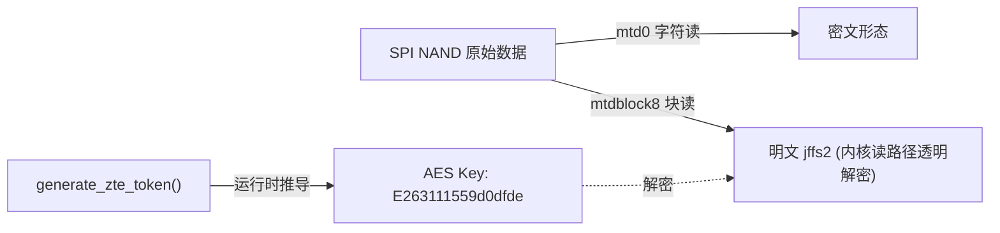
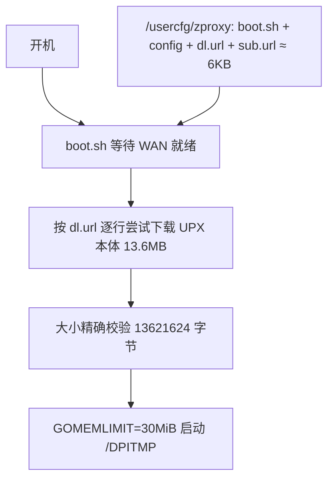

> 本文档面向持有中兴 ZXHN E2631（巡天AX3000）且有 telnet 权限的用户，涵盖固件加密分析、mihomo 代理移植、部署与使用全流程。
> **适用设备：** 中兴 ZXHN E2631（巡天AX3000，ZX279128S 平台）
> **适用系统：** 原厂固件（Linux 4.1.25，2025-09 版实测通过）
> **风险提示：** 涉及分区级读写操作，操作前务必备份全片闪存

---

## 一、固件解密分析（完整逆向记录）

### 1.1 硬件概况

| 项目 | 参数 |
|------|------|
| SoC | 中兴 ZX279128S（双核 Cortex-A9 rev1，part 0xc09） |
| CPU 特性 | 无 idiv 硬件除法、无 VFP/NEON（软浮点必须） |
| 内存 | **实际可用 225MB**（DTB 模板写 512MB；实测 MemTotal 225,324kB，系统基线已用约 140MB，开机可用仅 ~94MB） |
| 闪存 | 128MB SPI NAND（去 OOB 后 128MiB） |
| 内核 | Linux 4.1.25 #2 SMP（2025-09-25 版实测） |
| WiFi | MT7916（AX3000） |
| busybox | v1.17.2 精简版（无 dd skip/head/tail/od/env/pidof/timeout 新语法） |

> [!WARNING] 警告
> 两个决定成败的硬件事实：
> ① Cortex-A9 没有 idiv 指令，所有 GOARM=7 的 Go 程序（含 mihomo 官方 armv7 版）直接 `Illegal instruction`，**必须用 GOARM=5 版本**；
> ② **这台机器的内存预算只有 ~94MB**（225MB 减去系统基线 140MB）。任何"解压到内存盘再运行"的方案都要把本体大小计进预算，46MB 的解压体积是不可承受的。本文的内存优化（第二章）就是围绕这个数字展开的。

### 1.2 分区布局实测

分区表硬编码在内核中。2025 版 kernel1 按实际内核大小动态调整，后续分区依次排列：

```text
mtd6  kernel1      0x00700000  3.4MB    明文 uImage (zImage+DTB)
mtd7  kernel2      0x2300000   28MB     备份槽
mtd8  rootfs       0x00A40000  18.9MB   AES 加密 jffs2
mtd13 UNIFIED      0x6E00000   1MB      rw
mtd9  UUPlugin     0x6F00000   5MB      rw
mtd12 DPIPlugin    0x7400000   3MB      rw
mtd14 JDXBPLUGIN   0x7700000   1.5MB    rw
mtd10 owdptsbin    0x7900000   0.625MB  rw
mtd11 status       0x7A00000   5MB      rw
```

> [!IMPORTANT] 重要
> 2024 版与 2025 版固件分区布局**完全不同**（2024 的 rootfs 在 0xD80000 且 kernel2 区间是 rootfs 的一部分）。权威来源是 sysfs：`cat /sys/class/mtd/mtdN/offset`，勿信网上旧表。

### 1.3 加密方案与密钥推导

rootfs 使用 **AES-128-ECB**（无 IV，16 字节块独立）。密钥不落盘，由内核启动时从两个硬编码字符串推导：

```text
素材:   "E2631" (型号) + "edfd0d95511" (11位hex)
拼接:   sprintf(token, "%s%s", ...) → "E2631edfd0d95511"
反转:   下标 5..9 与 15..11 交换
结果:   "E263111559d0dfde"  ← AES-128 密钥 (16字节 ASCII)
```

推导代码位于内核 `generate_zte_token`（vaddr 0xc000c348，2024 版逆向），2025 版密钥素材相同（内核 Image 0x52f484 处可见 `E2631edfd0d95511`）。



验证方法（离线）：对 rootfs 首块做 `AES-ECB decrypt`，得到 `85 19 01 e0`（jffs2 dirent 节点魔数+类型）即密钥正确。

### 1.4 读写路径的不对称性（关键发现）

| 操作 | 行为 |
|------|------|
| mtdblock8 读（经挂载点） | 返回解密明文 |
| mtd0 字符读 | 返回原始密文 |
| mtdblock0/mtd0 裸写 rootfs 区 | **厂商虚拟层临时视图，重启丢弃** |
| jffs2 挂载点写（RW 分区） | 真正持久化 ✓ |

> [!CAUTION] 注意
> 这解释了为什么"往 flash 裸写补丁节点"在写后校验通过、重启后却消失。运行系统中修改 rootfs 无可行通道；持久化只能走 RW 分区的挂载点。

### 1.5 jffs2 节点结构（修改/校验用）

```text
dirent:  hdr_crc=crc32(node[0:8])  node_crc=crc32(node[0:32])  name_crc=crc32(name)
inode:   node_crc=crc32(node[0:60]) data_crc=crc32(data@68)
         CRC 算法: binascii.crc32(d, -1) ^ -1  (mtd_crc)
```

### 1.6 busybox 与工具链陷阱

| 陷阱 | 表现 | 对策 |
|------|------|------|
| 无 dd skip | 读偏移失败 | 自带静态 musl busybox（v10 方案已不需要） |
| 无 env 命令 | `setsid env VAR=x cmd` 报 can't execute 'env' | 用 `sh -c 'export VAR=x; exec cmd'` 包装 |
| setsid 不认 VAR=val 前缀 | `setsid GOMEMLIMIT=... cmd` 把变量名当程序名 | 同上，脚本内 export 后 exec |
| 无 pidof / timeout 老语法 | 按 pidof 杀进程是空操作；timeout 要 `-t 秒` | ps + awk 取 pid；`timeout -t N cmd` |
| telnet 会话退出杀后台任务 | 直接 `cmd &` 随会话消失 | `(setsid script.sh &)` |
| md5sum 大文件崩溃 | 管道校验失败 | 先落文件再 md5sum |
| /tmp 被系统周期清空 | 工具文件神秘消失 | 工具放 /usercfg 持久分区 |
| **mihomo SAFE_PATHS 限制** | provider 的 path 不在 `-d` 目录内直接 fatal | path 写**相对路径** `providers/sub1.yaml` |

---

## 二、方案设计与内存危机复盘

### 2.1 为什么不用 OpenWrt

ZX279128S 的以太网交换（NPP）、SPI NAND 加密层、WiFi 整合均为中兴闭源内核组件，社区无对应 OpenWrt target，移植工作量以月计且 WiFi 部分基本无解。原厂固件功能完整，保留它、在用户态外挂代理是唯一现实路径。

### 2.2 内存爆满事故（旧方案复盘）

> [!CAUTION] 事故记录
> 旧方案：mihomo armv5 xz 包（10.9MB）拆三片存插件分区，开机 `xzcat` 解压到 /DPITMP 内存盘（解压后 **46MB**），裸跑不限内存。
> 实际后果：系统基线 140MB + 本体 46MB + 运行 RSS ~60MB ≈ **246MB，逼近 225MB 物理上限**。运行一段时间后内存耗尽，**所有节点全部超时**，代理不可用。

旧方案的错误在于把"能启动"当成了"能常驻"：解压产物 46MB 常驻内存盘（tmpfs 的每一页都是真实内存），加上 Go 运行时无限制的堆增长，256MB 的小内存设备必然爆。

### 2.3 内存优化三板斧

| 优化 | 手段 | 节省 |
|------|------|------|
| 本体免解压 | **UPX 3.96 打包 armv5 二进制**（`--best` 默认 NRV2E 算法），46MB → **13.6MB**，内核按页解压执行，内存盘只占 13.6MB | **-32MB** |
| Go 堆压顶 | 启动环境变量 **`GOMEMLIMIT=30MiB GOGC=40`**，强制 GC 把堆压在 30MiB 内（代价是 CPU 略增） | RSS 从 60MB → **~50MB 稳定不涨** |
| 砍面板加载 | 去掉 `external-ui`，用在线面板 board.zash.run.place（本地 UI 文件不占内存盘） | -2MB |

**UPX 打包的三个坑（每个都实测撞过）：**

1. **必须打包 GOARM=5 的二进制**。用 armv7 版打包出来的 UPX 文件照样 SIGILL——问题在内核代码不在 stub；
2. **必须用 UPX 3.96 + 默认 NRV2E**。UPX 5.x 打包直接 `Illegal instruction`；`--lzma` 打包 `Segmentation fault`（stub 不兼容本机软浮点 A9）；
3. 打包命令：`upx-3.96 --best -o mihomo_upx mihomo_armv5`，产出 13,621,624 字节。

### 2.4 新架构：开机网络加载（v10，不分片）

本体只有 13.6MB，干脆**不存路由器里**：设备上只保留几 KB 的脚本和配置，每次开机自动从网络拉取本体到内存盘运行。换 mihomo 版本只需更新下载地址，分区零占用。



| 设计点 | 说明 |
|--------|------|
| mihomo 版本 | v1.19.30 linux-armv5（GOARM=5 软浮点）+ UPX 3.96 |
| 本地持久占用 | **约 6KB**（boot.sh / config_base.yaml / dl.url / sub.url，全在 /usercfg） |
| 运行位置 | /DPITMP（60MB 内存盘，仅占 13.6MB） |
| 内存预算 | 基线 140 + 本体 13.6 + RSS 50 ≈ **204MB / 225MB，可用余量 ~43MB 稳定** |
| 下载源 | dl.url 每行一个候选地址依次回退（GitHub Release / 镜像加速 / 自有服务器） |
| 面板 | 在线面板 board.zash.run.place（不占本机资源） |
| 工具依赖 | 无（原厂 busybox 的 cat/curl/sed 就够） |
| 自启动 | 手动一行命令（见第五章）；升级包注入钩子路线见 5.2 |

> [!NOTE] 提示
> 离线备选方案（无外网环境）：把 13.6MB 本体按各分区空闲精确裁成 4 片存插件分区（UUPlugin 4.5MB / status 4.5MB / DPIPlugin 2.6MB / usercfg 1.4MB），boot.sh 用 cat 拼接——其余逻辑完全相同，只是把 fetch 换成 cat。

---

## 三、部署步骤（MobaXterm 全图形操作）

> [!NOTE] 提示
> 配套文件见 `MobaXterm部署包/` 目录：boot.sh、config_base.yaml、dl.url、sub.url——一共 4 个小文件，本地持久占用约 6KB。

### 3.1 准备工作

1. 把打包好的 `mihomo_armv5_upx`（13,621,624 字节）传到某个可被路由器 HTTP 下载的位置：GitHub Release（国内直连不稳时在 dl.url 里加一行 ghproxy 类镜像地址）或自有服务器/NAS；
2. 把地址填进 `dl.url`（每行一个，从上到下依次尝试）；
3. MobaXterm：Session → **Telnet** → 路由器 IP → 登录（admin）；**Tools → HTTP Server** → 目录选 `MobaXterm部署包/上传到路由器的文件` → 端口 **8000** → Start；记下 PC 局域网 IP（示例 192.168.1.100）。

### 3.2 上传脚本与配置（路由器侧）

```bash
mkdir -p /usercfg/zproxy
```

```bash
curl -o /usercfg/zproxy/boot.sh http://192.168.1.100:8000/boot.sh
```

```bash
curl -o /usercfg/zproxy/config_base.yaml http://192.168.1.100:8000/config_base.yaml
```

```bash
curl -o /usercfg/zproxy/dl.url http://192.168.1.100:8000/dl.url
```

```bash
echo "https://你的Clash订阅URL" > /usercfg/zproxy/sub.url
```

```bash
chmod +x /usercfg/zproxy/boot.sh
```

### 3.3 config_base.yaml 关键内容

```yaml
mixed-port: 7890
external-controller: 0.0.0.0:9090
secret: ""
mode: rule
allow-lan: true
unified-delay: true
tcp-concurrent: true
profile:
  store-selected: true
proxy-providers:
  sub1:
    type: http
    url: "__SUB_URL__"
    interval: 86400
    path: providers/sub1.yaml     # 必须相对路径 (SAFE_PATHS 限制)
    health-check:
      enable: false
proxy-groups:
  - name: PROXY
    type: select
    use: [sub1]
  - name: AUTO
    type: url-test
    use: [sub1]
    url: https://www.gstatic.com/generate_204
    interval: 900
    tolerance: 50
rules:
  - IP-CIDR,192.168.0.0/16,DIRECT,no-resolve
  - MATCH,PROXY
```

> [!IMPORTANT] 重要
> `path` 必须写**相对路径**。mihomo v1.19.30 的 SAFE_PATHS 机制要求 provider 落盘位置在 `-d` 主目录内，写绝对路径（如 /tmp/...）直接 `fatal: path is not subpath of home directory`。
> 不配置 `external-ui`，用在线面板（见 4.3），本机不存 UI 文件。

### 3.4 boot.sh 启动脚本核心逻辑

```bash
fetch_mihomo() {
    # dl.url 每行一个候选地址, 依次尝试, 大小精确匹配才算成功
    while read -r U; do
        case "$U" in http*) ;; *) continue ;; esac
        curl -s --max-time 300 --connect-timeout 15 -o $ZDIR/mihomo.part "$U"
        SZ=$(wc -c < $ZDIR/mihomo.part 2>/dev/null)
        [ "$SZ" = "$MIHOMO_SIZE" ] && { mv $ZDIR/mihomo.part $ZDIR/mihomo; return 0; }
        rm -f $ZDIR/mihomo.part
    done < $DLURL
    return 1
}

start_mihomo() {
    # 精简 busybox 无 env 且 setsid 不认 VAR=val, 用 sh -c 包装
    printf '#!/bin/sh\nexport GOMEMLIMIT=30MiB GOGC=40\nexec %s/mihomo -d %s -f %s/config.yaml\n' \
        $ZDIR $ZDIR $ZDIR > $ZDIR/run.sh
    chmod +x $ZDIR/run.sh
    ( setsid $ZDIR/run.sh > $ZDIR/mihomo.log 2>&1 & )
    # UPX 解压在内存紧张时可达 10-20 秒, 轮询等待进程出现
    i=0
    while [ $i -lt 10 ]; do
        sleep 2
        ps | grep '[m]ihomo' | grep -v grep | awk '{print $1}' > $PIDF
        [ -s $PIDF ] && break
        i=$((i+1))
    done
}
```

> [!IMPORTANT] 重要
> `GOMEMLIMIT=30MiB GOGC=40` 是**内存不爆的关键**，必须通过环境变量传入且不能省略。三件套坑：无 `env` 命令、`setsid` 不认 `VAR=val` 前缀、telnet 退出杀后台——所以用"脚本内 export + exec + setsid"的组合。等进程出现必须**轮询**（不能只等 2 秒，UPX 解压在内存紧张时可达 10-20 秒）。

---

## 四、使用指南

### 4.1 启动 / 停止

```bash
/usercfg/zproxy/boot.sh start
```

```bash
/usercfg/zproxy/boot.sh stop
```

```bash
/usercfg/zproxy/boot.sh status
```

启动后自动：等待 WAN → 按 dl.url 拉取本体（首次约 1-3 分钟）→ 大小校验 → 等待 WAN → 生成配置 → GOMEMLIMIT 压顶启动（mixed-port 手动代理模式）。本体已校验存在时跳过下载，restart 很快。

### 4.2 导入订阅 / 更换程序版本

```bash
echo "https://你的Clash订阅URL" > /usercfg/zproxy/sub.url
```

```bash
/usercfg/zproxy/boot.sh restart
```

换 mihomo 版本：本地重新 UPX 打包 → 传到下载源 → 覆盖 dl.url 即可（改 `MIHOMO_SIZE` 同步新字节数）。

### 4.3 面板

| 方式 | 地址 | 说明 |
|------|------|------|
| 在线面板 | https://board.zash.run.place | 添加控制器 http://路由器IP:9090 |

面板内可切节点、看流量、测延迟。HTTPS 在线面板连 HTTP 控制器时浏览器会拦混合内容，点地址栏盾牌图标允许即可。

### 4.4 内存验收（部署后建议做一次）

```bash
ps | grep mihomo
```

```bash
grep -E "MemFree|MemAvailable" /proc/meminfo
```

合格标准：RSS 约 50MB 且**长时间不增长**；MemAvailable 稳定在 35MB 以上。若 RSS 持续上涨，检查启动环境里 `GOMEMLIMIT` 是否生效（`cat /DPITMP/zproxy/run.sh` 应有 export 行）。

---

## 五、自启动方案

### 5.1 现状：手动一行命令

中兴原厂插件守护进程（uuplugind 等）有数据库状态门控，空降脚本不会被自动执行（桥接模式下更是直接跳过）。当前方案重启后手动启动：

```bash
telnet 路由器IP
```

```bash
/usercfg/zproxy/boot.sh start
```

> [!NOTE] 提示
> 脚本和配置已持久化在 /usercfg，重启不丢；本体开机自动拉取。路由器日常不重启的话，启动一次就一直有效。

### 5.2 进阶：官方升级包注入钩子（已验证格式）

通过官方 Web 升级通道（supgrade.html）刷入"加了一行钩子"的官方固件包，可以彻底解决自启。逆向结论：

- 官方升级包与 SR1010 同构（outer magic `99999999 44444444...` + ver_header），当前渠道下发的包**本身就是免签名的**（header_offset=0，VerifySign 跳过）；
- 包内 rootfs 用同一把 AES-128-ECB 密钥（`E263111559d0dfde`），可解包、修改、重加密，CRC 链（hdr_crc → hdr_crc2 → kernel CRC → fs CRC）全部可离线重算；
- 刷写窗口由包的 ver_header +0x1E0/+0x1E4 字段声明（本机为 0x700000~0x2300000），rootfs 分区固定 18.9MB，仅剩 ~51KB 节点余量——**恰好够注入几 KB 的开机钩子**（调用 /usercfg/zproxy/boot.sh），程序本体则由钩子开机自动拉取，两者完美互补。

---

## 六、性能实测（UPX 内存优化版）

[交互式测速总结页](/interactive/proxy-speedtest-summary.html)

### 6.1 单线程 / 并发下载实测（GitHub 大文件）

| 指标 | VMess 节点（旧） | SS 节点（新） | 说明 |
|------|--------|-----------|------|
| 单线程 | **28.6 Mbps** | **19.8 Mbps** | 单连接 TCP 限制，与 CPU 无关 |
| 8 路并发 | **54.6 Mbps** | **35.0 Mbps** | CPU 满载时的极限吞吐 |
| 并发增益 | 1.9x | 1.8x | 多线程可吃满单核 |
| 相对 VMess | 基准 | -36% | 新 SS 节点整体更慢 |


> [!NOTE] 提示
> 日常用多线程下载工具（IDM/aria2）即可吃满 ~55 Mbps；单线程应用受 TCP 单连接限制只有 ~28 Mbps。VMess 的 `cipher: auto` 在无硬件 AES 的 A9 上实际使用 chacha20-ietf-poly1305（纯软件），比 SS 的软浮点 AES-256-GCM 更省 CPU——这也是 SS 节点并发吞吐低 36% 的原因之一。

### 6.2 CPU 单核瓶颈判定

| 状态 | CPU | 代理进程 | Load |
|------|-----|---------|------|
| 压测满载 | usr 37.5% + sirq 12.5% · idle 50% | **45.7%** | 2.07 |
| 彻底空载 | idle 100% | 0% | 0.60 |
| 每核采样（压测中） | **cpu0 100%（满载）/ cpu1 0%（闲置）** ← 单核瓶颈实锤 | - | - |

- 代理进程单线程 + 网卡软中断全部绑定核 0，核 1 完全闲置——**升级设备优先看单核性能，核数意义不大**；
- 中兴固件未开放 RPS 中断分散，固件层面无解；
- 判定 CPU 瓶颈看 top 的 `idle%/sirq%`，不要看 loadavg（含 D 状态任务的水分，空载时 load 仍可能高达 2+）；
- HTTPS 异常：走代理 HTTPS 全部 TLS 握手失败（curl exit 35）与 CPU 无关，是该节点的 TLS 质量问题，换节点解决。

### 6.3 内存对比（核心改进）

| 指标 | 旧方案（xz 解压） | 新方案（UPX + GOMEMLIMIT） |
|------|------|------|
| 内存盘本体占用 | 46 MB | **13.6 MB** |
| mihomo RSS | ~60 MB 失控增长 | **~50 MB，GOMEMLIMIT 压顶不涨** |
| 系统可用内存 | 趋近 0 → **节点全部超时** | **~43 MB 稳定**（开机实测） |
| 能否常驻运行 | ✗（运行一段时间必挂） | ✓（压力测试通过） |

### 6.4 资源占用明细

| 指标 | 数值 |
|------|------|
| mihomo RSS | 49 - 53 MB（GOMEMLIMIT=30MiB 下稳定） |
| /DPITMP（60MB 内存盘） | 13.6 MB（UPX 本体） |
| 本地持久占用 | 约 6 KB（4 个脚本/配置文件） |
| 订阅节点 | 45 个（33 SS + 12 VMess） |

## 七、故障排查

| 现象 | 排查 |
|------|------|
| mihomo 没起来 | `cat /DPITMP/zproxy/mihomo.log`；多数是订阅 URL 无效或拉取失败 |
| **运行一段时间节点全部超时** | **内存耗尽。确认 run.sh 里有 `GOMEMLIMIT=30MiB`；确认跑的是 UPX 版（本体 13.6MB）而不是 xz 解压版（46MB）** |
| 启动卡死（进程 R 状态、日志空、端口不开） | 系统长期运行后内存碎片化所致，**重启路由器再 start**；正常开机流程不受影响 |
| `all download sources failed` | dl.url 各地址逐一 `curl -v` 检查；确认开机时外网可用 |
| 面板打不开 | `netstat -l \| grep 9090`；在线面板跨 HTTPS 记得允许混合内容 |
| 订阅拉取失败 | 检查 sub.url 是否为 Clash 格式；`curl -v 订阅URL` 测连通性 |
| provider 报 `path is not subpath` | config 里 path 改相对路径 `providers/sub1.yaml` |
| `Illegal instruction` | 二进制不是 armv5（armv7 版必然崩溃）；UPX 版必须用 3.96 + NRV2E |
| 路由器断网 | `/usercfg/zproxy/boot.sh stop` 立即恢复直连 |
| 重启后没自启 | 见第五章，手动 start 即可 |

---

## 八、风险与回滚

### 8.1 风险说明

> [!WARNING] 警告
> 本方案仅通过 jffs2 挂载点添加文件，不修改 rootfs、不修改分区表、不刷写引导。

- 开机自启依赖外网可达下载源；离线场景用分片备选方案（见 2.4 提示）
- 原厂固件升级会重写 rootfs 和插件分区，zproxy 文件可能被清除
- TUN 已关闭（旁挂模式避免路由冲突），使用 mixed-port 7890 手动代理
- 如果设置了无效订阅，mihomo 启动后可能导致设备无法通过子路由上网（用 stop 恢复）

### 8.2 完全卸载（还原所有更改）

> [!CAUTION] 注意
> 以下命令会删除所有 zproxy 相关文件，恢复到原厂状态。不会影响路由器正常功能。

```bash
/usercfg/zproxy/boot.sh stop
```

```bash
rm -rf /usercfg/zproxy /DPITMP/zproxy
```

```bash
rm -f /UUPlugin/uuplugin /UUPlugin/uu.conf
```

```bash
sync
```

执行完后验证：

```bash
ls /usercfg/zproxy 2>&1
```

报 No such file or directory 即卸载完成。重启路由器后回到原厂状态。

### 8.3 恢复出厂（编程器/物理方案）

如果路由器变砖或需要完全恢复：

1. 用编程器重新刷入原始全片 dump（去 OOB 后 128MiB）
2. 或者用 telnet 从备份恢复各分区（参考 1.2 节分区表偏移）

> [!IMPORTANT] 重要
> 操作前务必备份原始全片。不同版本固件分区布局不同，恢复时必须使用对应版本的 dump。

---

## 九、固件逆向要点（分析者参考）

| 项目 | 结论 |
|------|------|
| 加密算法 | AES-128-ECB，无 IV |
| 密钥推导 | `E2631` + `edfd0d95511` 拼接后反转后半段 → `E263111559d0dfde` |
| 密钥位置 | 内核 Image（zImage 解压后）0x52f484 附近 |
| kernel1 | 明文 uImage（zImage 自解压 + DTB 尾部） |
| kernel2 | 备份槽（versionstates 可查双槽地址与序列号） |
| rootfs 加密 | 开机 jffs2 挂载时由内核读路径透明解密 |
| mtdblock0 裸写 | 厂商虚拟层临时视图，**重启丢弃**，不可用于持久化 |
| 官方升级包 | 免签名（header_offset=0）；刷写窗口由 ver_header +0x1E0/+0x1E4 声明；rootfs 余量仅 ~51KB |
| busybox 陷阱 | v1.17.2 无 dd skip/head/tail/od/env/pidof，md5sum 大文件崩溃 |
| UPX 陷阱 | 必须 armv5 二进制 + UPX 3.96 + 默认 NRV2E；5.x 版或 `--lzma` 在本机分别 SIGILL / SIGSEGV |

> [!IMPORTANT] 重要
- 2025-09 与 2024-09 两版固件的分区表布局**完全不同**（kernel2/rootfs 起始地址变了），网上的分区表资料对不上号时，先确认固件版本。
- **文档版本：** 2026-08-30（v10 网络加载版）
- **适用设备：** 中兴 ZXHN E2631（巡天AX3000）
- **适用系统：** 原厂固件 2025-09（Linux 4.1.25）
- **参考项目：** MetaCubeX/mihomo · Zephyruso/zashboard · 1234205a/zte-sr1010-research· cnjn/ZXSLC_SR1010
