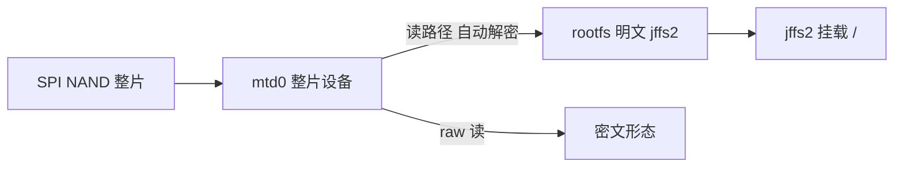
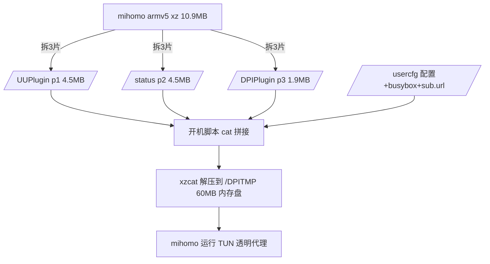

> 本文档面向持有中兴 ZXHN E2631（巡天AX3000）且有 telnet 权限的用户，涵盖固件加密分析、mihomo 代理移植、部署与使用全流程。
> **适用设备：** 中兴 ZXHN E2631（巡天AX3000，ZX279128S 平台）
> **适用系统：** 原厂固件（Linux 4.1.25，2025-09 版实测通过）
> **风险提示：** 涉及分区级读写操作，操作前务必备份全片闪存

---

## 一、设备与固件分析

### 1.1 硬件概况

| 项目 | 参数 |
|------|------|
| SoC | 中兴 ZX279128S（双核 Cortex-A9，无硬件除法 idiv） |
| 内存 | 256MB（DTB 模板写 512MB，以实际为准） |
| 闪存 | 128MB SPI NAND（去 OOB 后 128MiB） |
| 内核 | Linux 4.1.25 #2 SMP（2025-09-25 版实测） |
| WiFi | MT7916（AX3000） |
| busybox | v1.17.2（精简版，无 dd/head/tail/od） |

> [!WARNING] 注意
> Cortex-A9 **没有 idiv 硬件除法指令**，Features 里也没有 VFP/NEON。这意味着所有 GOARM=7 的 Go 程序（含 mihomo armv7 官方版）会直接 `Illegal instruction`，**必须使用 GOARM=5（armv5，软浮点+软除法）版本**。

### 1.2 真实分区表

分区表硬编码在内核中（2025 版按实际内核大小动态调整 kernel1，随后依次排列）：

```text
mtd6 kernel1     0x00700000  +0x0340000  (3.4MB, 明文 uImage)
mtd7 kernel2     0x2300000  +0x1c00000  (28MB, 备份槽)
mtd8 rootfs      0x00A40000 +0x1220000  (18.9MB, AES 加密 jffs2)
mtd9 UUPlugin    0x6F00000  +0x0500000  (5MB, rw)
mtd10 owdptsbin  0x7900000  +0x00A0000  (rw)
mtd11 status     0x7A00000  +0x0500000  (rw)
mtd12 DPIPlugin  0x7400000  +0x0300000  (rw)
mtd13 UNIFIED    0x6E00000  +0x0100000  (rw)
mtd14 JDXBPLUGIN 0x7700000  +0x0180000  (rw)
```

> [!IMPORTANT] 重要
> 网上流传的 /proc/mtd 分区表（kernel2 在 0xA40000、rootfs 在 0xD80000）与 2025 版固件的**实际物理偏移不符**。以 `cat /sys/class/mtd/mtdN/offset` 的输出为准。

### 1.3 加密方案与密钥推导

rootfs（及部分插件分区）使用 **AES-128-ECB** 加密，密钥由型号字符串运行时推导：

```text
sprintf(token, "%s%s", "E2631", "edfd0d95511")
→ "E2631edfd0d95511"

再做一次交换（下标 5..9 与 15..11 反转）：
→ "E263111559d0dfde"   ← 这就是 AES-128 密钥
```

密钥素材硬编码在内核 Image 中（`E2631` + 11 位十六进制串），密钥本身不出现在任何文件里，只存在于内存。



> [!WARNING] 注意
> mtd0/mtdblockX 的**裸写是厂商虚拟层的临时视图，重启后丢弃**。只有通过 jffs2 挂载点写入的文件才真正持久化。对 rootfs 分区而言，mtdblock0/1 的写入在 mtdblock8 挂载路径下被静默拒绝——这正是无法在线改 rootfs 的根本原因。

---

## 二、方案设计

### 2.1 为什么不用 OpenWrt

ZX279128S 的以太网交换（NPP）、SPI NAND 加密层、WiFi 整合均为中兴闭源内核组件，社区无对应 OpenWrt target，移植工作量以月计且 WiFi 部分基本无解。原厂固件功能完整，保留它、在用户态外挂代理是唯一现实路径。

### 2.2 架构设计

核心矛盾：rootfs 分区 100% 满、/tmp 仅 20MB 放不下 46MB 的 mihomo、裸写不持久。最终方案：



| 设计点 | 说明 |
|--------|------|
| mihomo 版本 | v1.19.30 linux-armv5（GOARM=5 软浮点） |
| 存储 | 三个 RW 插件分区的空闲空间（持久化 ✓） |
| 运行位置 | /DPITMP（60MB 内存盘） |
| 面板 | mihomo 自动下载 UI（无需自带）；在线面板 board.zash.run.place |
| 内存占用 | mihomo RSS 约 30-60MB，/DPITMP 45MB |
| 自启动 | UUPlugin 钩子（非桥接模式自动）/ 桥接模式手动一行命令 |

> [!TIP] 建议
> mihomo 配置了 `external-ui` 后，首次启动会**自动从 GitHub 下载面板**（走自己的代理出网），无需自带面板程序。就算下载失败，在线面板不受影响。

---

## 三、部署步骤（MobaXterm 全图形操作）

> [!NOTE] 提示
> 文件传输使用 MobaXterm 内置的 HTTP / TFTP 服务，纯界面操作，无需在 PC 上跑任何脚本。配套文件见 `MobaXterm部署包/` 目录。

### 3.1 MobaXterm 会话与内置服务

1. Session → **Telnet** → 路由器 IP → 登录（admin）
2. 工具栏 **Tools → HTTP Server** → 根目录选择 `MobaXterm部署包/上传到路由器的文件` → 端口填 **8000** → Start
3. （可选）**Tools → TFTP Server** → 同一目录 → 端口 69 → Start（备用通道）
4. 记下 PC 的局域网 IP（示例用 192.168.1.100）

### 3.2 创建目录并拉取文件（路由器侧）

```bash
mkdir -p /usercfg/zproxy /UUPlugin/zproxy /status/zproxy /DPIPlugin/zproxy
```

```bash
cd /usercfg/zproxy
```

```bash
curl -o busybox http://192.168.1.100:8000/busybox-armv7l
```

```bash
chmod +x busybox
```

```bash
curl -o /UUPlugin/zproxy/p1 http://192.168.1.100:8000/zp_p1
```

```bash
curl -o /status/zproxy/p2 http://192.168.1.100:8000/zp_p2
```

```bash
curl -o /DPIPlugin/zproxy/p3 http://192.168.1.100:8000/zp_p3
```

> [!TIP] 建议
> 也可以用 TFTP 备用通道拉取（busybox 自带 tftp 客户端）：
> `tftp -g -b 4096 -r zp_p1 192.168.1.100`
> 大文件建议加 `-b 4096` 提高块大小，否则默认 512 字节分块会很慢。

### 3.3 写入启动脚本与配置

同样用 curl 从 MobaXterm 的 HTTP 服务拉取（这两个文件就在部署包目录里）：

```bash
curl -o /usercfg/zproxy/boot.sh http://192.168.1.100:8000/boot.sh
```

```bash
curl -o /usercfg/zproxy/config_base.yaml http://192.168.1.100:8000/config_base.yaml
```

```bash
echo "https://你的Clash订阅URL" > /usercfg/zproxy/sub.url
```

```bash
chmod +x /usercfg/zproxy/boot.sh
```

### 3.4 config_base.yaml 关键内容

```yaml
mixed-port: 7890
external-controller: 0.0.0.0:9090
external-ui: /tmp/zproxy/ui
secret: ""
tun:
  enable: true
  stack: system
  dns-hijack:
    - any:53
  auto-route: true
  auto-detect-interface: true
dns:
  enable: true
  enhanced-mode: fake-ip
proxy-providers:
  sub1:
    type: http
    url: "__SUB_URL__"
    interval: 86400
    path: /tmp/zproxy/providers/sub1.yaml
proxy-groups:
  - name: PROXY
    type: select
    use: [sub1]
  - name: AUTO
    type: url-test
    use: [sub1]
rules:
  - IP-CIDR,192.168.0.0/16,DIRECT,no-resolve
  - MATCH,PROXY
```

> [!TIP] 建议
> 规则集保持最简（无 GEOIP 依赖），避免启动时联网下载分流失败导致代理不可用。订阅链接支持 Clash 格式。

### 3.5 boot.sh 启动脚本核心逻辑

```bash
load_mihomo() {
    cat /UUPlugin/zproxy/p1 /status/zproxy/p2 /DPIPlugin/zproxy/p3       | xzcat > /DPITMP/zproxy/mihomo
    SZ=$(wc -c < /DPITMP/zproxy/mihomo)
    [ "$SZ" = "46465150" ] || return 1
    chmod +x /DPITMP/zproxy/mihomo
}
```

> [!IMPORTANT] 重要
> 原厂 busybox（v1.17.2）没有 dd 的 skip 支持和 xzcat，因此自带了一个**静态 musl busybox**（/usercfg/zproxy/busybox），所有 flash 读写与解压都通过它完成。

---

## 四、使用指南

### 4.1 启动 / 停止

```bash
/usercfg/zproxy/boot.sh start
```

```bash
/usercfg/zproxy/boot.sh stop
```

```bash
/usercfg/zproxy/boot.sh status
```

启动后自动：拼装三片 → 解压到 /DPITMP → 等待 WAN 就绪 → 生成配置 → 启动 mihomo（TUN 透明代理）。

### 4.2 导入订阅

```bash
echo "https://你的Clash订阅URL" > /usercfg/zproxy/sub.url
```

```bash
/usercfg/zproxy/boot.sh restart
```

> [!NOTE] 提示
> 订阅按 Clash 格式解析，24 小时自动更新。修改 sub.url 后 restart 即可生效。

### 4.3 面板

| 方式 | 地址 | 说明 |
|------|------|------|
| 本地面板 | http://192.168.1.50:9090/ui | mihomo 自动下载，需能出网 |
| 在线面板 | https://board.zash.run.place | 添加控制器 192.168.1.50:9090 |

面板内可切节点、看流量、测延迟。HTTPS 在线面板连 HTTP 控制器时浏览器会拦混合内容，点地址栏盾牌图标允许即可。

---

## 五、自启动方案

### 5.1 原理

中兴原厂有三个插件守护进程会从各自的 RW 插件分区执行脚本：

| 守护进程 | 分区 | 执行文件 | 触发条件 |
|----------|------|----------|----------|
| uuplugind | /UUPlugin | /UUPlugin/uuplugin | 插件状态启用（非桥接模式） |
| owdplugind | /owdptsplugin | .../owdpts/start.sh | 插件安装流程 |

实测 2025-09 固件中，直接投放脚本**不会被自动执行**（厂商要求插件经过官方渠道安装并写入数据库状态），但在**非桥接（路由）模式**下，一旦插件状态被置位（例如在 Web 管理页启用过联通插件），uuplugind 就会在开机时自动执行。

### 5.2 已部署内容

| 文件 | 位置 | 作用 |
|------|------|------|
| /UUPlugin/uuplugin | 可执行脚本 | uuplugind 拉起时调用（非桥接模式） |
| /UUPlugin/uu.conf | 同上 | 插件配置（版本号占位） |
| /usercfg/zproxy/uuplugin.hook | 母本备份 | 防止分区清理丢失 |

### 5.3 桥接模式（手动启动说明）

当前设备作为子路由桥接/旁挂使用时，uuplugind 会因桥接模式检查直接跳过插件执行，此时需要手动启动：

```bash
telnet 192.168.1.50
```

```bash
/usercfg/zproxy/boot.sh start
```

> [!NOTE] 提示
> 就一行命令。所有文件都已持久化在 /usercfg 和三个插件分区里，重启不丢。路由器日常不重启的话，启动一次就一直有效。

---

## 六、性能实测

### 6.1 分加密方式对比

| 加密方式 | 测试节点 | 延迟 | 速率 | CPU 均值/峰值 | mihomo RSS |
|----------|----------|------|------|---------------|------------|
| SS aes-256-gcm | 新加坡Z03 (IEPL x2) | 36ms | 2.62 MB/s ≈ 21 Mbps | 16% / 50% | 46.6 MB |
| VMess auto | 香港Z10 (IEPL) | 40ms | 4.79 MB/s ≈ 38 Mbps（单轮，后失效） | 未覆盖满速时段 | 46.5 MB |
| AUTO 混合 | 自动选速 | - | 最高 5.3 MB/s ≈ 43 Mbps | - | - |

> [!NOTE] 提示
> VMess 的 `cipher: auto` 在无硬件 AES 的 A9 上实际使用 chacha20-ietf-poly1305（纯软件），CPU 开销低于 SS 的 aes-256-gcm 软件实现，但免费 VMess 节点稳定性较差。SS 软浮点 AES-256-GCM 峰值 50% 单核符合预期。

### 6.2 资源占用

| 指标 | 数值 |
|------|------|
| mihomo 内存 RSS | 30 - 60 MB（波动） |
| /DPITMP（60MB 内存盘） | 45 MB（mihomo 46MB 解压后） |
| /tmp（20MB 内存盘） | 8.8 MB（UI + 配置 + 日志） |
| 订阅节点 | 45 个（33 SS + 12 VMess），37 个有延迟数据 |

### 6.3 MobaXterm 操作

全部操作可在 MobaXterm 的 Telnet 会话中完成：Session → Telnet → 路由器 IP，登录后粘贴命令即可。文件传输用 PC 端 HTTP 服务 + 路由器 curl 的方式（见部署步骤），配套的完整部署包见 `MobaXterm部署包/` 目录。

## 七、故障排查

| 现象 | 排查 |
|------|------|
| mihomo 没起来 | `cat /tmp/zproxy/mihomo.log`；多数是订阅 URL 无效或拉取失败 |
| 面板打不开 | 确认 9090 端口：`netstat -l | grep 9090`；在线面板跨 HTTPS 记得允许混合内容 |
| 订阅拉取失败 | 检查 sub.url 是否为 Clash 格式；`curl -v 订阅URL` 测连通性 |
| 路由器断网 | `/usercfg/zproxy/boot.sh stop` 立即恢复直连 |
| 重启后没自启 | 桥接模式或插件状态未启用，手动 start 即可 |

---

## 八、风险与回滚

> [!WARNING] 警告
> 本方案仅通过 jffs2 挂载点添加文件，不修改 rootfs、不修改分区表、不刷写引导。但以下风险仍需了解：

- 原厂固件升级会重写 rootfs 和插件分区，zproxy 文件可能被清除（重传即可恢复）
- 三个插件分区与厂商守护进程共存，分区写满（95%）属正常，厂商按需写入自己的数据
- TUN 模式接管全部流量，配置错误可能导致断网，`stop` 后立即恢复
- 终极回滚：telnet 删除 /usercfg/zproxy、/UUPlugin/zproxy、/status/zproxy、/DPIPlugin/zproxy 四个目录并去掉 boot.sh 里的钩子行，即回到原厂状态

---

## 九、固件逆向要点（分析者参考）

| 项目 | 结论 |
|------|------|
| 加密算法 | AES-128-ECB，无 IV |
| 密钥推导 | `E2631` + `edfd0d95511` 拼接后反转后半段 → `E263111559d0dfde` |
| 密钥位置 | 内核 Image（zImage 解压后）0x52f484 附近 |
| kernel1 | 明文 uImage（zImage 自解压 + DTB 尾部） |
| kernel2 | 28MB 备份槽（2025 版动态调整） |
| rootfs 加密 | 开机 jffs2 挂载时由内核读路径透明解密 |
| mtdblock0 裸写 | 厂商虚拟层临时视图，**重启丢弃**，不可用于持久化 |
| busybox 陷阱 | v1.17.2 无 dd skip/head/tail/od，md5sum 大文件崩溃 |

> [!IMPORTANT] 重要
> 2025-09 与 2024-09 两版固件的分区表布局**完全不同**（kernel2/rootfs 起始地址变了），网上的分区表资料对不上号时，先确认固件版本。

---

::github{repo="MetaCubeX/mihomo"}

---

> **文档版本：** 2026-08-29
> **适用设备：** 中兴 ZXHN E2631（巡天AX3000）
> **适用系统：** 原厂固件 2025-09（Linux 4.1.25）
> **参考项目：** MetaCubeX/mihomo · Zephyruso/zashboard · 1234205a/zte-sr1010-research
