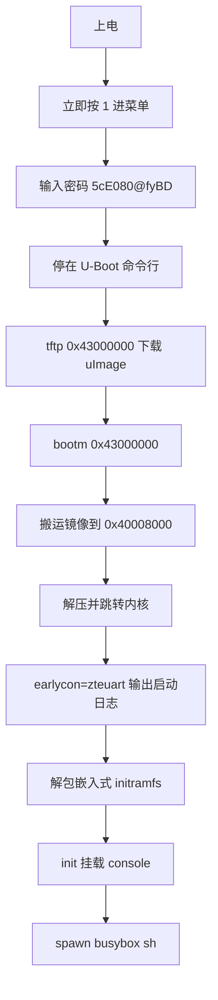

> 本文档面向嵌入式开发与路由器逆向爱好者，完整记录中兴巡天 AX3000（E2631）从固件解密、SoC 逆向、交叉编译到主线内核上板验证的全过程，并给出 mihomo（Clash.Meta）全功能适配的配置与开源复现方式。
> **适用系统：** Windows 10/11（MSYS2 构建） / WSL2（可选提速）
> **适用平台：** 中兴 ZTE ZXHN E2631（巡天 AX3000，ZX279128S）

---

## 一、项目背景与目标

E2631 是中兴巡天 AX3000 千兆双频路由器，采用自研 ZX279128S SoC，运营商定制固件、源码不开放，内核特性老旧，既没有 TPROXY / nftables 等现代防火墙能力，也无法直接运行 mihomo（Clash.Meta）。网上流传的 openwrt-e2631 镜像只能通过 U-Boot 导入，实际只有镜像头能被识别为 OpenWrt，内核根本无法启动。

因此本项目决定走一条完整链路：**固件解密 → SoC 逆向 → 串口/U-Boot 打通 → 主线内核编译 → 上板验证 → mihomo 适配 → 开源发布**。


最终成果：主线内核 **6.18.38** 已在真实硬件上从 U-Boot 启动到交互式 busybox shell，TPROXY / TUN / nftables / zram 等特性全部验证通过，mihomo 可跑在 armv5 软浮点二进制下，且全部源码、工具、一键编译脚本已开源，别人可以直接拉取复现。

---

## 二、硬件规格与 SoC 逆向

### 2.1 硬件规格

| 项目 | 规格 |
|------|------|
| SoC | 中兴 ZX279128S（双核 Cortex-A9 rev1 @ 1GHz） |
| 内存 | 256MB DDR3-1333（U-Boot 实测 256MiB；DTS 当前写 128MB 占位，可按需调整） |
| 闪存 | 128MB SPI NAND（AMD/Spansion HYF1GQ4UTACAE） |
| 有线 | 千兆 PHY（GEPHY ×4，驱动待移植） |
| 无线 | MT7916 WiFi（走 PCIe，驱动待移植） |
| USB | 无对外 USB 口（dwc2 / dwc3 驱动已验证，DT 保持禁用） |
| 调试串口 | ZTE 定制 PL011 @ 0x94404000 |

> [!IMPORTANT] 重要
> 这台机器**没有 USB 口**，后续所有调试、部署、镜像搬运都只能依赖 TFTP 和串口，这是整个调试方案设计的出发点。

### 2.2 CPU 能力（最重要的事实）

由 `cat /proc/cpuinfo` 实测，CPU features 为：

```text
half thumb fastmult edsp thumbee tls
```

对照 ARMv7 完整特性集，结论如下：

| 特性 | 支持情况 |
|------|---------|
| ARMv7（Cortex-A9） | ✅ 支持 |
| Thumb / ThumbEE | ✅ 支持 |
| EDSP（增强 DSP 指令） | ✅ 支持 |
| TLS（线程本地存储） | ✅ 支持 |
| VFP 浮点单元 | ❌ 不支持（无硬件 FPU） |
| NEON SIMD | ❌ 不支持 |
| 硬件整数除法 idiv | ❌ 不支持 |

> [!CAUTION] 注意
> 无 VFP / NEON / idiv 意味着：
> - 所有二进制必须**软浮点**编译（`-mfloat-abi=soft`），用 `-mfpu=vfp` 或 hard-float 的二进制会直接非法指令崩溃；
> - 除法、浮点运算全部走软件库，CPU 占用高，跑加密代理时会出现明显的 CPU 瓶颈；
> - 内核编译时必须强制 `-marm`，避免工具链默认 Thumb 模式带来的启动问题。

### 2.3 串口 IP 逆向

E2631 的调试串口是 ZTE 定制的 PL011 兼容 IP，基地址 `0x94404000`，`earlycon=zteuart` 可输出引导日志，periphid 为 `0x001feffe`。它与标准 PL011 的寄存器偏移不同（与 ZX279133 是同一 IP）：

| 寄存器 | 标准 PL011 偏移 | E2631（ZTE 定制）偏移 |
|--------|----------------|----------------------|
| DR（数据寄存器） | 0x00 | 0x04 |
| FR（标志寄存器） | 0x18 | 0x14 |
| IBRD | 0x24 | 0x24 |
| FBRD | 0x28 | 0x28 |
| LCRH | 0x2C | 0x30 |
| CR | 0x30 | 0x34 |
| IFLS | 0x34 | 0x38 |
| IMSC | 0x38 | 0x40 |

> [!NOTE] 提示
> 早期主线内核没有这个 ZTE 定制 earlycon 的适配，需要为 `zteuart` 编写 earlycon 驱动（已包含在项目的 patches 中）。串口物理参数为 3.3V TTL，115200-8-N-1。

### 2.4 与 SR1010 的外设差异

本项目基于 cnjn 的 SR1010 主线移植（linux-mainline-zte-zxslc-sr1010），但 **E2631 的外围方案与 SR1010 不同**，SoC 周边芯片不能直接照搬：

| 外设 | SR1010 | E2631 |
|------|--------|-------|
| 有线 PHY | 与 E2631 不同 | GEPHY（千兆） |
| WiFi | 与 E2631 不同 | MT7916（PCIe） |
| SPI NAND | 与 E2631 不同 | HYF1GQ4UTACAE（128MB） |
| UART IP | 同源 | 同源（ZTE 定制 PL011） |

所以设备树、网卡/PHY 驱动、闪存驱动都需要针对 E2631 单独适配，这也是"待办与未来工作"一章里列出的主要缺口。

---

## 三、固件获取与解密

### 3.1 加密与密钥

原厂固件的 kernel 分区使用 **AES-128-ECB** 加密，密钥常量为 `E263111559d0dfde`。解密后即得到标准 uImage（ih_load 为 `0x40008000`，这也是后面 XIP 陷阱的根源）。

### 3.2 分区布局

128MB SPI NAND 上的功能分区（具体偏移以固件 dump 为准）：

| 分区 | 内容 | 备注 |
|------|------|------|
| bootloader | U-Boot | 串口可交互，命令未被完全阉割 |
| kernel | 加密内核 | AES-128-ECB 解密后为 uImage |
| rootfs | 只读根文件系统 | JFFS2 |
| kmodule | 内核模块 + 用户态程序 | JFFS2 |
| 配置区 | 出厂配置 / 无线参数 | — |

### 3.3 kmodule 解包与 vendor 运行库

把 kmodule 分区按 JFFS2 解包后，拿到两样关键资产：

- **busybox v1.17.2**（原厂用户态，后续 initramfs 直接复用）；
- **uClibc 0.9.33.2 运行库**（libc.so.0 / libm.so.0 / libresolv.so.0 等）。

> [!WARNING] 警告
> vendor 的库文件在打包时被记录成了符号链接（直接拷出来是"不是 ELF 文件"），需要解析 `.symlink` 文件还原真实内容，才能用于构建 initramfs。

---

## 四、串口与 U-Boot 引导

### 4.1 进入 U-Boot

上电后**立即连续按 1** 进入引导菜单，输入密码 `5cE080@fyBD`，回车后停在 U-Boot 命令行（自动启动已被停止）。原厂 U-Boot 支持 tftp / bootm / md / mw 等常用命令，可以直接用来引导主线内核。

```bash
# 电脑端准备一个 TFTP 服务器（仓库里的 e2631-tools/tftpd2.py 即可）

# 串口里配置网络并下载内核
setenv serverip 192.168.1.100

setenv ipaddr 192.168.1.1

tftp 0x43000000 uImage-e2631.img

bootm 0x43000000
```

### 4.2 XIP 陷阱（本项目最大的坑）

> [!CAUTION] 注意
> **绝对不要在 `0x40008000` 加载内核。**
>
> uImage 头的 ih_load 就是 `0x40008000`。如果 tftp 直接下到这个地址，bootm 会认为镜像"已经就位"，走 XIP（就地执行）路径跳过搬运，64 字节的 uImage 头直接压在内核入口上，结果就是**静默崩溃——串口没有任何输出**。
>
> 另外 `0x42000000` 区域是 U-Boot 自用区，大文件传输会失败，也要避开。
>
> **正确姿势：`tftp 0x43000000` → `bootm 0x43000000`**，bootm 会把镜像搬到 `0x40008000` 再跳转。

### 4.3 完整引导链路



---

## 五、Windows 交叉编译环境

### 5.1 环境组成

项目在纯 Windows 上完成了整个内核构建，环境如下：

| 组件 | 版本/说明 |
|------|----------|
| MSYS2 | 提供 make 4.x 与 POSIX 工具链 |
| Arm GNU Toolchain | 10.3（mingw 版），交叉编译内核 |
| Zig | 0.14（arm-linux-musleabi 静态），编译 initramfs 的 init 等用户态程序 |
| Git | 管理源码树与行尾 |

> [!TIP] 建议
> 同一套源码在 WSL2（Ubuntu）里用完整 GCC 交叉编译，速度明显快于 MSYS2，cpio 打包也更省心。仓库同时提供 `build.sh`（Linux/WSL）和 `build.bat`（Windows/MSYS2），二选一即可。

### 5.2 Windows 构建的强制限制

> [!IMPORTANT] 重要
> - `make -j4` 是上限：MSYS2 下 `-j8` 会触发 make 段错误；
> - 必须强制 `-marm`：mingw 工具链默认编 Thumb，会导致内核启动异常；
> - 源码树必须保持 LF 行尾：clone 时 CRLF 污染了约 9 万文件，fixdep 解析依赖文件会出错，需要 CRLF 补丁。

构建命令（对应 build.sh / build.bat 的核心）：

```bash
make ARCH=arm CROSS_COMPILE=arm-none-eabi- zx279128s_e2631_defconfig

make ARCH=arm CROSS_COMPILE=arm-none-eabi- -j4
```

### 5.3 踩过的编译坑（均已修复并固化在仓库）

| 问题 | 现象 | 处理 |
|------|------|------|
| CRLF 污染 | fixdep 依赖文件解析错误 | 全树转 LF + 补丁 |
| Thumb 默认编译 | 内核启动异常 | 强制 `-marm` |
| make -j8 段错误 | 编译中途崩溃 | 限 `-j4` |
| ntfs3 需要 gcc11 flag | 编译报错 | 禁用 `CONFIG_NTFS3_FS` |
| syncconfig 交互式提示 | GCC_PLUGINS / DWARF 卡住构建 | 禁用 / 固定选项 |
| initramfs_data.S 被误删 | 构建失败 | git 恢复，重建脚本不再删除 .S |
| uapi netfilter 头文件是 stub | xt_mark.c 等编译失败 | 从 git 恢复真实内容并修复索引 |
| busybox 用 zig 构建时 make 崩溃 | 段错误 | 改用 vendor busybox + uClibc 库 |

---

## 六、内核配置要点（mihomo 全功能适配）

### 6.1 关键特性（全部 `=y` 并已上板验证）

| 内核特性 | 配置项 | 用途 |
|---------|--------|------|
| TUN 虚拟网卡 | `CONFIG_TUN` | mihomo TUN 模式 |
| TPROXY 透明代理 | `CONFIG_NETFILTER_XT_TARGET_TPROXY` + `CONFIG_NF_TPROXY_IPV4/IPV6` | 透明代理核心 |
| socket 匹配 | `CONFIG_NETFILTER_XT_MATCH_SOCKET` | 按 socket 分流 |
| nftables | `CONFIG_NF_TABLES` + nft_tproxy / nft_socket / nft_compat | 现代防火墙规则 |
| iptables-legacy | `CONFIG_IP_NF_IPTABLES_LEGACY` + `CONFIG_XTABLES_LEGACY` | 兼容原厂规则集 |
| conntrack / NAT | `CONFIG_NF_CONNTRACK` + MASQUERADE / REDIRECT / MARK | 代理流量转发 |
| 策略路由 | `CONFIG_IP_ADVANCED_ROUTER` + `ip rule fwmark` | 按 fwmark 分流 |
| IPv6 | `CONFIG_IPV6` | 双栈代理 |
| zram | `CONFIG_ZRAM` | 内存压缩，缓解 256MB 压力 |

### 6.2 netfilter 配置丢失的修复

内核默认配置做"平台精简"时会把 netfilter 相关选项丢掉，需要在 `olddefconfig` 之后显式重新打开：

```bash
make ARCH=arm CROSS_COMPILE=arm-none-eabi- olddefconfig

scripts/config -e NETFILTER -e XTABLES_LEGACY -e IP_NF_IPTABLES_LEGACY

make ARCH=arm CROSS_COMPILE=arm-none-eabi- olddefconfig
```

### 6.3 嵌入式 initramfs

> [!NOTE] 提示
> 最初的方案是把 initrd 打成 uImage 传给内核，但 uImage 的 64 字节头会被内核误读，导致根文件系统无法挂载。最终改用 `CONFIG_INITRAMFS_SOURCE`，把 cpio 直接编进内核，干净可靠。

initramfs 内容（由 `e2631-tools/initramfs-src/` 构建）：

- `init`：musl 静态编译，`O_RDWR` 打开 console、`TIOCSCTTY` 接管终端、spawn busybox sh；
- busybox v1.17.2（vendor 版，经 uClibc 库支撑）；
- uClibc 0.9.33.2 运行库（经 `.symlink` 修复后的真实 ELF）；
- 设备节点：console / null / tty / ttyAMA0(204:64) / zero / random（`pack2.py` 递归 cpio 打包）。

---

## 七、上板验证

### 7.1 启动结果

主线内核 **6.18.38** 从 U-Boot 引导成功，`earlycon=zteuart` 输出完整启动日志，最终进入交互式 busybox shell。板上实测日志：

```text
=== E2631 mainline bring-up init reached userspace ===
[init] kernel booted, zteuart console OK
[init] Features : half thumb fastmult edsp thumbee tls
[init] handing console to busybox shell
/ # iptables -t mangle -L PREROUTING    # 正常
/ # ip rule add fwmark 1 lookup 100     # 正常
/ # busybox cat /proc/net/ip_tables_targets
...
TPROXY
TPROXY
MASQUERADE
REDIRECT
...
```

### 7.2 特性验证命令

```bash
# 验证 TPROXY / REDIRECT / MASQUERADE / MARK 等目标已编进内核
cat /proc/net/ip_tables_targets

# 确认 CPU 特性（无 VFP / NEON / idiv）
cat /proc/cpuinfo

# 确认内存识别
cat /proc/meminfo
```

`/proc/net/ip_tables_targets` 中能看到 `TPROXY` 等目标，说明透明代理内核路径完整可用；策略路由（`ip rule fwmark`）也已在板上实测通过。

---

## 八、mihomo 适配与部署

### 8.1 二进制选择

由于 CPU 无 VFP / NEON / idiv，mihomo 必须使用 **armv5 软浮点** 二进制：

```text
mihomo-linux-armv5      # GOARM=5，软浮点
```

> [!WARNING] 警告
> 不要用 armv7 或 hard-float 的 mihomo 包，否则在无 FPU 的 A9 上会直接非法指令崩溃。

### 8.2 内核侧已就绪

mihomo 需要的内核能力已全部 `=y` 编入（见第六章）：TUN、TPROXY（v4/v6）、xt_socket、nftables（nft_tproxy/socket/compat）、iptables-legacy、conntrack、NAT、策略路由、IPv6、zram。无需任何外部内核模块。

### 8.3 部署与预期

部署方式：通过 tftp / 串口把 armv5 二进制与配置文件拷入，挂到 TUN 或 TPROXY 模式即可。注意这台机器没有 USB，所以文件传输只能走网络或串口。

> [!NOTE] CPU 瓶颈提示
> 无硬件 FPU / NEON，SS / SSR 节点的加解密全部由 CPU 软算，1GHz 双核 A9 + 256MB 内存跑满速代理时 CPU 会明显吃满（"CPU 爆缸"风险）。这是硬件上限；软件层面已尽量做到极致——特性齐全、软浮点、无非法指令崩溃。

---

## 九、开源仓库与复现

### 9.1 仓库结构

仓库 [Zlion-Y/e2631-mainline-zx279128s](https://github.com/Zlion-Y/e2631-mainline-zx279128s) 本身就是**完整的内核源码树**（Linux 6.18.38 + E2631 平台适配全部落树），不再需要单独拉基础树再套补丁。默认分支 `main`：

```text
e2631-mainline-zx279128s/                       # 完整内核源码树（GitHub）
├── arch/arm/boot/dts/zte/zx279128s-e2631.dts       # E2631 板级设备树
├── arch/arm/configs/zx279128s_e2631_defconfig      # 精简 defconfig（initramfs 已内嵌）
├── initramfs-e2631.cpio.gz                         # 嵌入式 initramfs（busybox + uClibc + init）
├── e2631-tools/
│   ├── tftpd2.py          # 简易 TFTP 服务器（UDP 69，服务父目录）
│   ├── pack_uimage.py     # uImage 打包（load/entry 0x40008000）
│   ├── serial_ctl.py      # 串口驱动（驱动 U-Boot 用）
│   ├── bootflow2.py       # 脚本化 tftp + bootm 串口序列
│   ├── mkconfig.sh        # MSYS2 构建步骤
│   ├── cleanbuild3.sh     # MSYS2 清理重建
│   ├── mihomobuild.sh     # mihomo 相关构建
│   ├── initramfs-src/     # init.c + pack2.py
│   └── README.md
├── upstream-series/                             # cnjn 的 ZX279133 16 补丁集（6.18.38 基线，参考）
├── research.md                                 # 内核版本调研笔记
├── README.md / README_EN.md / README           # 中英文说明 + 内核自带 README
├── build.sh                                    # Linux / WSL 一键编译
├── build.bat                                   # Windows / MSYS2 一键编译
└── .github/workflows/build.yml                 # CI：main + v* tag + 手动触发
```

编译产物由 CI 直接发布到 GitHub Release：**v0.1.1** 已包含 `uImage-e2631.img`（约 13.3MB，zImage + DTB 拼接，DTB 在末尾），可直接下载后 tftp 引导。

### 9.2 复现步骤

Linux / WSL（树内直接构建，无需套补丁）：

```bash
git clone https://github.com/Zlion-Y/e2631-mainline-zx279128s.git

cd e2631-mainline-zx279128s

./build.sh
```

Windows（MSYS2，首次运行自动装 MSYS2 与交叉工具链，再树内构建）：

```bat
git clone https://github.com/Zlion-Y/e2631-mainline-zx279128s.git

cd e2631-mainline-zx279128s

build.bat
```

GitHub Actions：fork 后 push（或手动 `workflow_dispatch`）即可，产物在 Actions 页面 / Release 下载。

编译产物 `uImage-e2631.img` 按第四章的姿势引导：

```bash
tftp 0x43000000 uImage-e2631.img

bootm 0x43000000
```

> [!NOTE] 提示
> 树内构建要点：`make zx279128s_e2631_defconfig` 通过 `CONFIG_INITRAMFS_SOURCE` 把 `initramfs-e2631.cpio.gz` 一并编入；设备树用单目标编译（`make zte/zx279128s-e2631.dtb`），不走 `make dtbs` 批量入口。

### 9.3 CI 与 Release

`build.yml` 触发条件：`main` 分支 push、`v*` tag push、手动 `workflow_dispatch`；并显式声明 `permissions: contents: write` 以便创建/更新 Release。流程为：装依赖 → 装 Arm GNU Toolchain 10.3（`arm-none-linux-gnueabihf-`）→ `zx279128s_e2631_defconfig` → `zImage` → 单目标 `zte/zx279128s-e2631.dtb` → `e2631-tools/pack_uimage.py` 打包 → 上传 artifact → 在 tag 上挂到 Release。

当前状态：**v0.1.1 已发布**（2026-08-31），Release 附件 `uImage-e2631.img` 为 Actions 验证产物（zImage + DTB），可直接下载引导。

> [!NOTE] 提示
> 后续发新版：`git tag v0.1.2` 后 `git push origin v0.1.2`，Actions 会自动构建并更新 Release，无需手动传附件。

### 9.4 参考项目

| 项目 | 用途 |
|------|------|
| [cnjn/linux-mainline-zte-zxslc-sr1010](https://github.com/cnjn/linux-mainline-zte-zxslc-sr1010) | SR1010 主线移植，本项目的基础（6.18.38 + ZX279133 平台支持） |
| [xuejian1354/toolchains](https://gitlab.com/xuejian1354/toolchains/) | 官方 ZX27912X 交叉工具链 |
| [1234205a/zte-sr1010-research](https://github.com/1234205a/zte-sr1010-research) | 原厂固件分析方法论 |

> [!NOTE] 提示
> 仓库内 `research.md` 记录了内核版本调研结论：6.18.38 是 **6.18 LTS 稳定线**的第 38 个补丁版本（2026-07-04 发布，LTS 预计 EOL 2028-12），同线当前最新为 6.18.45；cnjn 分支基于 6.18.38 官方基线加入 ZX279133 平台支持。树内 `upstream-series/` 保留了该 ZX279133 16 补丁集（6.18.38 基线）作为参考。

---

## 十、待办与未来工作

| 项目 | 说明 | 状态 |
|------|------|------|
| 有线网卡驱动 | 三件套：GEPHY（4 个千兆 PHY）、`zx279128s-mdio` 控制器、TM/NPP/PP 包处理引擎；参考原厂 `tm.ko`（1.2MB）/ `switch.ko`（223KB）逆向，cnjn 的 ZX279133 MDIO 补丁（0008）可作控制器写法参考 | ⏳ 下一个目标 |
| 第二核 SMP | 原厂 enable-method `zte,zx279128-smp`，需逆向上核流程（推测类似 A9 的 NDPGFCR / freeze 寄存器） | ⏳ 未移植 |
| SPI-NAND + 透明解密 | ZTE SPIFC 控制器 + Denali NAND；flash 分区带 AES-128-ECB 透明解密（密钥由 `zte_token` 派生）；本移植不碰 flash，不含任何原厂密钥 | ⏳ 未移植 |
| PCIe host（MT7916 WiFi） | `zte,ZX279127-pcie` 未移植；`mt7916e` 驱动已编入内核，PCIe 通了 WiFi 即用 | ⏳ 未移植 |
| 时钟树 | topcrm / lsp0crpm / lsp1crpm 用 fixed-clock 占位；A9 PERIPHCLK 500MHz 实测可用，外设时钟精度未逐一校准 | ⚠️ 占位 |
| DW MMC | SD 控制器在原厂 DT 里就是 disabled | ⚠️ DT 已写 |
| USB host | dwc2 / dwc3 驱动已验证，但本机型无对外 USB 口、控制器时钟未接，DT 保持禁用 | ⚠️ 禁用 |
| OpenWrt / ImmortalWrt 移植 | 需先补齐网卡与闪存驱动 | ⏳ 规划中 |

> [!NOTE] 提示
> 已完成且已上板验证的项还包括：L2C-310 / GIC / 全局定时器（单核 1000 BogoMIPS）；DTS 中 NAND / SPIFC / PCIe / MDIO / GEPHY 节点已描述但未启用；原厂网络命令 ip / iptables / ip6tables / ebtables / tc / dnsmasq / curl 已打包进 initramfs。

---

## 十一、总结

- **链路已全部打通**：固件解密 → SoC 逆向 → U-Boot 引导 → 主线 6.18.38 → busybox shell → mihomo 适配 → 开源发布；
- **关键经验**：XIP 加载陷阱、`0x42000000` 禁区、强制 `-marm`、`-j4` 上限、CRLF 行尾、嵌入式 initramfs、armv5 软浮点；
- **硬件上限**：无 VFP / NEON / idiv，代理加解密是 CPU 软算，跑满速会有明显瓶颈，但已做到不非法指令、特性齐全；
- **可复现**：源码、设备树、配置、工具、双平台一键脚本、CI 全部在仓库中，拉下来就能编，改完还能继续编。

---

> **文档版本：** 2026-08-31
> **适用系统：** Windows 10/11（MSYS2 构建） / WSL2
> **适用平台：** 中兴 ZTE ZXHN E2631（巡天 AX3000）
