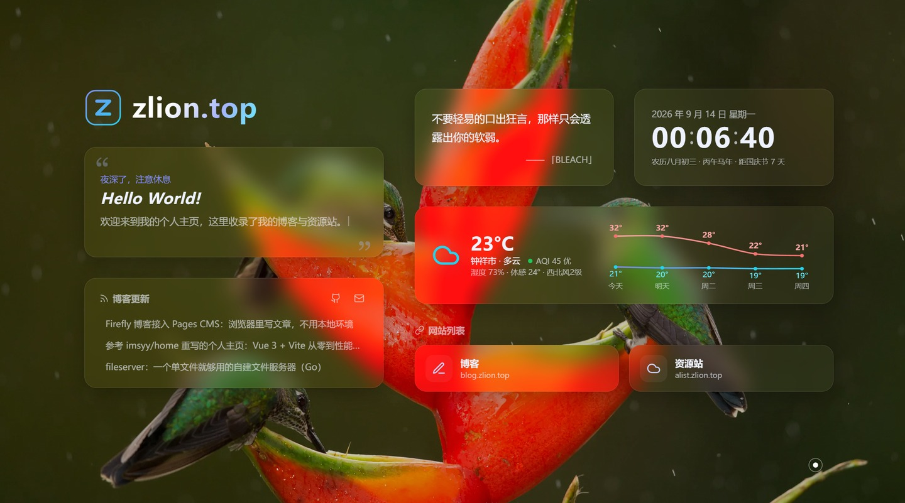

> **在线访问：** [www.zlion.top](https://www.zlion.top) ｜ **开源仓库：** [Zlion-Y/zlion-homepage](https://github.com/Zlion-Y/zlion-homepage)
> 本文记录给自己的导航站从选型、上线到后来一轮完整的性能治理的全过程。
> **参考项目：** [imsyy/home](https://github.com/imsyy/home)（MIT License，已存档）
> **技术栈：** Vue 3.5 + Vite 7，唯一运行时依赖是 vue 本身，构建产物 gzip 约 60KB
> **部署：** GitHub + Vercel，零配置

---

## 一、为什么不用原版

[imsyy/home](https://github.com/imsyy/home) 是 4.6k star 的知名主页项目，但直接拿来用有两个问题：

1. **仓库已存档**（read-only），作者不再维护；
2. **依赖偏重**：Element Plus、Pinia、APlayer、Swiper 一应俱全，对一个导航页来说 surplus 太多。

我的需求其实很简单：**站点导航 + 一言 + 时钟 + 天气**。于是参考它的布局思路，用 Vue 3 + Vite 重写了一份，运行时依赖只留 vue，构建产物 gzip 约 60KB（JS 52KB + CSS 9KB，原版含组件库通常在数百 KB 量级）。上线之后又陆续加了二级面板、音乐播放器和站点监控，最后一轮则是在性能上做了一次彻底的清算——那部分占了本文后半程。

## 二、布局：从手绘草图到 Bento 网格

最终布局是拿平板画草图定稿的：

```
左列（5fr）                右列（7fr）
Z 徽标 + zlion.top         一言        | 时钟
问候语卡片                  天气长卡（跨 2 列）
博客更新卡                  网站列表（3 列小卡）
```

实现上就是两层 Grid：

```css
.container {
  display: grid;
  grid-template-columns: 5fr 7fr;
  gap: 48px;
  /* 视口富余时垂直居中，内容超高时退化为顶对齐（防裁顶） */
  align-content: safe center;
}

.bento {
  display: grid;
  grid-template-columns: 1fr 1fr;
  grid-auto-rows: 150px;
  gap: 32px;
}

.bento .weather { grid-column: span 2; } /* 天气长卡 */
```

几个布局上的经验：

- **卡片高度全部写死在网格行上**（`grid-auto-rows`），而不是让内容撑开——否则一言长短句切换会把整行顶得跳一下；
- 打字机文案区**固定单行高度**（`min-height: 1.8em`），超长时视口跟随滚动而不是撑高卡片；
- `align-content: safe center` 是关键技巧：直接写 `center` 在小屏内容溢出时会裁掉顶部，加 `safe` 前缀让它溢出时自动退化为 `start`。

还有一个不起眼但很烦的问题：进场动画给卡片加了 26px 的下移位移，页脚被推出视口底部，**滚动条闪现一下又消失，页面整体右移一截**。修法是给主内容容器加 `overflow: clip`，把动画期间的这点溢出就地裁掉，滚动条从头到尾不出现。

## 三、动效：hover 才触发的 3D 倾斜与自定义光标

第一版我做成了"鼠标在页面任意位置，所有卡片持续跟随倾斜"，实际体验反而显得闹腾。最终改成和我的音乐播放器 [FluentPlayer](https://github.com/Zlion-Y/FluentPlayer) 播放页封面一致的手感：**鼠标移入卡片才倾斜，按卡内相对位置变换，移出归零回弹**：

```ts
const maxRotate = 12;
tiltRotateY = ((x - centerX) / centerX) * maxRotate;
tiltRotateX = -((y - centerY) / centerY) * maxRotate;
// perspective(1000px) + scale3d(1.02)，transition 240ms cubic-bezier(0.22,1,0.36,1)
```

配合一层 `mix-blend-mode: overlay` 的径向渐变光泽跟随鼠标，就是熟悉的"果冻玻璃"质感。

这里踩了最大的一个坑：**CSS 动画的 `forwards` 填充优先级高于内联样式**。最初进场动画用 `animation: rise .8s both`，动画播完后 `transform: none` 被永久锁定，JS 写入的倾斜 transform 完全失效。解法是进场改用 `backwards` 填充（配合 `transition-delay` 做级联进场），JS 在 1.5s 后接管 transform；接管时同时用内联样式覆盖 `.glass` 上 0.5s 的 transform 过渡，否则逐帧倾斜会被过渡拖成慢动作。

另外 `.glass` 因为圆角裁切设了 `overflow: hidden`，悬停提示气泡从上方弹出会被裁掉一半——把气泡改为向下弹出解决。

光标部分则是进入页面后隐藏系统光标（`cursor: none`），替换为三层：

- **中心圆点**：即时跟随（直接 transform）；
- **外圈**：`lerp 0.18` 缓动跟随，制造"拖尾"的物理感，悬停可点击元素时变色放大；
- **涟漪**：每移动 42px 泛起一圈小涟漪，`mousedown` 泛大涟漪。

触屏设备（`hover: none`）和 `prefers-reduced-motion` 下整套系统自动禁用。顺带一提，这个 `lerp` 外圈我一开始写成了**常驻 rAF**——鼠标静止时也在每帧写一次 `transform`，白占主线程与合成器配额。后来改成"追上鼠标即停帧、鼠标再动时唤醒"，这类"看不见的常驻开销"在性能治理那一轮里被清掉了一批。

## 四、天气卡：免 Key、定位到县级 + 平滑温度曲线

天气最初用的是高德 Web 服务 API，上线后发现一个致命问题：**手机流量（IPv6）环境下 `v3/ip` 定位返回全空，整张卡直接消失**。后来整体换成了 [uapis.cn](https://uapis.cn) 聚合接口：

```js
// https://uapis.cn/api/v1/misc/weather?extended=true&forecast=true
// 免 Key、按访客 IP 定位（可精确到县级）、IPv6 正常
// 返回 temperature / humidity / feels_like / wind / aqi / aqi_category + forecast[]
```

相比高德的优势：不用申请和暴露 Key（也就不需要 Vercel 环境变量）、IPv6 环境（手机流量）正常工作、自带 AQI 与多日预报。本地缓存 30 分钟，失败 3 秒重试一次，仍失败整卡隐藏、网格自动补位。

温度曲线用 Catmull-Rom 转三次贝塞尔把折线变平滑：

```js
for (let i = 0; i < pts.length - 1; i++) {
  const p0 = pts[i - 1] || pts[i], p1 = pts[i], p2 = pts[i + 1], p3 = pts[i + 2] || p2;
  d += ` C ${p1.x + (p2.x - p0.x) / 6} ${p1.y + (p2.y - p0.y) / 6}, ` +
       `${p2.x - (p3.x - p1.x) / 6} ${p2.y - (p3.y - p1.y) / 6}, ${p2.x} ${p2.y}`;
}
```

纯内联 SVG，零依赖。



## 五、二级「探索更多」面板：一屏六卡，全部配置驱动

点击左上角 Logo 进入二级面板，桌面 3 列 2 行一屏放六张卡（行数随卡片数自适应），手机端退化为单列流式。卡片清单完全由 `config.js` 驱动：

```js
// 数组顺序 = 面板内排列顺序；删掉某项 = 隐藏该卡
panelCards: ["news", "hotlist", "music", "epic", "history", "monitor"],
// 可选值：news 新闻 / hotlist 热榜 / music 音乐 / epic 限免 /
//         history 历史上的今天 / monitor 站点监控 / github GitHub
```

现有六张卡：**每日新闻**（60s API）、**多平台热榜**（平台与顺序可配置）、**音乐播放器**（下一节）、**Epic 限免**、**历史上的今天**、**站点监控**（第七节）。GitHub 数据卡组件保留，把 `"github"` 加回数组即可显示。

这里踩了最隐蔽的一个坑：面板给每张卡透传布局类 `class="cell"`，落在组件根元素上，被卡片内部"贡献格子"的同名样式命中——**整张卡被压成 49px**。父组件透传的类名与组件内部类名撞车，这种问题只有实际渲染后量尺寸才能发现，从此卡片组件内部再也不敢用 `.cell` 这种通用名。

另外行数自适应要靠 CSS 变量注入（`--rows`），直接内联 `grid-template-rows` 会把手机端媒体查询里的 `grid-template-rows: none` 覆盖掉，移动端布局直接错乱。

## 六、音乐播放器：照搬 Firefly 的多源自愈设计

面板里的音乐播放器，核心逻辑照搬了 [CuteLeaf/Firefly](https://github.com/CuteLeaf/Firefly) 项目的 MusicManager，这套设计相当优雅：

- `loadVersion` 版本号：每次切歌自增，过期的 play 回调直接丢弃——根治了快速切歌时新旧音源互相抢 `src` 的经典问题（表现为"点了没反应"）；
- `AbortError` 静默：被新加载打断的播放请求不当失败处理；
- 同曲多源降级：Meting 返回的链接带 id/server 时，每个备源都能按单曲重新解析，全败才延迟 2 秒跳下一首。

在此之上又补了三层：

**并发竞速**：多 Meting 源同时拉歌单，谁先返回用谁（串行降级最坏要等 3 个超时，并发只要最快那家）。

**音频探针**：点播放时并行试全部候选源——用 `preload="metadata"` 的隐藏 Audio 元素（媒体加载不受 CORS 限制、只拉头部不下载歌曲），谁先给出元数据就播谁。挂起源不报错也不出声，靠逐个等超时永远等不完，探针把这个问题变成了并行竞速。

**播放意图标记**：预载阶段任何源失败都保持静默，只有用户点过播放才允许出声。否则面板打开几秒后音乐自己响起来，非常灵异。

歌词同步居中也修了个典型坑：滚动容器忘了 `position: relative`，歌词行的 `offsetTop` 以整张卡片为基准，多算了头部高度，当前句永远定位不到可视区。歌单列表同理被内容撑到 4336px——**卡片定高 + 抽屉 `min-height: 0` + 容器 `height: calc(100% - 8px)`** 三件套才能把滚动约束进可视槽位。

这个播放器后来也成了性能问题的主角：410 行的歌单在前端是个不小的渲染负担，具体见第八节。

## 七、站点监控卡：no-cors 直连探测

监控卡检测我所有站点的可用状态，实现出乎意料地简单——浏览器 `fetch(url, { mode: "no-cors" })` 直连探测：

- 请求返回**不透明响应** = 服务器在线（拿不到状态码，但"能不能打开"这个语义已经够了）；
- 请求失败（DNS / 断网 / 6 秒超时）= 离线。

绿点红点加响应耗时，60 秒自刷新，结果本地缓存 60 秒用于重开面板秒显。**这是访客视角的连通性，与"用户能不能打开"完全一致**，而且不需要注册任何第三方监控服务。这张卡替换了原来的 GitHub 数据卡（组件保留，配置加回来就能显示）。

到这里功能就齐了。以下四节是后来的一轮性能治理，也是我认为最值得记录的部分——因为**它推翻了我不少"看起来应该很慢"的直觉**。

## 八、性能治理（一）：410 行歌单与 100ms 主线程长任务

上线一段时间后收到两条反馈：「二级界面卡顿掉帧」和「一打开 GPU 就拉满」。看起来是一回事，实测下来是两个完全独立的根因。

先说第一条。**我的第一反应是去优化全屏播放器**——上一个迭代刚给它做过动态背景，印象里它最重。翻了记录才发现用户说的「点 logo 进去的二级界面」其实是「探索更多」面板（MorePanel），全屏播放器还在更里面一层。**排查性能问题的第一步永远是先对齐「你说的那个界面」到底是哪个组件**，否则优化得再漂亮也没打在点上。

对齐之后量入场：打开面板那一瞬间有一个 **97–158ms 的主线程长任务**，120Hz 下等于掉 5–11 帧。把面板的 DOM 拆开一数，答案一目了然：

| 区域 | 节点数 |
| --- | --- |
| 面板整体 | 5623 |
| 音乐卡 | 5440（占 96.7%） |
| └ 歌单子树 | **5330**（410 行 × 约 13 个节点） |
| 其余 5 张卡合计 | 174 |

五张新闻/热榜/Epic/历史/监控卡加起来才 174 个节点，而歌单一次性把 5330 个节点砸进了 DOM。

修法是**渐进上屏**：首屏只渲染 24 行，其余用 `requestIdleCallback` 分批追加（实测 24 节点一批、约 10ms 一批、200ms 内补完）。这里有个坑值得单独说——

**改完第一版，长任务只从 158ms 降到 81ms，还是掉帧。** 原因是「自动定位到当前播放行」这一步：默认随机播放，起始曲序号可能接近 400，而定位逻辑会先把行渲染到 `index + 1`（`ensure(index+1)`）——这一插队直接把 limit 从 24 拉到 360，等于又把整份歌单一次性上屏了。加一个 `fillDone` 门控：补齐完成前禁止插队，补齐完成后再定位（此时 limit 已到底，插队是空操作），长任务才真正消失。

顺带两个配套改动：行上加 `content-visibility: auto` 让离屏行不参与布局（歌单滚动时超过 20ms 的帧从 6~12 个降到 0）；全屏播放器的队列从 `v-show` 改 `v-if`（原来只播歌词时，410 行队列也已经在后台建好了）。

还有一个纯粹的陷阱：**`contain-intrinsic-size` 量的是内容盒，不含 padding**。我给 48px 高的行填了 `auto 48px`，于是每行占位实际是 64px（48 + 上下各 8px padding），`offsetTop` 逐行累积漂移，自动定位偏了 119px（队列那边偏 474px）。正确填法是填封面高度 32px，补齐后误差为 0。

## 九、性能治理（二）：GPU 拉满——模糊不贵，模糊的「背景在变」才贵

第二条反馈是「一打开 GPU 就拉满」。这里先要解决「怎么量」的问题：

**`requestAnimationFrame` 的帧间隔看不出 GPU 饱和**——GPU 打满时 rAF 回调照样准时，因为主线程根本没被阻塞。我一开始就是被这个误导，以为一切正常。要量化只能量 GPU，最终方案是用 `nvidia-smi` 采样利用率（同机空白页底噪约 38%），配合「分阶段切换 CSS、每阶段取样求中位数」来定位：

| 状态 | GPU |
| --- | --- |
| 空白页（底噪） | 38% |
| 一级界面 | 49% |
| **打开二级面板** | **73%** |

面板只多了一屏内容，却吃掉 24 个点。根因是面板背景那层覆盖整屏的 `backdrop-filter: blur(20px)`，而它的背景是主页——主页上时钟每秒跳一次、打字机每 35–90ms 改一个字，**任何一次改动都会让整屏 20px 模糊从头重算一遍**。

这跟「模糊本身很贵」是两回事：静态壁纸上的模糊一次栅格化后就被缓存了，只有背景在变才逐帧重算。**所以真正要治的不是模糊，而是"让模糊背景别再变"。**

改法是把面板做成**不透明的清晰壁纸**（按要求「只模糊卡片、背景不模糊」）：面板背景不透明，卡片各自的 `backdrop-filter` 只对自己的这一层取景。壁纸直接复用一级那一张：

```js
// Background.vue：壁纸载入成功后把地址挂到根变量，供面板复用
document.documentElement.style.setProperty(
  "--bg-src",
  `url("${new URL(url, location.href).href}")`
);
```

```css
.more { background: var(--bg); }              /* 不透明兜底 */
.more::before {
  content: ""; position: absolute; inset: 0; z-index: -1;
  background-image: linear-gradient(rgba(0, 0, 0, 0.2), rgba(0, 0, 0, 0.2)), var(--bg-src);
  background-size: cover, cover;
}
```

这里踩的坑是**取错了 URL**：第一版我用的是预加载探针的 `img.src`，而探针请求带了个 `r=` 随机参数、跟模板实际展示的不是同一个地址——壁纸接口是随机的，结果「页面一张图、面板另一张图」。必须取模板实际绑定的那个地址，同一个 URL 才能命中缓存、也不会二次下载。

亮度对齐用的是 20% 黑罩叠加，而不是给父层写 `filter: brightness(0.8)`：**`filter` 会建立 backdrop root**，可能影响卡片的 `backdrop-filter` 取景。最终面板从 73% 降到 38%，与空白页底噪齐平。

## 十、性能治理（三）：毛玻璃的两个反直觉问题

### 10.1 毛玻璃慢半拍：opacity 动画会暂停 backdrop-filter

改完之后新的反馈是「卡片先白底、毛玻璃慢半拍才上来」。这个坑我在卡片进场动画上踩过一次（当时的结论是「毛玻璃卡片的进场动画只能做位移、绝不能做透明度」），但**这次犯的是同一类错误的另一种形态：动画加在了容器上**。面板的入场过渡带了 `opacity: 0 → 1`，而 Chromium 在透明度动画期间会暂停整棵子树里 `backdrop-filter` 的渲染——于是 0.35s 淡入全程卡片只有半透明底，淡入结束模糊才补上。

规则对任何容器都成立，不只是卡片自身：把面板的 enter/leave 改成**纯 `transform`**，实测面板挂载后每一帧 `opacity` 都是 1（原来会 0→1），模糊与卡片同帧出现。同一批还发现返回按钮只有半透明底色、**压根没写 `backdrop-filter`**，夹在一堆磨砂卡片里不是一套。

### 10.2 两层卡片「交叉抖动」：问题是采样哪一层，不是能不能看见

再往下是「打开/关闭二级界面时，两层的卡片模糊交叉、抖动」。根因还是半透明：面板是 `rgba(7,11,22,0.08)`，它下面就是主页卡片，于是面板卡片的 `backdrop-filter` 取景里**混着主页卡片和壁纸**；过渡期间只要主页一显隐（我当时为了防卡片叠加加了个 `visibility` 开关），取景内容就突变、模糊逐帧重算，两层卡片的模糊就交着抖。

结论相当反直觉：**问题不是「能不能看到两层」，而是「卡片在采样哪一层」**。所以正解不是把主页藏起来，而是让面板不透明——卡片永远只对自己这一层取景，背后发生什么都与它无关。那个 `visibility` 开关随之删掉，取景突变的来源从根上消失。

### 10.3 面板动效：本体不能动

第一版我让面板整屏 `translateY(100%)` 滑进来，被吐槽「太丑」。**丑的根因不只是滑得大：面板自带一张壁纸层，本体一动，背景就整块跟着平移**——壁纸本该是静止的，动起来特别假。

改成「背景静止 + 内容依次加载」：面板本体**不做任何动画**（它的背景与一级是同一张壁纸，瞬间出现/消失本来就无缝），真正做动效的是卡片——进场自下而上错峰浮起（`translateY(16px) + scale(0.97)` 归位，每张延后 40ms），退场反向依次沉下，返回一级时给主页内容补一次整体浮起去接住。卡片数量由配置决定，所以用 `--i` / `--n` 注入自动适配。

⚠️ 必须给 `<Transition :duration="...">`：面板本体没有过渡样式，动画全靠 class 钩子触发内部元素，得让 `enter/leave-active` 保留足够久。

## 十一、性能治理（四）：哪些贵、哪些其实免费

用同一套「分阶段关样式 + 采样 GPU」的方法把一级界面也拆了一遍（基线 49%）：

| 关掉的东西 | GPU | 结论 |
| --- | --- | --- |
| 卡片毛玻璃 | 45% | 7 张卡约 4 个点 |
| **背景颗粒层 `.grain`** | **41%** | 整屏 `mix-blend-mode: overlay` 独占 8 个点 |
| 壁纸的 `brightness / saturate` filter | 49% | **不花钱**（静态，一次栅格化） |
| 整个背景层 | 41% | 成本全在那层颗粒上 |

那层颗粒是 5% 透明度的噪声纹理，视觉上几乎看不见，却因为是**整屏混合模式**而被 Chromium 逐帧重算——哪怕下面什么都没变。改成普通低透明度叠加后，一级从 49% 降到 41%。

同一轮还排除掉两个「看起来很重」的嫌疑，实测都是免费的：

- 卡片 hover 光泽的 `mix-blend-mode`（常态 `opacity: 0`，关掉 41% → 41%）；
- 全屏播放器的 **44px 整屏模糊 + 呼吸/漂移三个动画**——播放器整体 39~43%，跟底噪持平，单独关模糊、关动画都不变。

也就是说，那个我原本以为最耗 GPU 的"动态模糊背景"，实际上几乎是白送的：模糊层一次栅格化后只剩缩放纹理，渐变层是合成器位移。**「看起来重」和「真的重」完全是两件事，只能量。**

另外顺手清掉的两处常驻逐帧开销，它们不直接掉帧、但一直在吃余量：光标的常驻 rAF（已在上文提及），以及问候卡打字机跟随——它每帧读一次 `scrollWidth`，而 `scrollWidth` 是**强制同步布局**，等于页面常驻约 120 次/秒的全量布局。改成"文字/视口变化才唤醒、宽度按需重算"后，空闲期读数降到 0。

顺带一个小发现：全屏播放器切歌时要提取封面主色（canvas 画成 24×24 取均值），我原本直接 `drawImage` 了 1024×1024 的官方封面——这会强制整张大图在主线程解码，偶发 81ms 长任务。改成取 `?param=64y64` 的缩略版本后解码几乎免费，而取色结果完全一致（本来就要降采样求均值）。

## 十二、移动端细节：封面空旷与超长歌名

### 12.1 封面四周那片空

手机端刚进全屏播放器、歌词还没滚动时，封面周围一大片空。量了一下：390×844 的屏上封面只有 210px 宽（54%），而且封面底到第一句歌词之间空了 **186px**。

那 186px 的来源是歌词区的居中占位：为了让当前唱的那句能停在歌词区正中，容器首尾各有一个 `::before` / `::after` 弹性占位，高度 45%，再加 30px 上内距——刚进来时 `scrollTop = 0`，这个占位整块露在外面。

两头一起收：封面放大到 `min(76%, 300px, 33vh)`（390 屏上 210 → 257px），歌词区上内距 30 → 16px、占位 45% → 24%，空当从 186px 压到 95px。`33vh` 是给矮屏手机的兜底，否则封面太大会把歌词区挤到只剩两行（实测 360×640 上封面 211px、歌词区还有 142px）。代价是开头一两句歌词没法再滚到正中（会被顶到上限），从第三句起完全正常——**居中占位和「开头不留白」本质上不可兼得**。

### 12.2 超长歌名撑破布局：省略号写了不等于会生效

「歌名/歌手太长会影响其他位置显示」这个反馈，我没有猜是哪一处，而是直接注入一个 40+ 字的歌名去压测所有出现名字的地方。结果和预想相反：**音乐小卡本来就是好的**（`.title` 有 `flex: 1 + min-width: 0`，歌单行 `.pi-meta` 有 `min-width: 0`，都正常省略），真正破的是全屏播放器两处：

1. **手机端全屏标题**：`.fs-titles-l` 漏了 `min-width: 0`。它作为 flex 子项，最小尺寸等于 nowrap 文本的整个宽度——实测超长歌名把它撑到 **1469px、冲出 338px 的容器 1131px**，里面的标题跟着变成 1469px，省略号完全不触发，文字直接糊出屏幕；
2. **桌面端底部信息条**：`.fs-trackinfo` 写了 `min-width: 0`，但同时有 `justify-self: start`，宽度于是走 fit-content，而 **fit-content 的下限仍然是 nowrap 文本的 min-content**（1057px）——溢出它 451px 的网格列，压到了中间的播放键上。

修法一共两行：`.fs-titles-l { flex: 1; min-width: 0 }` 和 `.fs-trackinfo { max-width: 100% }`。实测手机 1469 → 338（冲出 0）、桌面 1057 → 451，播放键恢复 282px。

这里我选的是**按容器宽度截断**而不是写死字数：桌面容器天然比手机宽，同一个规则在桌面自动就更宽松，而且完整名字不丢（小卡的歌名还留着 `title` 提示可悬停查看）。**省略号生效的前提是外层能收缩**——只写 `text-overflow: ellipsis` 远远不够，这大概是 CSS 里最容易被漏掉的一条因果链。

## 十三、部署与配置化

GitHub 建仓库后 Vercel 导入即可，Framework 自动识别 Vite，零环境变量（免 Key 接口的好处之一）。

所有个性化集中在 `config.js`：站名/问候语/打字机标语、`homeCards`（主页卡片开关）、`panelCards`（面板排列）、`hotPlatforms`（热榜平台与顺序）、`siteMonitors`（监控列表）、社交链接与网站列表，改完 push 即自动重新部署。

## 十四、结语与致谢

仓库在 [Zlion-Y/zlion-homepage](https://github.com/Zlion-Y/zlion-homepage)，欢迎参考/自用。回头看这次重写加迭代的收获：

1. **参考布局思路而不是搬代码**——原版的重依赖一个都没带进来；
2. **成熟设计直接照搬**——动效手感抄 FluentPlayer 的 tilt 参数，播放器容错抄 Firefly 的 MusicManager，比凭感觉调快得多；
3. **布局类名透传、滚动容器基准、动画位移撑出滚动条**这三类问题，都只有实际渲染后量尺寸才能发现——视觉验证永远不可省略；
4. **性能问题上，"看起来重"和"真的重"完全是两件事**。这一轮里被实测推翻的直觉包括：全屏 44px 模糊加呼吸动画几乎免费，而一层看不见的 5% 颗粒纹理却独占 8 个 GPU 点；模糊本身不贵，贵的是模糊的背景一直在变。判断依据只能是自己量的数据——而且要注意 `rAF` 帧率看不出 GPU 饱和（GPU 打满时回调照样准时），以及窗口被遮挡时渲染会被节流到 1fps 而 `document.visibilityState` 仍报 `visible`；
5. **同一类错误会换一种形态再来一次**。"毛玻璃容器上不能做透明度动画"这条我在卡片上记住了，却在面板容器上又踩了一遍——把结论抽象成规则（"任何包含 backdrop-filter 的子树"），比记住具体案例更管用。

致谢：

- [imsyy/home](https://github.com/imsyy/home)——布局与功能灵感来源；
- [CuteLeaf/Firefly](https://github.com/CuteLeaf/Firefly)——音乐播放器核心逻辑（MusicManager）来源；
- [uapis.cn](https://uapis.cn/)、[60s API](https://github.com/vikiboss/60s)、[hitokoto.cn](https://hitokoto.cn/)——免 Key 数据接口；
- [Lucide](https://lucide.dev/)——图标。
