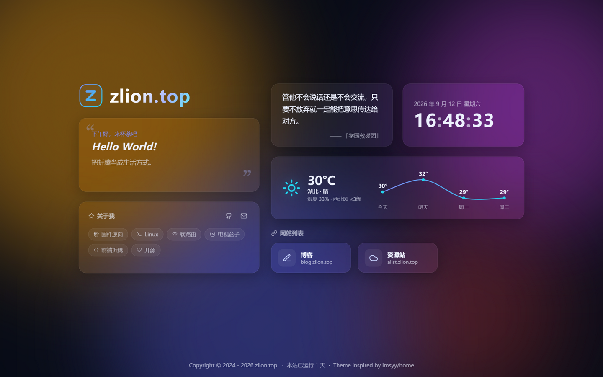

> 本文记录给自己的导航站 [zlion.top](https://github.com/Zlion-Y/zlion-home) 从选型、上线到持续迭代的完整过程。
> **参考项目：** [imsyy/home](https://github.com/imsyy/home)（MIT License，已存档）
> **技术栈：** Vue 3.5 + Vite 7，唯一运行时依赖是 vue 本身
> **部署：** GitHub + Vercel，零配置

---

## 一、为什么不用原版

[imsyy/home](https://github.com/imsyy/home) 是 4.6k star 的知名主页项目，但直接拿来用有两个问题：

1. **仓库已存档**（read-only），作者不再维护；
2. **依赖偏重**：Element Plus、Pinia、APlayer、Swiper 一应俱全，对一个导航页来说 surplus 太多。

我的需求其实很简单：**站点导航 + 一言 + 时钟 + 天气**，于是决定参考它的布局思路，用 Vue 3 + Vite 重写一份，最终构建产物 gzip 仅 ~35KB（原版含组件库通常在数百 KB 量级）。上线后又迭代了二级「探索更多」面板与音乐播放器，本文一并记录。

## 二、布局：从手绘草图到 Bento 网格

最终布局是拿平板画草图定稿的：

```
左列（5fr）                右列（7fr）
Z 徽标 + zlion.top         一言        | 时钟
问候语卡片                  天气长卡（跨 2 列）
博客更新卡                  网站列表（3 列小卡）
```

实现上就是两层 Grid：

```css
.container {
  display: grid;
  grid-template-columns: 5fr 7fr;
  gap: 48px;
  /* 视口富余时垂直居中，内容超高时退化为顶对齐（防裁顶） */
  align-content: safe center;
}

.bento {
  display: grid;
  grid-template-columns: 1fr 1fr;
  grid-auto-rows: 150px;
  gap: 32px;
}

.bento .weather { grid-column: span 2; } /* 天气长卡 */
```

几个布局上的经验：

- **卡片高度全部写死在网格行上**（`grid-auto-rows`），而不是让内容撑开——否则一言长短句切换会把整行顶得跳一下；
- 打字机文案区**固定单行高度**（`min-height: 1.8em`），超长时视口跟随滚动而不是撑高卡片；
- `align-content: safe center` 是关键技巧：直接写 `center` 在小屏内容溢出时会裁掉顶部，加 `safe` 前缀让它溢出时自动退化为 `start`。

还有一个不起眼但很烦的问题：进场动画给卡片加了 26px 的下移位移，页脚被推出视口底部，**滚动条闪现一下又消失，页面整体右移一截**。修法是给主内容容器加 `overflow: clip`，把动画期间的这点溢出就地裁掉，滚动条从头到尾不出现。

## 三、动效：hover 才触发的卡片 3D 倾斜

第一版我做成了"鼠标在页面任意位置，所有卡片持续跟随倾斜"，实际体验反而显得闹腾。最终改成和我的音乐播放器 [FluentPlayer](https://github.com/Zlion-Y/FluentPlayer) 播放页封面一致的手感：**鼠标移入卡片才倾斜，按卡内相对位置变换，移出归零回弹**：

```ts
const maxRotate = 12;
tiltRotateY = ((x - centerX) / centerX) * maxRotate;
tiltRotateX = -((y - centerY) / centerY) * maxRotate;
// perspective(1000px) + scale3d(1.02)，transition 240ms cubic-bezier(0.22,1,0.36,1)
```

配合一层 `mix-blend-mode: overlay` 的径向渐变光泽跟随鼠标，就是熟悉的"果冻玻璃"质感。

这里踩了最大的一个坑：**CSS 动画的 `forwards` 填充优先级高于内联样式**。最初进场动画用 `animation: rise .8s both`，动画播完后 `transform: none` 被永久锁定，JS 写入的倾斜 transform 完全失效。解法是进场改用 `backwards` 填充（配合 `transition-delay` 做级联进场），JS 在 1.5s 后接管 transform；接管时同时用内联样式覆盖 `.glass` 上 0.5s 的 transform 过渡，否则逐帧倾斜会被过渡拖成慢动作。

另外 `.glass` 因为圆角裁切设了 `overflow: hidden`，悬停提示气泡从上方弹出会被裁掉一半——把气泡改为向下弹出解决。

## 四、自定义光标 + 涟漪

进入页面后隐藏系统光标（`cursor: none`），替换为：

- **中心圆点**：即时跟随（直接 transform）；
- **外圈**：`lerp 0.18` 缓动跟随，制造"拖尾"的物理感；悬停可点击元素时外圈变色放大；
- **移动涟漪**：每移动 42px 泛起一圈小涟漪，`mousedown` 泛大涟漪；

```js
function loop() {
  rx += (mx - rx) * 0.18;
  ry += (my - ry) * 0.18;
  ring.style.transform = `translate(${rx}px, ${ry}px)`;
  requestAnimationFrame(loop);
}
```

触屏设备（`hover: none`）和 `prefers-reduced-motion` 下整套系统自动禁用。

## 五、天气卡：免 Key、定位到县级 + 平滑温度曲线

天气最初用的是高德 Web 服务 API，上线后发现一个致命问题：**手机流量（IPv6）环境下 `v3/ip` 定位返回全空，整张卡直接消失**。后来整体换成了 [uapis.cn](https://uapis.cn) 聚合接口：

```js
// https://uapis.cn/api/v1/misc/weather?extended=true&forecast=true
// 免 Key、按访客 IP 定位（可精确到县级）、IPv6 正常
// 返回 temperature / humidity / feels_like / wind / aqi / aqi_category + forecast[]
```

相比高德的优势：不用申请和暴露 Key（也就不需要 Vercel 环境变量）、IPv6 环境（手机流量）正常工作、自带 AQI 与多日预报。本地缓存 30 分钟，失败 3 秒重试一次，仍失败整卡隐藏、网格自动补位。

温度曲线用 Catmull-Rom 转三次贝塞尔把折线变平滑：

```js
for (let i = 0; i < pts.length - 1; i++) {
  const p0 = pts[i - 1] || pts[i], p1 = pts[i], p2 = pts[i + 1], p3 = pts[i + 2] || p2;
  d += ` C ${p1.x + (p2.x - p0.x) / 6} ${p1.y + (p2.y - p0.y) / 6}, ` +
       `${p2.x - (p3.x - p1.x) / 6} ${p2.y - (p3.y - p1.y) / 6}, ${p2.x} ${p2.y}`;
}
```

纯内联 SVG，零依赖。



## 六、二级面板：一屏六卡，全部配置驱动

点击左上角 Logo 进入二级「探索更多」面板，桌面 3 列 2 行一屏放六张卡（行数随卡片数自适应），手机端退化为单列流式。卡片清单完全由 `config.js` 驱动：

```js
// 数组顺序 = 面板内排列顺序；删掉某项 = 隐藏该卡
panelCards: ["news", "hotlist", "music", "epic", "history", "monitor"],
// 可选值：news 新闻 / hotlist 热榜 / music 音乐 / epic 限免 /
//         history 历史上的今天 / monitor 站点监控 / github GitHub
```

现有六张卡：**每日新闻**（60s API）、**多平台热榜**（平台与顺序可配置）、**音乐播放器**（下一节）、**Epic 限免**、**历史上的今天**、**站点监控**（第八节）。GitHub 数据卡组件保留，把 `"github"` 加回数组即可显示。

这里踩了最隐蔽的一个坑：面板给每张卡透传布局类 `class="cell"`，落在组件根元素上，被卡片内部"贡献格子"的同名样式命中——**整张卡被压成 49px**。父组件透传的类名与组件内部类名撞车，这种问题只有实际渲染后量尺寸才能发现，从此卡片组件内部再也不敢用 `.cell` 这种通用名。

另外行数自适应要靠 CSS 变量注入（`--rows`），直接内联 `grid-template-rows` 会把手机端媒体查询里的 `grid-template-rows: none` 覆盖掉，移动端布局直接错乱。

## 七、音乐播放器：照搬 Firefly 的多源自愈设计

面板里的音乐播放器，核心逻辑照搬了 [CuteLeaf/Firefly](https://github.com/CuteLeaf/Firefly) 项目的 MusicManager，这套设计相当优雅：

- `loadVersion` 版本号：每次切歌自增，过期的 play 回调直接丢弃——根治了快速切歌时新旧音源互相抢 `src` 的经典问题（表现为"点了没反应"）；
- `AbortError` 静默：被新加载打断的播放请求不当失败处理；
- 同曲多源降级：Meting 返回的链接带 id/server 时，每个备源都能按单曲重新解析，全败才延迟 2 秒跳下一首。

在此之上又补了三层：

**并发竞速**：多 Meting 源同时拉歌单，谁先返回用谁（串行降级最坏要等 3 个超时，并发只要最快那家）。

**音频探针**：点播放时并行试全部候选源——用 `preload="metadata"` 的隐藏 Audio 元素（媒体加载不受 CORS 限制、只拉头部不下载歌曲），谁先给出元数据就播谁。挂起源不报错也不出声，靠逐个等超时永远等不完，探针把这个问题变成了并行竞速。

**播放意图标记**：预载阶段任何源失败都保持静默，只有用户点过播放才允许出声。否则面板打开几秒后音乐自己响起来，非常灵异。

歌词同步居中也修了个典型坑：滚动容器忘了 `position: relative`，歌词行的 `offsetTop` 以整张卡片为基准，多算了头部高度，当前句永远定位不到可视区。歌单列表同理被内容撑到 4336px——**卡片定高 + 抽屉 `min-height: 0` + 容器 `height: calc(100% - 8px)`** 三件套才能把滚动约束进可视槽位。

## 八、站点监控卡：no-cors 直连探测

监控卡检测我所有站点的可用状态，实现出乎意料地简单——浏览器 `fetch(url, { mode: "no-cors" })` 直连探测：

- 请求返回**不透明响应** = 服务器在线（拿不到状态码，但"能不能打开"这个语义已经够了）；
- 请求失败（DNS / 断网 / 6 秒超时）= 离线。

绿点红点加响应耗时，60 秒自刷新，结果本地缓存 60 秒用于重开面板秒显。**这是访客视角的连通性，与"用户能不能打开"完全一致**，而且不需要注册任何第三方监控服务。这张卡替换了原来的 GitHub 数据卡（组件保留，配置加回来就能显示）。

## 九、部署与配置化

GitHub 建仓库后 Vercel 导入即可，Framework 自动识别 Vite，零环境变量（免 Key 接口的好处之一）。

所有个性化集中在 `config.js`：站名/问候语/打字机标语、`homeCards`（主页卡片开关）、`panelCards`（面板排列）、`hotPlatforms`（热榜平台与顺序）、`siteMonitors`（监控列表）、社交链接与网站列表，改完 push 即自动重新部署。

## 十、结语与致谢

仓库在 [Zlion-Y/zlion-home](https://github.com/Zlion-Y/zlion-home)，欢迎参考/自用。回头看这次重写加迭代的收获：

1. **参考布局思路而不是搬代码**——原版的重依赖一个都没带进来；
2. **成熟设计直接照搬**——动效手感抄 FluentPlayer 的 tilt 参数，播放器容错抄 Firefly 的 MusicManager，比凭感觉调快得多；
3. **布局类名透传、滚动容器基准、动画位移撑出滚动条**这三类问题，都只有实际渲染后量尺寸才能发现——视觉验证永远不可省略。

致谢：

- [imsyy/home](https://github.com/imsyy/home)——布局与功能灵感来源；
- [CuteLeaf/Firefly](https://github.com/CuteLeaf/Firefly)——音乐播放器核心逻辑（MusicManager）来源；
- [uapis.cn](https://uapis.cn/)、[60s API](https://github.com/vikiboss/60s)、[hitokoto.cn](https://hitokoto.cn/)——免 Key 数据接口；
- [Lucide](https://lucide.dev/)——图标。
