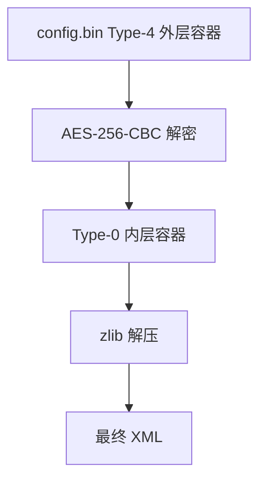
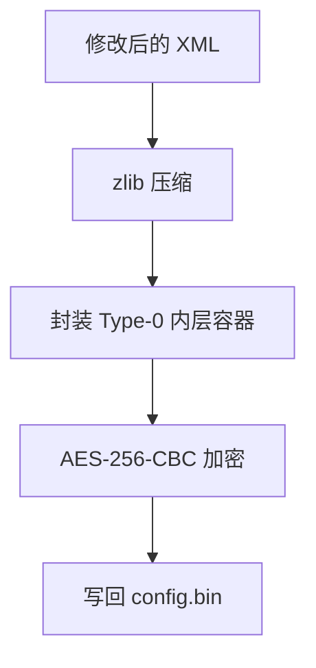
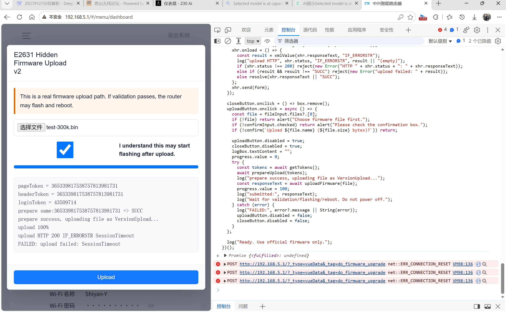
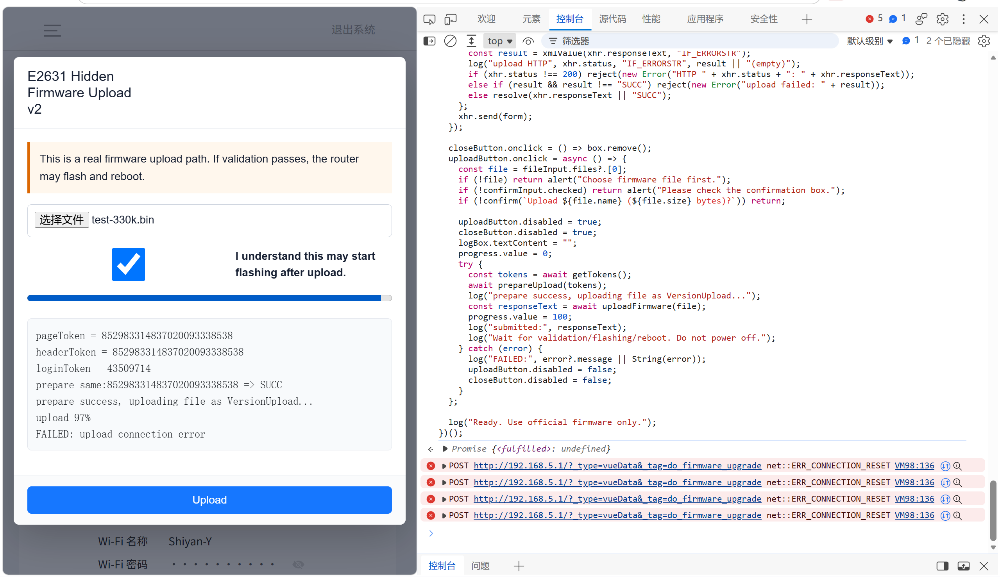

> 本文档面向研究 ZTE E1630/E2631 配置文件、tag 分区与固件刷写流程的用户，整理目前已验证的结论、踩坑点和待确认问题。
> **适用设备：** ZTE E1630 / E2631 样本
> **适用场景：** 自有设备备份、配置修改、固件刷写验证

---

## 1 config.bin 配置文件

`config.bin` 不是明文 XML，而是 ZTE 的 Type-4 外层容器。E1630/E2631 样本中使用的是 AES-256-CBC。

| 参数 | 值 |
|------|------|
| `keySeed` | `E2631Key13515211` |
| `ivSeed` | `E2631Iv13515211` |
| `key` | `SHA256(keySeed)` |
| `iv` | `SHA256(ivSeed)` 取前 16 字节 |
| 填充 | 关闭，尾部补零到 AES 块边界 |

解包流程如下：

回写流程如下：

> [!IMPORTANT] 重要
> 修改 XML 后必须重新压缩、重新加密并做字节级比对，确认最终 `config.bin` 与修改后的 XML 完全对应。

开 Telnet 时不能只改一个位置，需要同时修改 `PortControl` 和 `TelnetCfg`。只改其中一处可能导致配置看似生效，但业务逻辑仍然不放行。

---

## 2 tag 分区写入

`/dev/mtd2` 是 ZTE 私有 tag 记录表，里面包含 WiFi 信息、MAC 地址、SN 等数据。它不是文件系统，不能 mount。

可行做法是先修改可控字段，再重新计算校验，然后刷回分区。

> [!WARNING] 警告
> 不要把 tag 分区当普通文件系统处理。写入前必须完整备份，写入后必须逐字节回读验证。

已经踩过的坑：

| 错误方式 | 表现 | 实际结果 |
|------|------|------|
| `cat > /dev/mtd2` | 表面能写，提示 success | 读回 MD5 不一致，实际没有可靠写入 |
| `cat > /dev/mtdblock2` | 表面能写，提示 success | 读回 MD5 不一致，实际没有可靠写入 |

正确方向是使用 ARMv7 静态编译的 MTD ioctl 工具完成写入：

1. 擦除目标块
2. 写入修改后的 tag 数据
3. 逐字节回读验证
4. 使用 MD5 校验确认写入结果

> [!NOTE] 提示
> `fsync: Invalid argument` 可以忽略。该驱动不支持同步调用，最终只认工具回读结果和 MD5 校验。

---

## 3 公版系统 Web 上传限制

公版系统隐藏了上传本地文件升级页面。实际接口可以被调用，但 `httpd` 对请求体大小有较小上限，因此不适合用来刷官方完整固件。

| 请求体大小 | 现象 |
|------|------|
| 约 300 KiB | 请求可以发完，但不能进入校验和刷写流程 |
| 约 320 KiB 以上 | 连接被重置，浏览器显示 `ERR_CONNECTION_RESET` |
| 官方固件 22,413,844 字节 | 明显超过限制，不适合走该页面 |

> [!IMPORTANT] 重要
> `SessionTimeout` 是业务层问题，`ERR_CONNECTION_RESET` 是连接层问题。排查时不要把这两个现象混在一起。

结论：公版系统 Web 上传路径可以放弃，不要指望用隐藏页面刷 22 MiB 级别的官方固件。

---

## 4 fw_flashing 固件刷写

`fw_flashing` 是系统自带升级程序，会进行校验，但目前观察下来似乎没有做完整性级别的强校验。它使用的是带升级头的小包。

官方系统下，可以把官方升级包通过 Telnet 传入路由器后调用 `fw_flashing` 刷写。该路径在官方系统环境下已验证；没有运营商 Web 刷公版的机器，因此该场景是否通用还不能确认。

已验证信息：

| 项目 | 结论 |
|------|------|
| 写入位置 | 会把官方包写入备用高槽 |
| 高槽参考地址 | `0x02300000`，具体位置可能有差异 |
| 启动结果 | 写入后设备可从高槽成功启动 |
| 低槽地址 | `0x00700000` |
| 高槽地址 | `0x02300000` |
| 高槽边界 | `0x03f00000` |

已知校验项：

1. Magic
2. 版本号
3. 板型
4. VID
5. uImage / CRC 校验
6. 范围检查
7. 写后回读校验

> [!WARNING] 警告
> 双槽布局和 `IsBad` 字段已经确认，但不要依赖自动回退。故意破坏固件验证不一定会触发回滚，存在变砖风险。

---

## 5 待补充问题

目前还需要继续确认的内容：

1. RSA 签名验证的具体位置
2. NAND 写入工具的更可靠实现方式
3. 不同批次设备中高低槽地址是否完全一致
4. 运营商 Web 环境下能否复用官方系统中的 `fw_flashing` 刷写路径

欢迎有经验的朋友补充指正，尤其是 RSA 验证位置和 NAND 写入工具方面的细节。

---

