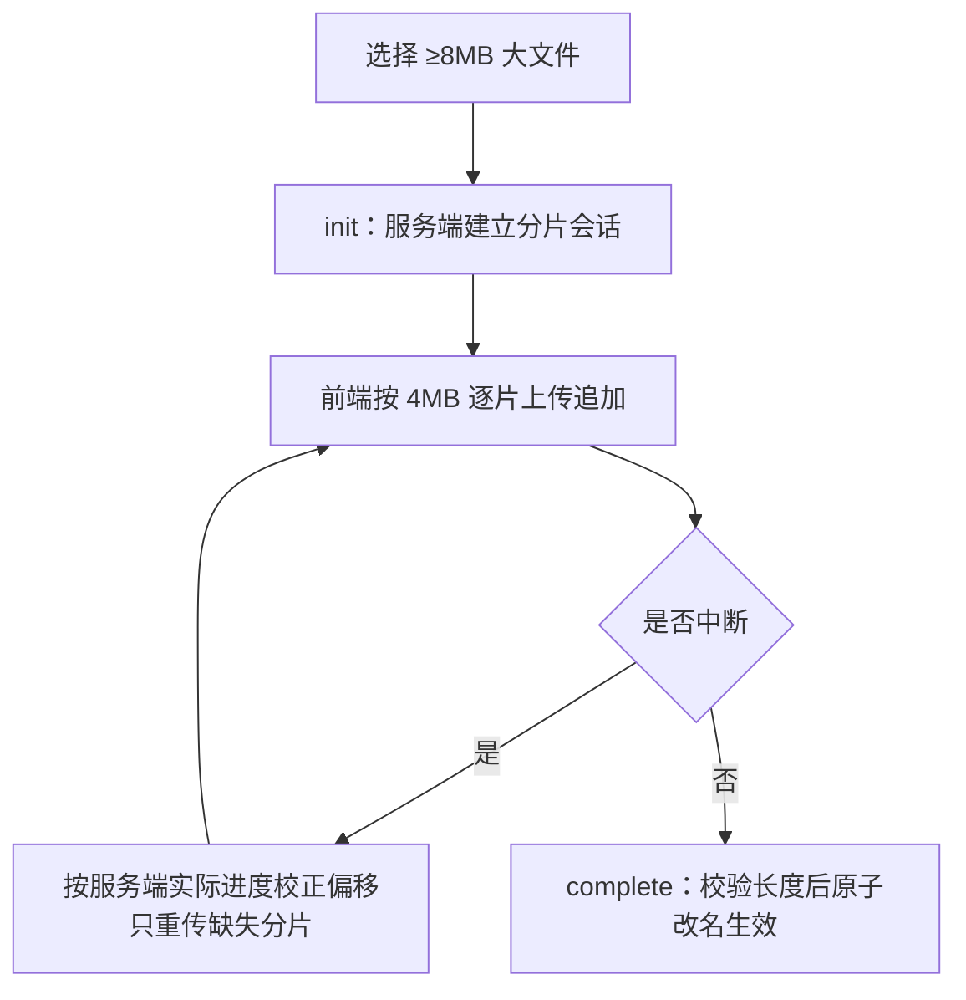
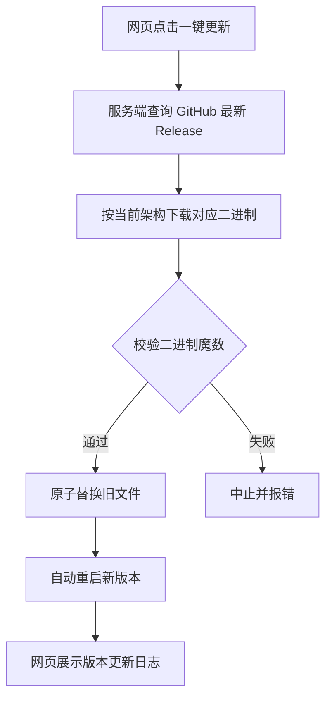

> 本文档面向想在服务器 / NAS / 路由器上自建文件分享服务的用户，涵盖功能介绍、三种部署方式与安全设计。
> **适用系统：** Linux（amd64 / arm64 / armv7 / armv5 / mipsle / 386）/ Windows / macOS
> **适用平台：** 云服务器 / 本地虚拟机 / NAS / 软路由 / Docker

---

## 一、为什么要再造一个文件服务器

网盘限速、第三方工具要装 Docker 拉一堆镜像、老 NAS 上连 Node 都跑不动——fileserver 就是为了解决这些场景：**一个可执行文件，拷过去就能跑**。

它的定位很简单：

- **单个二进制文件**：Go 编写、零第三方库，前端页面经 `go:embed` 直接编译进二进制，无任何运行时依赖；图片缩略图、文本预览、统计图全部在浏览器端渲染，弱机服务器只负责透传字节流
- **8 个平台开箱即用**：从 x86 云服务器到 mipsle 架构的老路由器，总有一个包能跑
- **核心功能齐全**：目录管理、分片断点续传上传、限时限次分享链接、WebDAV 直连、回收站、一键自更新

::github{repo="Zlion-Y/fileserver"}

---

## 二、功能总览


| 功能 | 说明 |
| ---------- | ------------------------------------------------------ |
| 文件管理 | 上传、删除（进回收站）、重命名 / 移动、新建文件夹、勾选批量操作 |
| 分片上传 | ≥8MB 自动分片断点续传：失败只补缺失分片，服务重启自动重建会话，对网页端无感 |
| 文件夹上传 | 「上传文件夹」递归上传整个目录结构；把文件夹直接拖进页面同样整体上传 |
| 相册视图 | 图片文件夹一键切换缩略图网格，浏览器端懒加载，点击直接预览 |
| 媒体 / 文本预览 | 图片 / 视频 / 音频浏览器内直接播放（支持拖动）；txt / md / 源码 / 配置直接查看 |
| 搜索排序 | 全盘递归文件名搜索、按名称 / 大小 / 时间排序、按类型与大小筛选，选择自动记忆 |
| 大目录优化 | 分页拉取 + 前端虚拟滚动，万级文件目录也只渲染可见行 |
| 分享链接 | 有效期（1 小时 ~ 30 天 / 永久 / 自定义）+ 下载次数（1/5/20/不限）双限制 |
| 自定义别名 | 分享链接可设自定义尾段（如 `/s/发布会-materials`），对外发布更好看，原 token 链接兼容 |
| 防盗链 | 按分享开启 Referer 校验，拒绝其他网站的页面引用，直访与下载工具不受影响 |
| 分享密码 | PBKDF2 哈希校验，密码 AES-GCM 加密存储，管理端可查看 |
| 直链 / 确认页 | 直链打开即下载（媒体文件内联展示）；确认页模式先展示文件信息与预览再计数 |
| 分享管理 | 筛选、批量撤销、行内快速编辑有效期 / 密码 / 别名 / 访问方式，一键复制、扫码访问 |
| 下载统计 | 分享管理页展示最近 30 天下载 / 失败趋势图（canvas 客户端绘制） |
| 访问日志 | 每条分享记录最近 50 次访问（IP / UA / 成败原因），行内展开查看 |
| 回收站 | 删除先进回收站，可逐条或勾选批量恢复 / 彻底删除，超期自动清理 |
| WebDAV | `/dav/` 挂载文件根目录，Salt Player 等播放器与移动端文件管理器可直连 |
| 一键自更新 | 自动下载对应架构二进制 → 校验 → 原子替换 → 自动重启，也可本地上传更新包 |
| 安全与会话 | 查看活跃会话、远程踢出、网页改密立即生效并踢出其他会话 |
| 深色模式 / PWA | 深浅主题跟随系统或手动切换；支持「添加到主屏幕」独立窗口运行 |
| 移动端适配 | 卡片式列表、贴底批量栏、底部抽屉弹窗，按触控目标重新设计 |
| 防爆破 | 同一 IP 5 分钟内认证失败 10 次自动封禁 15 分钟 |
| 定时清理 | 过期分享记录自动清理，保留时长可视化配置 |


---

## 三、v1.3 亮点：大文件分片上传

家用宽带上传几个 GB 的文件，最怕的就是传到 90% 断网重来。v1.3 起大文件（≥8MB）自动走分片通道：前端把文件切成 4MB 的分片逐个上传，服务端顺序追加落盘，完成后同盘原子改名——**中途断网只补缺失的分片，已经传上去的字节不会浪费**。



会话对客户端完全透明：普通小文件仍走一次性请求，分片文件在完成前对文件列表、搜索、WebDAV、ZIP 打包全部不可见，不会外泄半成品。

**相册视图**：管理图片目录时点「相册」，列表切换为缩略图网格——服务端依旧只返回原图字节，由浏览器懒加载，不增加服务器负担。

**分享别名与防盗链**：创建分享时可自定义链接尾段，发到网站 / 公众号里体面得多；对公开外发的链接可单独开启防盗链，外站页面引用直接拒绝。

---

## 四、快速开始

### 4.1 直接运行

从 [Releases](https://github.com/Zlion-Y/fileserver/releases) 下载对应架构的二进制，赋予执行权限后运行：

```bash
chmod +x fileserver

./fileserver --port 16666 --dir /data/files --user admin --pass 你的密码
```

打开 `http://服务器IP:16666` 即可使用。不设 `--user/--pass` 时无认证，仅建议纯内网使用。

### 4.2 常用启动参数


| 参数 | 默认值 | 说明 |
| ------------------- | -------- | --------------------------- |
| `--port` | `8080` | 监听端口 |
| `--dir` | 无 | 文件根目录（也可启动后在网页里选） |
| `--data-dir` | `./data` | 配置与分享记录存放目录，**必须持久化** |
| `--user` / `--pass` | 无 | 管理端账号密码 |
| `--max-upload-mb` | `0` | 单文件上传上限（MB），0 不限制，对分片上传同样生效 |
| `--trust-proxy` | `0` | 反向代理场景置 1 |


同名环境变量（`PORT`、`ROOT_DIR`、`AUTH_PASS` 等）同样生效，命令行优先。

> [!TIP] 建议
> `--data-dir` 务必放在持久目录，分享记录存在里面的 `shares.json`，目录丢了链接全部失效；加密分享密码的主密钥 `.masterkey` 也在这里，迁移服务器时一并带走。

---

## 五、一键部署到 Linux（推荐）

部署脚本自动识别 CPU 架构、从 Release 下载二进制、放行防火墙、注册 systemd 开机自启：

```bash
curl -fsSL https://raw.githubusercontent.com/Zlion-Y/fileserver/main/install-remote.sh -o install-remote.sh

sudo bash install-remote.sh --dry-run

sudo FS_USER=admin FS_PASS=你的密码 bash install-remote.sh
```

> [!NOTE] 提示
> `--dry-run` 只预览将要执行的操作，不改系统，建议先跑一次确认。

装好后的常用运维操作：


| 需求 | 命令 |
| -------- | ----------------------------------------------------------- |
| 换目录 / 端口 | `sudo DIR=/mnt/disk/share PORT=9000 bash install-remote.sh` |
| 指定版本安装 | `sudo VERSION=v1.3.3 bash install-remote.sh` |
| 升级到最新版 | 重跑安装即可，自动继承已有配置与密码 |
| 查看日志 | `journalctl -u fileserver -f` |
| 卸载 | `sudo bash install-remote.sh --uninstall` |


配置文件在 `/etc/fileserver.env`，改完 `systemctl restart fileserver` 生效。

---

## 六、Docker 部署

```bash
cp .env.example .env

docker compose up -d
```

`docker-compose.yml` 默认只监听 `127.0.0.1:16666`，由 Nginx / Caddy 反代后对外。数据落在 `./files` 与 `./data`，容器重建不丢。

> [!WARNING] 警告
> Docker 场景升级请重新构建镜像，不要在容器内替换二进制；未注入 `--build-arg VERSION` 时版本为 `dev`，网页会禁用一键更新。

---

## 七、一键自更新是怎么工作的

个人服务器最烦的就是升级：登服务器、找架构、下载、替换、重启。fileserver 把这整套做成了一个按钮：



服务器连不上 GitHub 也没关系：本地下载好二进制，从网页直接上传更新包（上限 256MB），校验通过后同样替换重启。

---

## 八、WebDAV：播放器直连

服务地址即 `http://<主机>:<端口>/dav/`，认证同管理端账号密码。Salt Player、foobar2000、常规移动端文件管理器都能直连，音乐 / 视频流式播放支持拖动进度条；通过 WebDAV 删除的文件同样进回收站，防误删。

> [!NOTE] 说明
> 未实现 LOCK/UNLOCK（Class 2），Windows 资源管理器「映射网络驱动器」不受支持；常规播放器与文件管理器不受影响。

---

## 九、安全设计

- **口令哈希**：管理端与分享密码均用 PBKDF2-HMAC-SHA256（管理端 10 万轮 / 分享端 5 万轮），旧版单次 SHA-256 记录校验通过后自动就地升级，无需用户操作
- **密码加密存储**：分享密码以 AES-GCM 加密落盘，主密钥独立文件存放；`config.json`（管理密码哈希）、`shares.json`（加密密码与访问日志）、主密钥文件均以 0600 权限落盘，泄露不再连带交出密码
- **改密踢会话**：修改管理员密码后立即踢出其他所有登录会话，被盗会话不会永久有效
- **续传授权**：下载断点续传必须持有真实下载后签发的 ticket Cookie，伪造 `Range: bytes=1-` 无法绕过一次性链接的次数限制
- **路径越权**：所有路径参数做根目录校验 + 符号链接兜底，`../` 逃逸与 root 内软链指向外部均无效
- **防盗链**：按分享开启 Referer 校验，外站页面引用返回 403，直访与下载工具不受影响
- **上传限制**：`MAX_UPLOAD_MB` 对普通与分片上传同样生效；分片临时文件对列表 / 搜索 / WebDAV / ZIP 不可见，半成品不会外泄

---

## 十、注意事项与故障排查

> [!IMPORTANT] 重要
> 公网部署务必设置 `AUTH_USER` / `AUTH_PASS`，否则任何人都能管理你的文件。

> [!NOTE] 反代注意
> 反向代理场景需设置 `TRUST_PROXY=1`，否则生成的分享链接会是 `http://127.0.0.1:...`；Nginx 需放开 `client_max_body_size 0` 并关闭 `proxy_buffering`。

常见问题排查：


| 现象 | 排查方向 |
| ---------------- | ------------------------------------------------------------------------------ |
| 分享链接打开 404 | `shares.json` 是否随 `--data-dir` 丢失；文件是否被移动或删除 |
| 链接提示下载次数用完 | 限次已耗尽，可在分享管理里快速编辑重新放开 |
| 链接打开提示「禁止引用」 | 该分享开启了防盗链，外站引用被拒；从原页面打开或直访即可 |
| 别名提示已被占用 | 别名全局唯一，换一个或留空使用随机 token |
| 反代后链接是 127.0.0.1 | 未设 `TRUST_PROXY=1`，或反代来源不在环回 / 内网信任范围 |
| 上传大文件失败 413 | 触发了 `MAX_UPLOAD_MB` 限制，或 Nginx 未放开 `client_max_body_size` |
| 大文件上传中断 | 直接重传即可，分片续传只补缺失部分，无需从头再来 |
| 一键更新报错 | 服务器连不上 GitHub，改用网页上传更新包方式 |
| 忘记管理密码 | 在配置中改 `AUTH_PASS` 后重启；网页改过密码的话删除 `config.json` 中的 `authPassHash` 字段即可回退到启动参数密码 |


---

> **文档版本：** 2026-09-12
> **软件版本：** fileserver v1.3.3
> **适用平台：** 云服务器 / 本地虚拟机 / NAS / 软路由 / Docker

