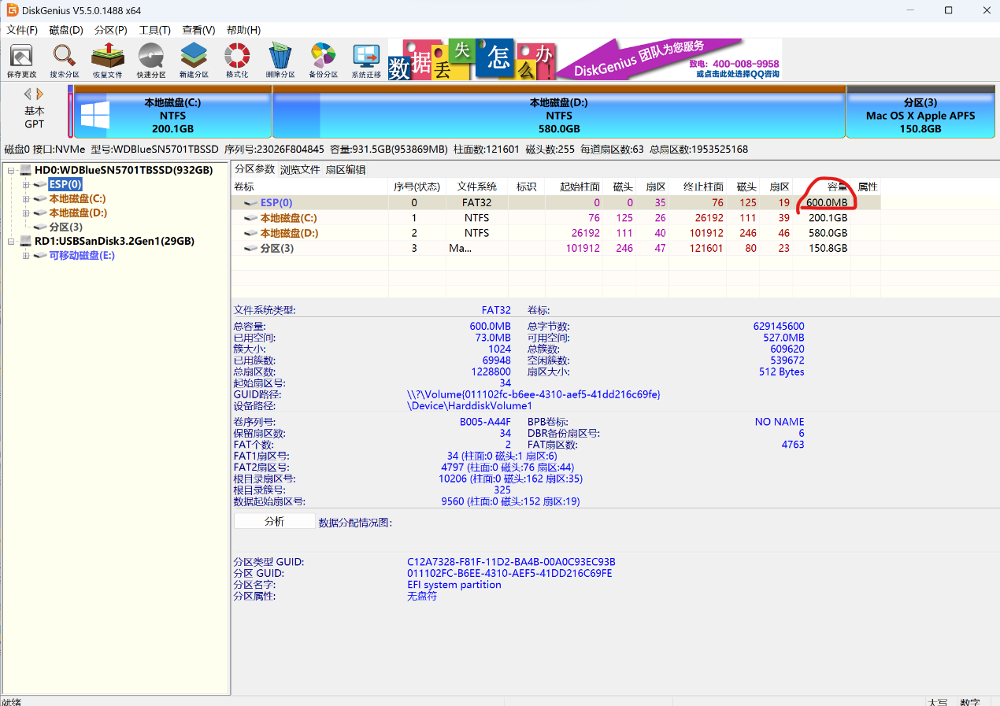
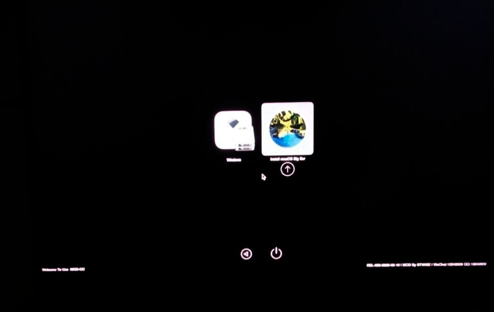
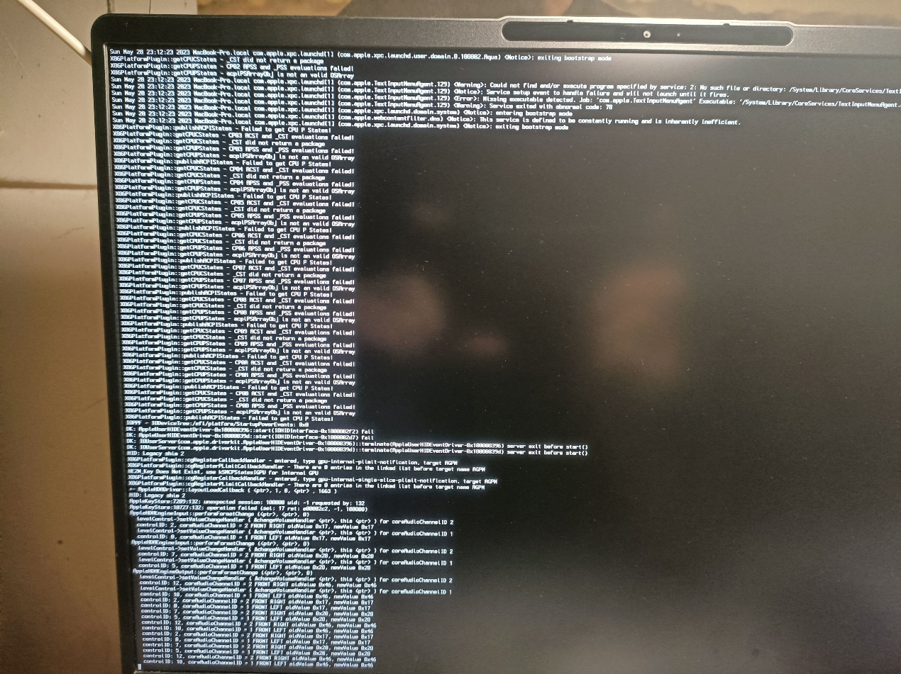
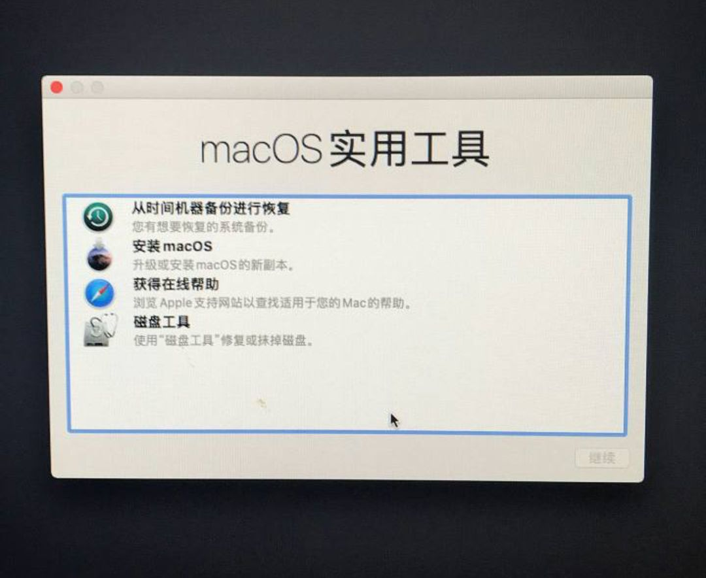
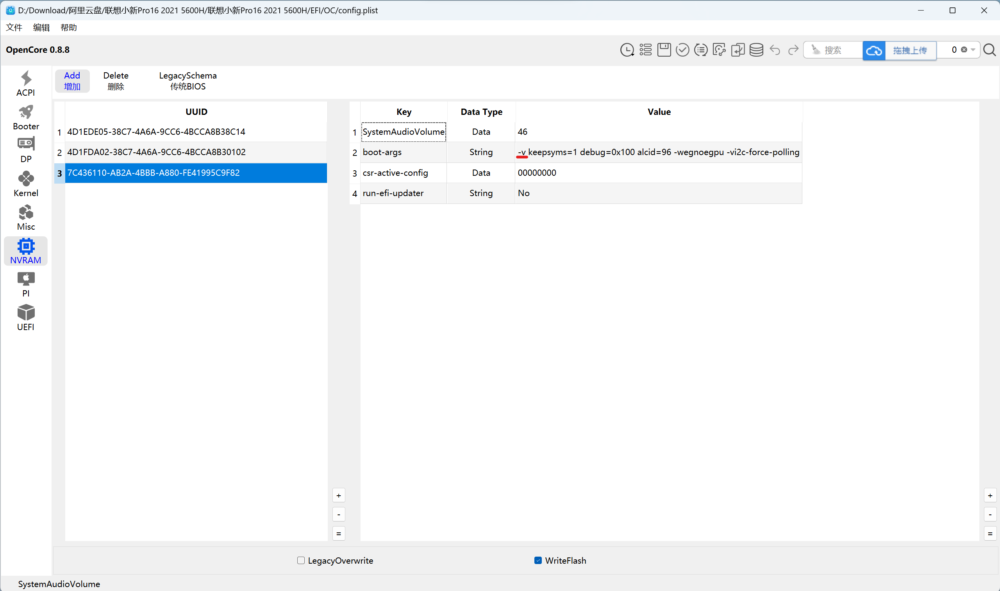
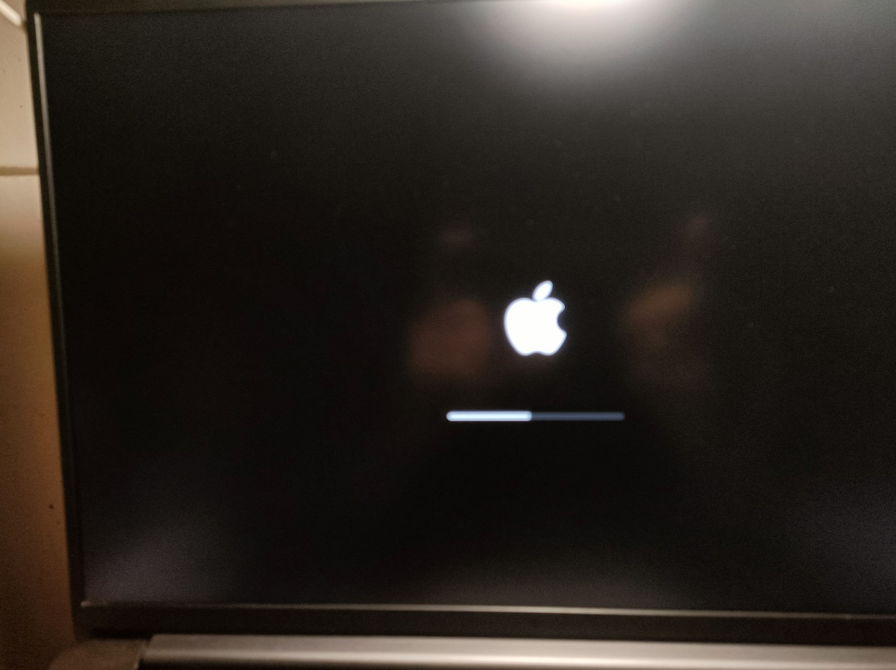
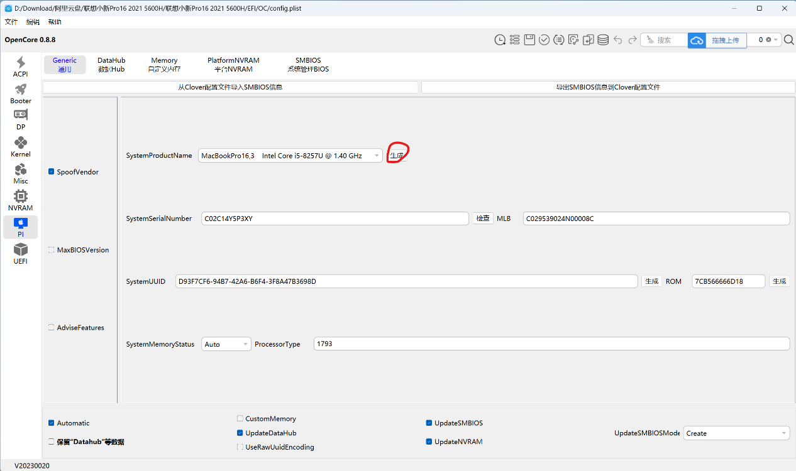
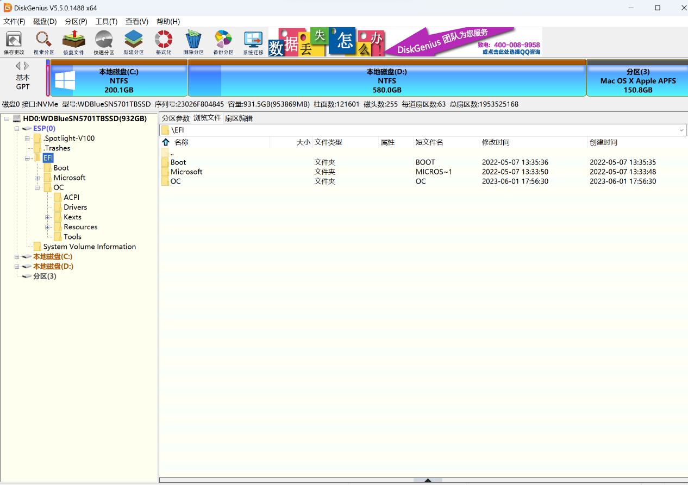
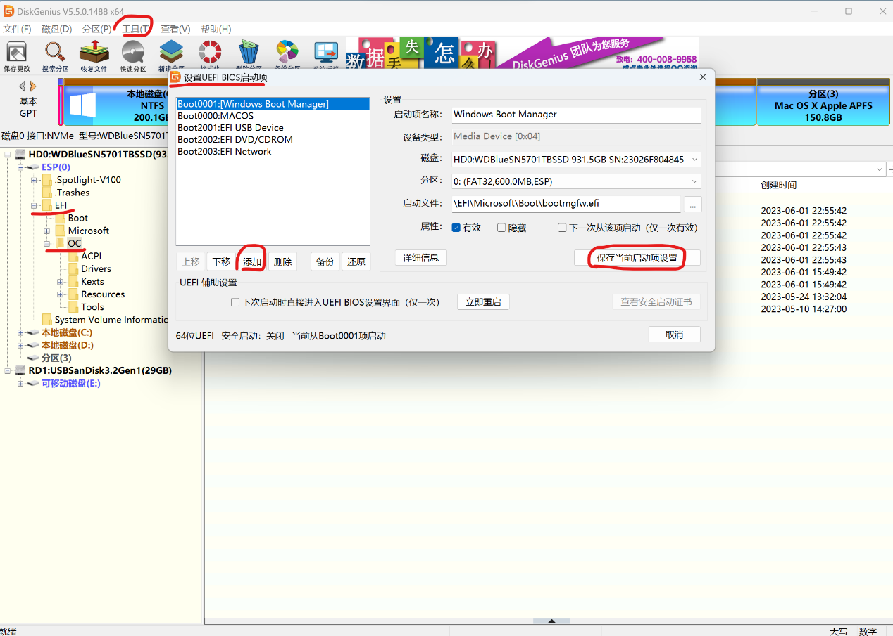

> 本文档面向联想小新 Pro16 2021 AMD 版用户，整理黑苹果安装、EFI 调整与 OpenCore 启动项配置流程。
> **适用机型：** 联想小新 Pro16 2021 AMD（5600H / 5800H）
> **适用系统：** macOS Big Sur / Monterey / Ventura 13.x（取决于镜像与 EFI 支持）


---

## 1. 准备工作

> [!IMPORTANT] 重要
> 开始前请先确认硬盘型号不在不兼容列表内，并备份 Windows 与重要数据。调整 ESP 分区和抹盘都有数据风险。
>
> 硬盘兼容列表参考：https://macoshome.com/hackintosh/hcourse/2476.html

### 1.1 下载所需文件

| 文件       | 地址                                                  | 说明                                      |
| ---------- | ----------------------------------------------------- | ----------------------------------------- |
| EFI        | `https://wwbnc.lanzoub.com/b007up95be`，密码：`zlion` | 5600H 与 5800H 使用不同 EFI，请按机型替换 |
| macOS 镜像 | `https://cloud.189.cn/t/BbyEFnE7FBJb`，访问码：`uzx8` | 安装版本取决于镜像                        |
| DiskGenius | `https://www.diskgenius.cn/`                          | 用于检查硬盘、调整 ESP 分区、复制 EFI     |

### 1.2 检查 BIOS 

1. 开机按 `F2` 进入 BIOS。
2. 关闭「快速启动」和「安全启动」。


### 1.3 调整 ESP 与 macOS 分区

> [!TIP] 建议
> Windows 默认 ESP 分区通常只有 100 MB。如果无法直接扩容，可进入微 PE 后使用 DiskGenius 调整分区。

1. 如果 ESP 小于 200 MB，可从 C 盘左侧腾出约 100 MB，再合并到 ESP 分区。
2. 单独划分一个用于安装 macOS 的分区，建议 `60 GB` 以上；示例环境分配约 `160 GB`。



---

## 2. 制作启动 U 盘

### 2.1 写入镜像

准备一个大于 `16 GB` 的 U 盘，使用 balenaEtcher 写入 macOS 镜像。

1. 打开 balenaEtcher。
2. 选择下载好的 macOS 镜像。
3. 选择目标 U 盘。
4. 点击 `Flash`，等待出现 `Complete`。


### 2.2 处理 EFI 文件

1. 使用 OCAT 打开 `EFI/OC/config.plist`。
2. 取消勾选 `Nootedred.kext`，保存配置。


1. 打开 DiskGenius，选中 U 盘的 EFI 分区。
2. 将调整后的 EFI 文件夹完整复制进去，最终路径应类似：

```text
EFI(X:)/EFI/OC
```

---

## 3. 开始安装 macOS

> [!WARNING] 警告
> 抹掉分区会清空目标分区数据。请确认选择的是为 macOS 单独划出的分区，不要误选 Windows 分区。

1. 插入启动 U 盘，开机按 `F12`。
2. 选择 USB 启动项。
3. 在 OpenCore 菜单中选择 `Install macOS Big Sur` 并按 `Enter`。
4. 等待代码加载完成，进入 macOS 实用工具界面。







1. 打开「磁盘工具」。
2. 选中之前划出的 macOS 分区，点击「抹掉」。
3. 格式选择 `APFS`，完成后返回实用工具界面。
4. 选择「安装 macOS」，按提示继续安装。




> [!NOTE] 提示
> 安装过程中可能会重启 1 到 2 次。如果重启后回到 Windows，请再次按 `F12` 进入 U 盘启动项，并选择 `Installer` 继续安装。

---

## 4. 调整 EFI 文件

完成安装后，需要调整 EFI，避免每次启动都显示冗长代码，并为本机生成独立序列号。

1. 打开最初未修改的 EFI 文件。
2. 使用 OCAT 打开本机适配 EFI：

```text
联想小新 Pro16 2021 5600H/EFI/OC/config.plist
```

3. 找到 `NVRAM` 第三行，双击编辑并删除对应启动参数-v。







1. 生成并写入本机专属序列号，避免多人共用同一套序列号。
2. 保存修改后的最终 EFI。




---

## 5. 设置 OpenCore 启动项

设置完成后，就不需要每次插 U 盘进入 macOS。

1. 回到 Windows。
2. 使用 DiskGenius 打开硬盘 ESP 分区。
3. 将最终 EFI 中的 `OC` 文件夹完整复制到：

```text
ESP/EFI/
```

复制后，`OC` 应与原本的 `Microsoft`、`Boot` 文件夹并列。




1. 在 DiskGenius 工具栏选择「设置 UEFI BIOS 启动项」。
2. 点击「添加」，按以下路径选中 `OpenCore.efi`：

```text
ESP/EFI/OC/OpenCore.efi
```

6. 保存启动项。
7. 将新增的 OpenCore 启动项移动到最上方，作为默认启动项。




> [!TIP] 建议
> 日常默认进入 macOS；需要进入 Windows 时，开机按 `F12` 手动选择 Windows 启动项。

---

## 6. 补充注意事项

1. 2021 款小新 Pro16 存在网卡限制：自带有线网卡无法驱动，不能直插网线。
2. 可通过 USB 网卡或手机 USB 网络共享上网，iPhone 通常无需额外驱动。
3. 不要在 macOS 内直接在线更新系统大版本，否则可能导致无法开机或引导失效。
4. 如需交流，可加入 QQ 群：[https://qm.qq.com/q/y1tjknEfcG](https://qm.qq.com/q/y1tjknEfcG)。

---

## 7. 故障排查

| 问题                          | 处理方式                                                        |
| ----------------------------- | --------------------------------------------------------------- |
| OpenCore 菜单一闪进入 Windows | 开机后尽快用方向键选择 macOS 安装项，或重新检查 U 盘启动顺序    |
| 安装中途重启回 Windows        | 再次按 `F12` 进入 U 盘，选择 `Installer` 继续安装               |
| 找不到 OpenCore 启动项        | 检查 `ESP/EFI/OC/OpenCore.efi` 是否存在，并重新添加 UEFI 启动项 |
| macOS 无法联网                | 使用 USB 网卡或手机 USB 网络共享                                |
| 更新后无法启动                | 不建议在线升级大版本；恢复原 EFI 或重新制作安装 U 盘排查        |

---

## 8. 视频演示

<iframe width="100%" height="468"
  src="//player.bilibili.com/player.html?bvid=BV1zV4y1U79F&p=1&autoplay=0"
  scrolling="no" border="0" frameborder="no"
  framespacing="0" allowfullscreen="true">
</iframe>

---